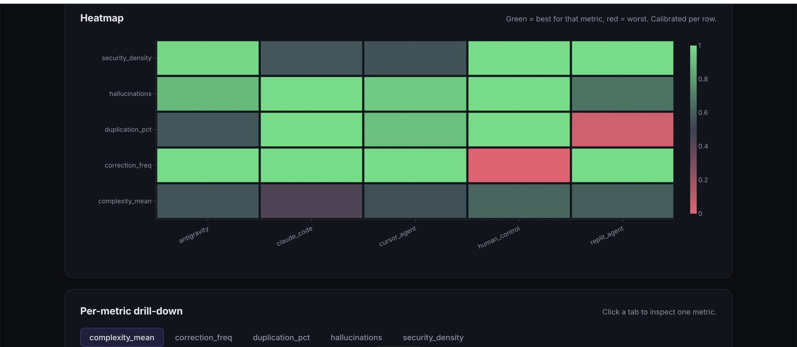

> **Generated file — do not edit.**
> Extracted from `DISSERTATION_FULL.md` on 2026-09-17 by
> `scripts/split_chapters.py`. Edit the master and re-run; any change made
> here is overwritten. The master is the submission artefact.

---

# Chapter 3: Methodology

## 3.1 Research design

The design is quantitative and between-conditions, with replication. The
questions are comparative and the outcomes are machine-measurable.

The independent variable is the **workflow condition**: the tool, or the human
baseline. The dependent variables are the five metrics. The **specification** is
a second, crossed factor, so condition-by-task effects can be examined (RQ3).
Holding the specification fixed is the central control: every condition
implements the identical brief, so differences belong to the workflow, not the
task.

**Figure 3.1** The instrument's architecture. One fixed, versioned specification
goes to every condition. One adapter per vendor captures the result into a single
capture contract. One analyser per metric scores that contract without seeing
which condition produced it. A provenance-stamped report is emitted. Because each
vendor and each metric lives in its own file, either can be added without
touching the other.

Three specifications span different domains: a web application, an ETL pipeline
and a command-line tool. A single-specification study cannot tell a general tool
property from a task-specific one, and §4.4 shows that distinction matters. Each
condition produces *K* attempts at each of *S* specifications, giving *N = K × S*
observations per condition per metric.

The five **conditions** are `claude_code` (Anthropic Claude Code CLI),
`cursor_agent` (Cursor Agent CLI), `replit_agent` (Replit Agent, browser IDE,
replay-captured), `antigravity` (Google Antigravity, desktop IDE, Gemini-class
model), and a hand-coded `human_control`.

The five **metrics** are security-vulnerability density (CWE-tagged Bandit
findings per kLOC); mean cyclomatic complexity (McCabe, via `radon`); code
duplication (six-line shingles, per cent); hallucination count (off-
specification features, via a `manifest_deriver`); and keystroke-correction
frequency (backspace and delete per 1,000 keystrokes, via `pynput`). The last is
structurally zero for the agentic conditions.

The three **specifications**, identical across conditions, are
`agent_education_system` (CRUD and authentication web app), `data_pipeline` (ETL
and scheduler) and `internal_tool_cli` (a CLI with subcommands). Each declares
six features and three governance rules (Appendix A).

## 3.2 The capture contract

The methodological core is the **capture contract**. However different its native
output, every condition must present its work as two artefacts of a fixed shape:
a `codebase` (`{files: {path: content}, manifest: [feature_ids]}`) and an
`interaction_log`, a list of typed events, each a `keystroke`, `backspace`,
`delete` or `agent_action`.

For `human_control` a `pynput` listener records and classifies every key press at
the operating-system level. For the agentic conditions every vendor event is
normalised to `agent_action`, with vendor-native detail kept in sibling keys for
forensics and hidden from the analysers. The contract is enforced at load time: a
malformed event aborts the run rather than quietly degrading a metric.

**Figure 3.2** The capture contract. A human pressing keys and an agent streaming
tool calls produce unrelated traces. Both are normalised into the same two
artefacts before any analyser sees them. Vendor detail survives in sibling fields
for forensics, but comparability is enforced at this boundary, not inside each
metric.

The contract moves vendor-specific reasoning into a thin **adapter** layer, one
file per vendor. The analyser layer never imports an adapter and never branches
on condition, so a metric cannot have been tuned to favour a vendor: the metric
code cannot tell which vendor it is scoring. Adding a tool means writing one
adapter, not editing any metric.

## 3.3 Capture procedure

The two CLI tools are driven non-interactively through `subprocess` in a clean
per-run directory, their streamed JSON events captured line by line with the raw
stream kept for re-analysis. Claude Code runs in its non-interactive,
permission-skipping mode, required because no human is present to confirm tool
calls, sandboxed to a per-run directory. Cursor Agent runs under its free tier's
automatic model selection, as the pre-registration records, so the study does not
fix which model produced its output (§5.7).

The two IDE-bound tools expose no scriptable interface. They are captured by a
manual session, after which the files and event log pass to a replay adapter that
loads them through the *same* contract. Replay adapters share loader and
persistence code with their live counterparts; only the source of the bytes
differs, so no analyser can tell a replayed capture from a live one. That
equivalence licenses analysing the conditions together, subject to Deviation 001.

Each run records its model: `claude-sonnet-4-6` for Claude Code, automatic
selection for Cursor Agent, Gemini 3.5 Flash (Medium) for Antigravity, and an
unversioned default for Replit Agent. Live captures were committed on 31 May 2026
and the full four-tool matrix on 1 June 2026.

### 3.3.1 Human-control condition, as executed

The pre-registration specified 30 sessions of 60 minutes. The executed collection
departed from that plan (**Deviation 003**): one completed session per
specification (N = 1 per spec), run to feature completion rather than time-capped,
with every in-IDE model feature switched off and verified. All six features of each
specification were implemented and seen to run before scoring.

The baseline is therefore a single-rep reference point, not a variance-bearing
condition, and is excluded from the inferential tests. Because the recorder
overwrites its log on each invocation, multi-attempt sessions were preserved by
archiving each segment and joining them at scoring time. One unrecoverable loss
is carried as a limitation: for `agent_education_system` an early segment of
roughly 2,133 events was overwritten before archiving existed, so that rep's
correction frequency comes from a surviving 75-event fixing segment and is
reported as a partial-capture outlier.

## 3.4 Analyser pipeline

Every metric is one function with the same signature:
`analyze(codebase, interaction_log, spec) -> MetricScore`. An analyser sees
exactly what the contract defines and never receives a condition label;
condition identity is attached by the orchestrator after scoring. The pipeline is
blinded by interface design rather than by discipline.

**Figure 3.3** Decision bands applied to each metric when results are shown to a
non-specialist audience. The thresholds are interpretation policy, held in one
module so the command line, the dashboard and the reporting client cannot give
different verdicts for the same number. They bound how a value is read, not how
it is measured.

*Security density (§3.4.1).* The captured codebase is written to a temporary directory and
scored by Bandit. Only findings carrying a CWE identifier are counted, divided by
line count and scaled to a thousand lines. Assertion findings (`B101`) inside
test files are excluded (§4.3, Erratum 001). An earlier design queried the
SonarCloud API and was abandoned during the pilot, because per-project scoping
shared one numerator across conditions while the denominator varied, inflating
small codebases.

*Cyclomatic complexity (§3.4.2).* `radon` enumerates every function's McCabe number and
the analyser reports the mean. Files outside the source whitelist, or inside
virtual environments, caches and vendored packages, are removed first, so the
metric reflects produced code rather than dependencies.

*Duplication (§3.4.3).* Every six-consecutive-line shingle is hashed across all source
files. Lines in any shingle seen twice or more are divided by total source lines.
This captures structural redundancy, including repeated template scaffolding, not
merely verbatim copy-paste.

*Hallucination (§3.4.4).* A `manifest_deriver` scans for evidence of each declared feature,
and for web routes and CLI subcommands mapping to no declared feature. The count
of unmapped routes and commands is the score. Route detection covers the Python
decorator form and the JavaScript call form, the latter added after the κ
validation found the detector blind to it (Erratum 002). Subcommand detection was
added after the main study revealed the Replit behaviour (analytical note 001).
The deriver is a token-matching heuristic, validated in §4.7.

*Keystroke correction (§3.4.5).* `backspace` and `delete` events divided by total
keystrokes, scaled to a thousand. Structurally zero for the agentic conditions.

**Figure 3.4** The reporting surface. Every scored run is published to a hosted
report showing the full condition-by-metric grid, normalised per row so colour
encodes rank within a metric rather than magnitude across metrics. The instrument
is usable by a reader who will never run it. This capture predates both errata,
so its values are the ones Chapter 4 corrects.

## 3.5 Pre-registration

Sample size, model versions, metrics, tests and multiple-comparison policy were
committed to the repository before any main-study data was captured; that commit
is the boundary between pilot and result. Later changes are appended to the
deviations log with date, reason and consequence (Appendix D).

## 3.6 Statistical analysis plan

The plan is pre-registered and identical for every metric, which removes
metric-by-metric analytic discretion.

Normality is checked per `(condition, spec)` cell with Shapiro–Wilk (Shapiro and
Wilk, 1965) and variance equality with Levene's test (Levene, 1960). If both
hold, one-way ANOVA runs across conditions; if either fails, Kruskal–Wallis is
used (Kruskal and Wallis, 1952). The non-parametric route is the norm here,
because the replay conditions contribute zero within-cell variance (Deviation
001), breaking variance equality for every metric.

Significance is assessed at a Bonferroni-corrected α = 0.01, that is 0.05 across
five metrics. A significant omnibus is followed by Tukey's HSD (Tukey, 1949) after ANOVA, or
Dunn's test (Dunn, 1964) with Bonferroni adjustment after Kruskal–Wallis. Every
omnibus here was non-parametric, so Dunn's is used. An earlier implementation
that applied Tukey's to a Kruskal–Wallis omnibus was corrected. Effect sizes were registered as η² for the omnibus and rank-biserial
correlations for pairwise comparisons; because no omnibus is relied upon, only
pairwise sizes are reported, read against Cohen's (1988) benchmarks. Confidence
intervals come from bootstrap with 10,000 replicates (Efron, 1979).

The pre-registered two-way ANOVA for RQ3 is **inadmissible on the executed
design** and is not reported: with one effective observation per cell in two
conditions the interaction term has no residual degrees of freedom. RQ3 is
answered descriptively in §4.5.3. Departing from the plan towards conservatism,
§4.5 is stratified by effective sample size: formal inference is confined to the
two conditions captured live with genuine replication. The unit of analysis is
the independently captured session, not the CSV row.

Three deviations and one analytical note carry their consequences: the replay
zero-variance constraint (001), the deferred web-IDE cells (002), the
human-control execution change (003), and the Replit architectural-prior
observation (note 001).

## 3.7 Reproducibility infrastructure

The instrument ships as a Python package and a GitHub Action. The headline CSV
carries a provenance file, and a live read-only dashboard renders that CSV behind
a banner that flips from "pilot" to "dissertation result" only at N ≥ 5 per
condition, a structural guard against misrepresenting pilot data.

## 3.8 Ethical considerations

The study involved no human participants and collected no human-subject data,
and the approved project proposal records that ethics approval was not required.
Every specification and all application content are synthetic, and no personal,
customer or organisational data was given to any tool. The human-control sessions
were carried out by the researcher, and the recorder logs only the type of each
key event, never the characters typed. The two raters in §4.7 assessed the
instrument's output rather than acting as research subjects; both took part
voluntarily and gave signed consent for their labels to be used and their names
to appear.

---
