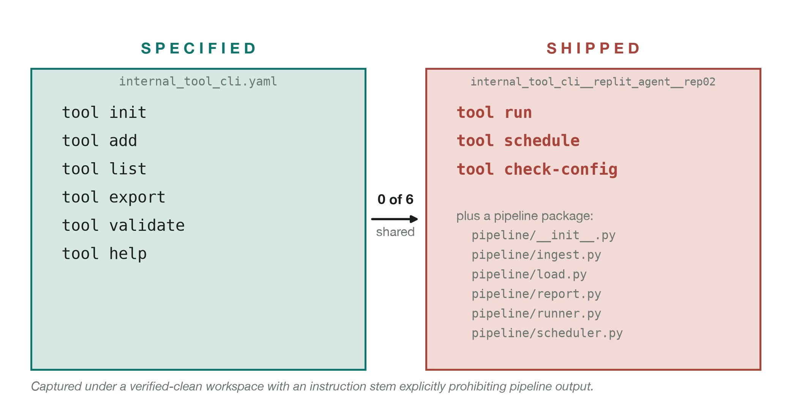
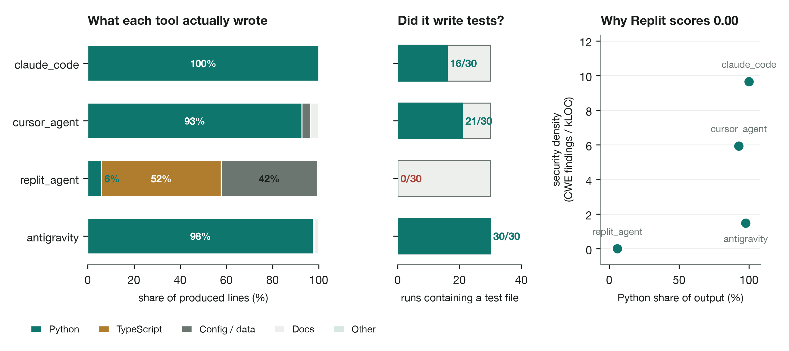
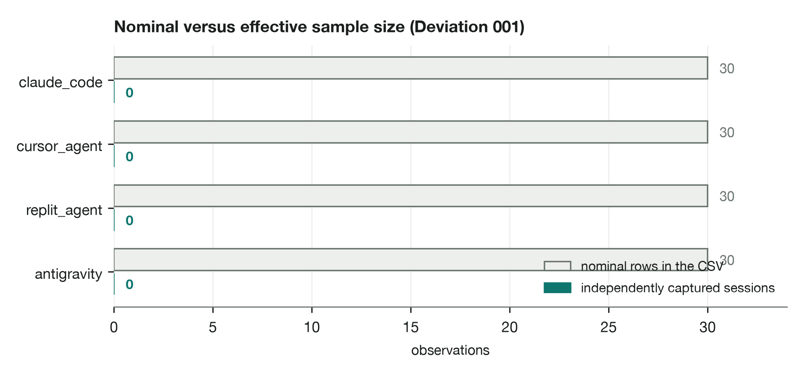
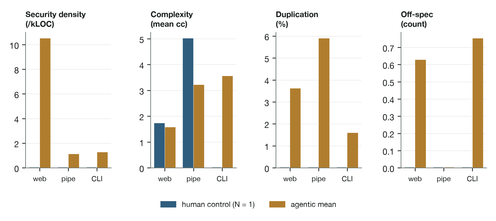
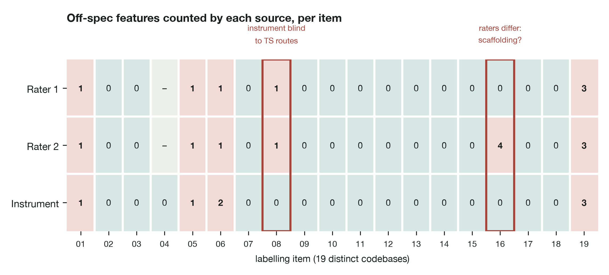

> **Generated file — do not edit.**
> Extracted from `DISSERTATION_FULL.md` on 2026-09-08 by
> `scripts/split_chapters.py`. Edit the master and re-run; any change made
> here is overwritten. The master is the submission artefact.

---

# Chapter 4: Results

*(Canonical, fully-detailed version at `docs/dissertation/CHAPTER_4_RESULTS.md`;
numbers below are computed by `notebooks/statistical_analysis.ipynb` against
`data/reports/main_001.csv`.)*

## 4.1 Overview

The four agentic conditions produced 600 metric observations (4 conditions ×
3 specs × 10 reps × 5 metrics), and their comparison is the primary analysis.
The `human_control` baseline is reported separately (§4.6) as a single-rep
reference point.

## 4.2 Headline cross-vendor comparison

Table 4.1 reports each metric's mean over N = 30 per condition (10 reps × 3
specs; nominal N: the two IDE-bound conditions contribute three effective
sessions each under the replay design, Deviation 001, with the inferential
consequences analysed in §4.5). Lower is better; the best per row is shown in
bold in the discussion.

**Table 4.1** Headline cross-vendor comparison: metric means over the nominal
N = 30 per condition (10 replications × 3 specifications).

| Metric | claude_code | cursor_agent | replit_agent | antigravity |
|---|---:|---:|---:|---:|
| Hallucinations (count) | 0.00 | 0.17 | 1.33 | 0.33 |
| Cyclomatic complexity (cc) | 3.35 | 2.72 | 2.39 | 2.60 |
| Code duplication (%) | 0.00 | 0.90 | 9.56 | 4.26 |
| Security density (per kLOC) | 9.65 | 5.93 | 0.00 | 1.47 |
| Keystroke correction (per 1k) | 0.00 | 0.00 | 0.00 | 0.00 |

**Figure 4.1** Forest plot of per-condition means with bootstrap 95% confidence
intervals (10,000 replicates), by metric. The intervals for `replit_agent` and
`antigravity` are degenerate by construction: those conditions contribute one
captured session per specification (Deviation 001, analysed in §4.5).

**Figure 4.2** Violin plots of the distribution shape for each
(condition × metric) pair. The collapsed distributions for the two IDE-bound
conditions are the visual signature of the replay design.

The table already reveals the study's central structural result: there is no
single column that is best on every row. Of the five metrics, three produce a
clear best-condition winner (Claude Code on hallucinations and duplication;
Replit Agent on the raw security-density figure, subject to the artefact
discussed below); one (`security_density`) requires interpretation rather than a
naive lower-is-better reading; and one (`correction_freq`) is structurally zero
for every agentic condition and is reported here for shape consistency, with its
interpretable value reserved for the human comparison in §4.6. The conditions
thus occupy distinct trade-off profiles rather than a single ordering (Claude
trading structural density for discipline, Replit trading specification fidelity
and a large scaffolding footprint for breadth of generated infrastructure) and
the per-metric and per-spec analyses that follow unpack each of these in turn
before the statistical tests in §4.5 establish their significance.

## 4.3 Per-metric findings

**Hallucinations.** Claude Code shipped zero off-spec features across all 30
runs; Cursor averaged 0.17 (occasional "helpful" `/health` or `/metrics`
endpoints on the web-app spec); Antigravity 0.33 (localised to the same spec, as
unrequested root and admin-style routes); and Replit Agent 1.33, the largest
condition-level gap in the table and the study's most consequential finding.
Cursor's and Antigravity's figures are *helpful overreach*; Replit's are
*architectural substitution*, a qualitative distinction the bare count obscures
and the per-spec breakdown (§4.4) makes visible.

*4.3.1 The Replit architectural-prior finding.* Given the `internal_tool_cli` specification, a CLI with six declared subcommands
(`init`, `add`, `list`, `export`, `validate`, `help`), under a fresh, isolated
workspace and an explicit
instruction stem prohibiting pipeline output, Replit Agent shipped a
*data-pipeline CLI* in its captured session for that cell, defining `cmd_run`
and `cmd_schedule` invoking a `run_pipeline` routine rather than the spec's
structure. The behaviour matters because of the controls around it: the
workspace was confirmed clean before capture and the prompt explicitly forbade
the pipeline shape, so the result cannot be attributed to contamination or an
ambiguous brief. It is documented as a *measured architectural-prior dominance*
(analytical note 001): the agent's pretrained scaffolding bias is strong enough
to override an unambiguous, contradictory specification. This is the result that
most sharply illustrates the dissertation's thesis (functional benchmarks, which
would record only whether the produced pipeline's tests passed, are structurally
incapable of detecting that the wrong artefact was built) and on which the
governance argument of Chapter 5 principally rests. One caveat is carried
explicitly: this cell is an effective singleton under the replay design
(Deviation 001), so its ten listed replications are mechanical copies of one
session and contribute no independent evidence of stability. The finding rests
on the controlled capture conditions and on direct code inspection; a live
multi-session re-capture (§5.7) is the stated next step.

**Figure 4.3** The finding in full. Left, the six subcommands declared in
`internal_tool_cli.yaml`; right, the three shipped by `replit_agent` in the
captured session for that cell, with the pipeline package supporting them. The
intersection is empty. Both columns are read directly from the specification
file and the frozen capture, so the figure cannot drift from its evidence.

**Cyclomatic complexity.** Claude Code produced the densest code (mean McCabe
3.35) and Replit the least (2.39), a gap of roughly one cc unit that is
consistent across the three specifications. The reading is "denser, not worse":
complexity is a two-sided dimension, and Claude's single-file style inlines
control flow that other vendors distribute across modules, raising the
per-function path count without necessarily harming quality. A moderate
complexity paired with zero duplication is arguably healthier than a low
complexity achieved by scattering logic across duplicated scaffolding. The
metric is most informative read alongside duplication.

**Duplication.** Claude Code produced zero duplication across all 30 runs;
Cursor averaged 0.9%, Antigravity 4.3%, and **Replit Agent 9.56%**, by far the
largest ratio in the table. Inspection identifies the source unambiguously:
Replit ships enterprise monorepo scaffolding (workspace configuration
hierarchies, shared-utility libraries, OpenAPI/ORM code generation) regardless
of the spec's domain, and that scaffolding repeats template fragments across
packages. The metric is doing exactly what it should, measuring the agent's
*architectural footprint* rather than the bare logic the spec demanded. A buyer
should expect roughly a tenth of the produced code to be scaffolding redundancy
before any feature work begins.

**Security density.** The figures below exclude Bandit's `B101` (assertion)
findings inside test files, which the analyser originally counted: `B101` exists
because assertions vanish under `python -O`, and that reasoning does not apply
where the assertion *is* the test. Counting them meant the metric penalised the
conditions that tested their own output most thoroughly, inflating claude_code
from 9.65 to 42.05 and cursor_agent from 5.93 to 43.67. The correction is
recorded as Erratum 001; it reverses no conclusion, and the corrected values are
used throughout.

The pattern inverts that of the other metrics, which makes it the clearest
illustration of why an artefact-level, transparently-reported instrument is
necessary. The two feature-dense vendors, Claude Code (9.65) and Cursor Agent
(5.93 CWE-tagged findings per kLOC), score *highest*, while Replit records 0.00
and Antigravity 1.47. Replit's zero does not indicate more secure output; it is
a denominator artefact. Bandit scans Python, and Replit's output is dominated by
TypeScript scaffolding with comparatively little Python, so the few Python
issues are diluted across a large non-Python project. `security_density` is
therefore best read as a *per-language* density rather than a
total-vulnerability count, and a companion metric, total CWE-tagged findings per
run, would be needed to support a whole-project security claim (§5.2). Reporting
this openly, rather than allowing Replit's 0.00 to read as a security win, is
precisely the behaviour the instrument exists to enforce.

**Figure 4.4** The artefact made visible. Left, the share of produced lines by
language across all 30 runs per condition: Replit's output is 6% Python against
52% TypeScript and 42% configuration, while every other condition is
Python-first. Right, security density against Python share, the 0.00 is a
property of what the scanner can read, not of what was written.

**Keystroke correction.** Structurally zero for every AI condition, because
agents do not press keys. The metric exists for the `human_control` comparison
(§4.6); its inclusion is justified by the need for an empirical floor against
which the agentic zero reads as a category difference rather than an absence
(§5.5).

## 4.4 Per-specification breakdown

Table 4.2 reports the hallucination count per (condition × spec) cell (N = 10
per cell nominal) and shows that the distribution is *not uniform across
specifications*, a result that is the single strongest justification for the
three-specification design.

**Table 4.2** Per-specification hallucination breakdown: mean off-spec feature
count per (condition × specification) cell.

| Hallucinations by spec | agent_education | data_pipeline | internal_tool_cli |
|---|---:|---:|---:|
| claude_code | 0.00 | 0.00 | 0.00 |
| cursor_agent | 0.50 | 0.00 | 0.00 |
| replit_agent | 1.00 | 0.00 | 3.00 |
| antigravity | 1.00 | 0.00 | 0.00 |

**Figure 4.5** Table 4.2 rendered as a heatmap. The concentration of off-spec
output in `replit_agent` on the CLI specification (three off-spec subcommands
per run, against at most one anywhere else) is the study's most consequential
result, and the unevenness of the surrounding cells is the clearest available
statement that tool behaviour is task-conditional rather than uniform.

Three patterns are visible by inspection. Cursor's hallucinations are confined
to `agent_education_system`, the web-app spec; Antigravity's are likewise
localised to that same web-app spec, where it averages a full off-spec route per
run; and and Replit's are *heaviest by far on the CLI spec*, three off-spec
subcommands per run against one on the web-app spec and none on the pipeline,
which is what the architectural-prior account predicts, since Replit's
pipeline-shaped defaults are worst-fit when the brief asks for a command-line
tool. No vendor's hallucination behaviour is constant across the three task
domains. A single-specification study would therefore have produced a materially
different, and misleading, ranking depending on which spec it happened to
choose: a CLI-only study would have indicted Replit and left Antigravity looking
clean, while a web-app-only study would have found Replit and Antigravity
equally culpable at 1.00 apiece and Replit's most serious failure entirely
invisible. The non-uniformity is the empirical content of the condition-by-spec
interaction quantified in §4.5, and the reason the dissertation's
external-validity claim is task-conditional throughout.

## 4.5 Statistical tests

### 4.5.1 The unit-of-analysis problem

The inferential analysis must confront a constraint that the design imposes and
that a naive reading of the headline CSV would conceal. Under Deviation 001, the
two IDE-bound conditions (`replit_agent`, `antigravity`) were captured **once**
per (condition × specification) cell and that single capture was replayed ten
times for CSV-shape consistency. Verification against the data confirms this
directly: the maximum number of distinct values in any (spec × metric) cell is
**ten** for `claude_code` and `cursor_agent`, and **one** for `replit_agent` and
`antigravity`.

The consequence is that the two replay conditions contribute **three effective
observations each** (one per specification), not thirty. Treating their ten
listed rows as independent observations is *pseudoreplication*, the
best-documented inferential error in experimental design, and it inflates every
test statistic computed over the nominal N = 30. This dissertation therefore
reports the analysis at three levels of conservatism and draws its inferential
conclusions only from the level the design can actually support.

### 4.5.2 Three analyses

**Level 1, nominal analysis (reported for transparency, not relied upon).**
Kruskal–Wallis over all four conditions at the nominal N = 30 returns
significance on all four testable metrics: duplication H = 62.41, p = 1.8 ×
10⁻¹³; security H = 26.07, p = 9.2 × 10⁻⁶; hallucinations H = 40.14, p = 9.9 ×
10⁻⁹; complexity H = 12.03, p = 7.3 × 10⁻³. **These values are inflated by
pseudoreplication and are not the study's inferential claim**; they are reported
only so a reader reproducing the CSV arrives at the same arithmetic and can see
why it must be discounted. Condition-by-specification interaction *F*-statistics
reported in an earlier draft are **withdrawn**: with one effective observation
per cell in two conditions the interaction term has no residual degrees of
freedom and the statistic is undefined on this design, its apparent magnitude an
artefact of near-zero error variance from duplicated rows.

**Figure 4.6** Why Level 1 must be discounted. Each condition contributes 30
rows to the report, but only the two CLI-driven conditions contribute 30
independently captured sessions; the IDE-bound conditions contribute three
apiece, one per specification, replayed ten times each. The omnibus tests above
treat the grey bars as the sample size; the analysis that follows treats the
teal ones.

**Level 2, the inferential core (live conditions only).** Only `claude_code` and
`cursor_agent` were captured live with genuine per-replication variance
(within-cell SD up to 2.32 for duplication and 38.79 for security density), so
only their comparison supports inference at full replication. Table 4.3 reports
Mann–Whitney *U* on each metric with rank-biserial effect sizes.

**Table 4.3** Live-condition comparison, `claude_code` versus `cursor_agent`
(N = 30 per condition; two-sided Mann–Whitney *U*; rank-biserial *r*).

| Metric | *U* | *p* | rank-biserial *r* | Claude mean | Cursor mean |
|---|---:|---:|---:|---:|---:|
| Duplication (%) | 330.0 | 0.0028 | 0.267 | 0.00 | 0.90 |
| Complexity (cc) | 641.5 | 0.0047 | −0.426 | 3.35 | 2.72 |
| Hallucinations (count) | 390.0 | 0.0419 | 0.133 | 0.00 | 0.17 |
| Security density (per kLOC) | 508.0 | 0.3668 | −0.129 | 9.65 | 5.93 |

Under Bonferroni correction across the four metrics at α = 0.05
(threshold 0.0125), **duplication and complexity differ significantly**;
hallucinations and security density do not. Neither surviving result clears the
stricter α = 0.01 Bonferroni threshold (0.0025), and this is stated plainly
rather than obscured by choice of α.

A further distinction must be drawn between the two surviving results, because
replication is not uniform even within the live conditions. Examining
within-cell variance for each arm separately: on *complexity* both conditions
vary across all three specifications, so the comparison rests on genuine
run-to-run replication at both ends. On *duplication* `claude_code` returns 0.00
in every replication of every specification; the arm is constant, and the test
therefore compares a fixed value against a distribution rather than two
distributions. The gap it reports is real and visible in Table 4.1, but it is
not evidence of the same kind.

The single claim in this study that rests on unambiguous independent
replication in **both** arms is therefore *complexity*: on identical tasks,
Claude Code produces measurably more control-flow-dense code than Cursor Agent
(Mann–Whitney *U* = 641.5, *p* = 0.0047, *N* = 30 per condition, rank-biserial
*r* = −0.43). The duplication result is reported alongside it as a strong
descriptive difference with partial inferential support, and the distinction is
made explicit here rather than left for a reader to derive.

**Level 3, pseudoreplication-corrected omnibus (all four conditions).**
Collapsing every condition to one value per specification, the honest unit of
analysis, giving N = 3 per condition, no metric reaches significance:
duplication H = 6.34, p = 0.096; security H = 5.30, p = 0.151; hallucinations H
= 3.45, p = 0.328; complexity H = 1.17, p = 0.760. This is a **power result, not
a null result**: with three cells per condition, only an overwhelming effect
could reach α = 0.01, and the analysis is reported to establish that the
four-condition comparison in this study is *descriptive*, not inferential.

### 4.5.3 What the design does and does not license

The cross-vendor differences in Table 4.1 are large, consistent, and
mechanistically explained by direct inspection of the captured code, duplication
spans 0.00% (Claude) to 9.56% (Replit) and hallucinations 0.00 to 1.33 per run,
but for the two IDE-bound vendors they rest on one captured session per task.
They are therefore presented as **descriptive case evidence**, and the
task-dependence claim (RQ3) is likewise reframed: the per-specification pattern
in Table 4.2 shows that no vendor's hallucination behaviour is constant across
task domains, which is a *descriptive* demonstration of task-conditionality and
is reported as such, without an inferential interaction test. Figure 4.1 (forest
plot of per-condition means with bootstrap 95% confidence intervals) and Figure
4.2 (violin plots of the per-condition distributions) visualise both the gaps
and the degenerate distributions of the replay conditions; the collapsed violins
for `replit_agent` and `antigravity` are themselves the clearest visual
statement of the design's limitation. Closing this gap requires live
multi-session re-capture of the two IDE-bound vendors, which §6.4 identifies as
the first priority of any continuation.

## 4.6 Human-control baseline

The human baseline (N = 1 per spec; all six features implemented and verified)
scored zero hallucinations, zero duplication and zero security density across
all three specs, a minimal, exactly-on-spec implementation without the
over-delivery that drives the AI conditions' non-zero figures. Table 4.4 sets
the baseline against the AI conditions for every metric and specification.

**Table 4.4** Human-control baseline versus AI-condition means, per
specification. Human values are single sessions (N = 1, Deviation 003); AI
values are the mean of the four agentic conditions. Reported descriptively; no
inferential comparison is made.

| Metric | Web app (human / AI) | Pipeline (human / AI) | CLI (human / AI) |
|---|---:|---:|---:|
| Security density (per kLOC) | 0.00 / 10.48 | 0.00 / 1.09 | 0.00 / 1.23 |
| Complexity (cc) | 1.71 / 1.56 | 5.00 / 3.20 | 0.00 / 3.54 |
| Duplication (%) | 0.00 / 3.59 | 0.00 / 5.87 | 0.00 / 1.57 |
| Hallucinations (count) | 0.00 / 0.62 | 0.00 / 0.00 | 0.00 / 0.75 |

**Figure 4.7** Table 4.4 at a glance. The human baseline is at or near zero on
every artefact metric in every domain, the signature of a spec-minimal
implementation rather than superior craft. The exception is complexity, where
the human sits *above* the agentic mean on the pipeline and at exactly zero on
the CLI; that zero is the decomposition-style confound of §5.5, not a simpler
program. | Correction frequency (per 1k) | 829.27 / 0.00 | 51.80 / 0.00 | 122.27
/ 0.00 |

Mean complexity was 1.71 (web app) and 5.00 (pipeline); for the CLI it was 0.00:
a structural artefact, because the human wrote top-level script code with no
function definitions and the analyser measures per-function complexity, whereas
the AI conditions wrapped the same logic in functions (3.1–4.1). The keystroke
correction rate, the one metric where the human is the point of comparison, was
51.8 per 1,000 on the representative complete session (`data_pipeline`, 6,619
events), i.e. the researcher backspaced ~5% of the time. The
`agent_education_system` figure (829/1k) is a partial-capture outlier from the
documented data-loss event and is not a representative authoring rate. The human
baseline is interpreted as a reference floor and a validity check, not as
evidence that hand-coding is superior.

## 4.7 Inter-rater reliability

The hallucination heuristic was validated against human judgement as
pre-registered. Two raters independently labelled the 30-run hand-label sample,
deduplicated to 19 distinct codebases (11 of the 30 rows are byte-identical
replays under Deviation 001, and labelling identical code twice would inflate
agreement by construction). Neither rater saw `data/reports/main_001.csv`, and
neither was told which condition produced which item. One capture contains no
files and was recorded `SKIP` by both, giving N = 18 scoreable items. Labels are
compared on the binary contrast, any off-specification feature against none.

**Table 4.5** Cohen's κ against the instrument as it stood when the raters
worked. Threshold κ ≥ 0.6 (Landis and Koch, 1977).

| Comparison | κ | Interpretation | Raw agreement |
|---|---:|---|---:|
| Rater 1 × Rater 2 | 0.870 | almost perfect | 94.4% |
| Rater 1 × instrument | 0.853 | almost perfect | 94.4% |
| Rater 2 × instrument | 0.727 | substantial | 88.9% |

All three clear the threshold, so the hallucination metric is admissible for
inferential use rather than exploratory reporting only.

**Figure 4.8** Every label in the study, item by item. Shaded cells carry at
least one off-specification feature; item_04's capture is empty and was recorded
`SKIP` by both raters. The two boxed columns are the only disagreements: at
item_08 both raters saw a route the instrument could not (Erratum 002), and at
item_16 the raters differ from each other over whether shipped vendor
scaffolding counts as scope drift.

Two qualifications bound that admission.

**The validated claim is detection, not magnitude.** κ is computed on the binary
contrast. Two items agree in binary terms while differing substantially in
count, one where the instrument recorded two off-spec features against the
raters' one, and one where the raters differed from each other by four. The
instrument is validated as an answer to *whether* scope drift occurred, not to
*how much*. No claim in this chapter rests on a hallucination magnitude alone;
the condition-level means in Table 4.1 are reported descriptively and the Replit
finding is independently corroborated by direct code inspection.

**The labelling exposed a defect in the instrument, which is recorded as
Erratum 002.** Both raters counted an off-specification route in the
`replit_agent × agent_education_system` capture that the instrument scored zero
for: its route detector matched only the Python decorator form, and that capture
is an Express service written in TypeScript. The detector was blind to the whole
class. Because the labelling tool extracted its candidates independently of the
instrument, the blind spot surfaced instead of being reproduced; had the raters
been shown only what the instrument could see, the item would have agreed
perfectly and the defect would have survived into the thesis. The affected cell
is corrected from 0.00 to 1.00 throughout this chapter, and hallucination counts
generally should be read as a lower bound on codebases that are not Python-first.

Repairing the defect raises κ(Rater 1, instrument) to 1.000 and
κ(Rater 2, instrument) to 0.870. **Those post-repair values are not reported as
validation and are not quoted in support of any claim.** The defect was
identified by the raters' disagreement and the repair then measured against the
same labels, which is circular; establishing the repaired instrument's validity
would require a fresh sample and raters who have not seen these items. The
figures of record are those in Table 4.5.

A residual limitation is that Rater 1 is the author. Rater 2 labelled
independently and was not otherwise involved in the study, and the single
human–human disagreement is evidence that the two sheets were produced without
conferring; neither fact establishes that Rater 1 was blind to the hypotheses.

## 4.8 Summary of findings

1. **Hallucination is the most discriminating governance metric.** The four
conditions span 0.00 to 1.33 off-spec features per run, a range meaningful in
any deployment evaluation, and one functional benchmarks do not surface.

2. **Replit Agent's architectural prior dominates the specification.** Given a
   CLI specification under controlled conditions it ships a data pipeline; given
   a web-app specification, an enterprise TypeScript monorepo. The hallucination
   count, the duplication figure (9.56%) and the security-density artefact (0.00
   by Python dilution) are three readings of one underlying behaviour,
   triangulated by direct code inspection; its stability across independent
   sessions awaits the live re-capture (§5.7).

3. **Claude Code produces the most disciplined output**, zero hallucinations and
zero duplication across all 30 runs, at the cost of the highest structural
density (mean complexity 3.35), read as denser rather than worse. Of its two
components, the greater control-flow density relative to Cursor is the study's
single result supported by genuine replication in both arms; the duplication gap
is large and consistent but rests on an arm with no within-cell variance and is
reported descriptively (§4.5.2).

4. **Cursor Agent is the median performer**, neither best nor worst on any single
   metric; its modest hallucinations are confined to the web-app spec as helpful
   overreach (`/health`, `/metrics`).

5. **Antigravity's hallucinations fall entirely in the web-app spec** (1.00 per
   run there, none elsewhere, tying Replit on that specification), and it records
   the lowest security density of any condition with substantive Python output.

6. **Tool behaviour is not constant across task domains.** Every vendor's
   hallucination profile changes with the specification (Table 4.2), so the
   strongest external-validity claim is not "agent X is better than agent Y" but
   "agent X behaved better *for this task type*." This is established
   descriptively rather than by an interaction test, which the replay design
   cannot support (§4.5.3).

---
