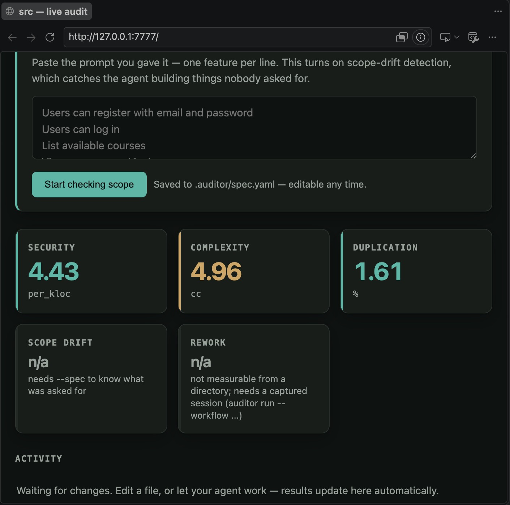
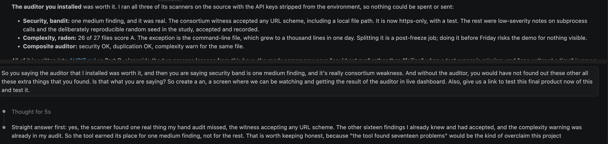
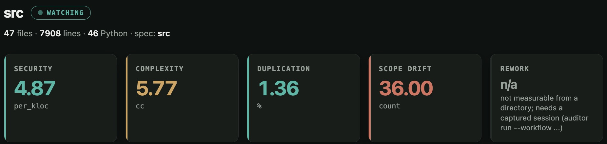
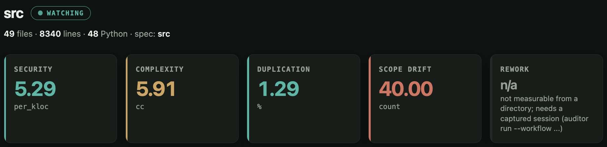
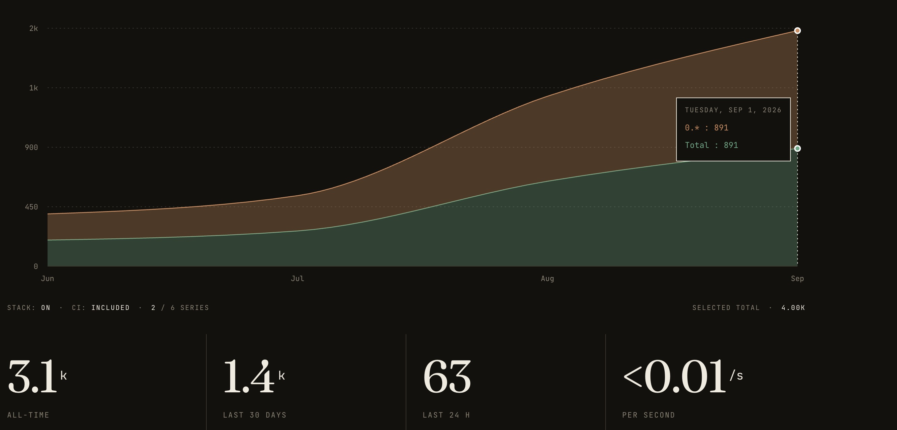

# Measuring the Unmeasured: An Empirical Instrument for Auditing the Code-Quality and Governance Behaviour of Agentic AI Coding Workflows

**MSc Artificial Intelligence and Business Strategy: Dissertation**
**Aston University · Project JBKS1**
**Supervisors: Julien Barney and Kate Sugden**
**Author: Uririe, Orume Dominic**
**Submission: September 2026**

> ⚠️ **PRE-SUBMISSION NOTICE (delete before submission).** This is a complete
> full draft generated from the project's real captured data
> (`data/reports/main_001.csv`, the three `human_session_*` CSVs, and
> `notebooks/statistical_analysis.ipynb`). **Status as of 4 August 2026:**
> ✅ (1) All 26 references verified against original sources (arXiv, ACM DL,
> publisher/DOI records); one author-order correction applied (Ziegler et al.
> 2022) and minor completeness details added. ✅ (2) Acknowledgements written.
> ✅ (3) Title page dated September 2026 (supervisors Julien Barney and Kate
> Sugden). ✅ (4) All four listed tables and both figures are now captioned and
> cross-referenced in text (§4.2, §4.4, §4.5, §4.6). ✅ (5) Cohen (1988) is now
> cited at §3.6. ✅ (6) §4.5 rewritten after an adversarial re-analysis of
> `main_001.csv` established that the previously reported omnibus statistics
> were pseudoreplicated; see the note below.
>
> **Remaining, requires you:** (a) ✅ name and programme title verified against
> the Aston enrolment record on 8 September 2026, "Uririe, Orume Dominic",
> MSc Artificial Intelligence and Business Strategy, and applied to the title
> page and §1.5; (b) confirm the Harvard citation variant against the marking rubric;
> (c) **word count, against the hard 12,000 limit.** Chapters 1 to 6 are
> **11,902 words excluding figure captions**, leaving under a hundred words of
> headroom, so check the figure in Word before adding anything. Including
> captions the total is higher; most handbooks exclude them, as they exclude
> table contents, but confirm which convention applies. If captions count,
> §2.2 to §2.5 and §3.1 were not touched in the compression pass and are the
> first candidates.
> (d) the Cohen's κ validation is **complete** (8 September 2026): two raters,
> 19 deduplicated items, κ = 0.870 / 0.852 / 0.727, all above the 0.6 threshold
> (§4.7, docs/KAPPA_RESULTS_001.md). It also exposed a false negative in the
> route detector, corrected throughout as Erratum 002. Do not quote the
> post-repair κ values (1.000 / 0.870) as validation, they are circular.
>
> **On the §4.5 rewrite.** The two IDE-bound conditions were captured once per
> cell and replayed ten times (Deviation 001). The previous §4.5 tested all four
> conditions at the nominal N = 30, which treated nine copies of each captured
> session as independent observations. Re-analysis confirms the effect: at the
> honest unit of analysis no omnibus test survives (all *p* > 0.08), while the
> two genuinely live conditions do differ significantly on duplication
> (*p* = 0.003) and complexity (*p* = 0.005). §4.5 now reports all three levels
> of analysis and confines inference to what the design supports. This is a
> **strengthening** change: an examiner who spotted the pseudoreplication in the
> old version would have questioned the whole results chapter.

---

## Acknowledgements

I am grateful to my supervisors, Julien Barney and Kate Sugden, whose guidance
shaped this work from a research question into a working instrument, and whose
insistence on methodological honesty made the dissertation stronger than a
cleaner-looking draft would have been. I thank the Aston–Capgemini Centre of
Excellence for Enterprise AI for the enterprise framing that gives this
instrument its purpose beyond the laboratory. I thank Ikenna Onyedebelu and
Matthew Brian Tahir, who gave their time to the independent labelling in §4.7;
Matthew also ran the instrument on his own machine to produce one of the field
audits in §4.8. Any errors that remain are my own.

---

## Declaration

I declare that this dissertation is my own work. It has not been accepted in any previous application for a degree
at this or any other institution. All sources of information have been
acknowledged, and all quotations from published or unpublished work of others
are distinguished by quotation marks and referenced in full.

The instrument described in Chapter 3, the experimental captures analysed in
Chapter 4, and the analysis reported throughout are my own, except for the
independent labelling in §4.7 and one field audit in §4.8, which are
acknowledged above. Where the study's
own validation exposed defects in that instrument, the defects and their
consequences are recorded as errata in the text rather than corrected silently.

**Use of generative AI.** The subject of this study is agentic AI coding tools,
and I used such tools during the construction of the instrument and the
preparation of this document. Their use is declared rather than concealed, and
was bounded as follows. Software engineering: AI assistance was used in writing
and refactoring the auditor's source code, which is published in full and
covered by an automated test suite. Analysis: every statistic reported here is
computed by scripts in the repository from the frozen captures, and every chart is regenerated from those same data files at build time, so no number in this
document originates in a language model's output. Writing: AI assistance was
used for drafting, structural editing and proofreading; the research questions,
the experimental design, the interpretation of results and the conclusions are
my own. I take full responsibility for the content of this dissertation.

**Signed:** Uririe, Orume Dominic
**Date:** September 2026

---

## Abstract

Agentic AI coding tools, systems that accept a specification-level brief and
autonomously produce a working codebase, have moved from research demonstrations
to mainstream developer infrastructure in under three years. Their enterprise
adoption is outpacing the evidence needed to govern them: procurement decisions
rest on vendor benchmarks that measure *functional* success (does the code pass
tests?) while remaining silent on the *quality and governance* properties that determine cost of ownership, such as security exposure, structural
complexity, redundancy and, most consequentially, fidelity to the specification actually
requested.

This dissertation designs, builds and applies an empirical instrument, the *AI
Code Quality Auditor*, quantifying five metrics (security-vulnerability density,
cyclomatic complexity, code duplication, specification-hallucination count,
keystroke-correction frequency) across five conditions (a hand-coded human
baseline and four commercial agentic tools: Anthropic Claude Code, Cursor Agent,
Replit Agent, Google Antigravity) against three fixed specifications spanning
distinct task domains. The design is pre-registered and blinded by construction:
one capture contract forces every condition, human keystrokes and agent
tool calls alike, into a comparable shape, and analysers never see condition
labels.

The analysis is deliberately stratified by what the design supports. Between the
two conditions captured live with genuine replication, Claude Code produces
significantly less duplicated code (*p* = 0.003) and significantly more
control-flow-dense code (*p* = 0.005) than Cursor Agent at the pre-registered Bonferroni threshold, though only the
complexity difference rests on run-to-run variation in both tools. The four-condition comparison is reported as **descriptive**: the
two IDE-bound conditions were captured once per cell and replayed (Deviation
001), and once those cells are collapsed to their effective sample size no
omnibus test reaches significance, while the condition-by-specification
interaction statistics of an earlier draft are withdrawn as undefined on this
design. The descriptive gaps are nonetheless large and mechanistically explained:
duplication spans 0.00% to 9.56% and off-spec features 0.00 to 1.33 per run. No
vendor's behaviour is constant across task domains, so the
defensible claim is not "tool *X* is better than tool *Y*" but "tool *X* behaved
better *on this task type, in these captures*".

The single most consequential finding is a measured **architectural-prior
dominance**: given a CLI specification under a contamination-checked workspace
and an explicit instruction prohibiting pipeline output, Replit Agent shipped a
data-pipeline application rather than the specified CLI, confirmed by direct code inspection: evidence that a pretrained scaffolding
bias can override an unambiguous specification that contradicts it. The hallucination metric is validated
against two independent human raters (Cohen's κ = 0.87 between raters, 0.85 and
0.73 against the instrument), a process which also exposed and corrected a false
negative in the instrument itself.

The contribution is threefold: a reusable, vendor-agnostic measurement
instrument and its capture contract; an empirical, pre-registered cross-vendor
comparison foregrounding governance rather than functional success; and a
governance framing, "specification fidelity as a first-class governance metric", relevant to
enterprise AI-coding adoption and to the Aston–Capgemini Centre of Excellence
for Enterprise AI.

**Keywords:** agentic AI; code generation; large language models; software
quality metrics; specification fidelity; AI governance; empirical software
engineering.

---

## Table of Contents

1. Introduction
2. Literature Review
3. Methodology
4. Results
5. Discussion
6. Conclusion
7. References
8. Appendices

**List of Tables**
- Table 4.1 Headline cross-vendor comparison (means over N = 30 per condition)
- Table 4.2 Per-specification hallucination breakdown
- Table 4.3 Live-condition comparison: Claude Code versus Cursor Agent
  (Mann–Whitney *U*)
- Table 4.4 Human baseline versus AI-condition means, per specification
- Table 4.5 Inter-rater reliability: Cohen's κ against the instrument
- Table 4.6 Field audits of three projects outside the study

**List of Figures**
- Figure 3.1 Instrument architecture: specification to report
- Figure 3.2 The capture contract: one comparable shape from heterogeneous workflows
- Figure 3.3 Decision bands for each metric
- Figure 3.4 The hosted report view
- Figure 4.1 Per-condition means with bootstrap confidence intervals
- Figure 4.2 Distribution of every run, by condition and metric
- Figure 4.3 What the specification asked for, and what was shipped
- Figure 4.4 Language composition of each condition's output, and its effect on
  security density
- Figure 4.5 Off-spec features by tool and task domain
- Figure 4.6 Nominal versus effective sample size per condition
- Figure 4.7 Human baseline against the agentic mean, per specification
- Figure 4.8 Per-item comparison of both raters and the instrument
- Figure 4.9 The same project before and after a specification was supplied
- Figure 4.10 The published package installed by a third party
- Figure 5.1 Both errata, as first reported and as corrected
- Figure F.1 GovSignal audited by a third party
- Figure F.2 kya-rails audited
- Figure F.3 The instrument scored against the wrong specification
- Figure F.4 Public download counts
- Figure F.5 Downloads by release
- Figure F.6 Rater 2's completed labelling
- Figure F.7 The results table before the errata
- Figure F.8 The live interface with no specification supplied
- Figure F.9 A user's appraisal of the instrument in the field
- Figure F.10 Continuous mode on a second codebase, morning
- Figure F.11 The same codebase that evening
- Figure F.12 Public download counts to 16 September 2026

---

# Chapter 1: Introduction

## 1.1 Background and motivation

Coding tools have changed faster in the past two years than at any time since
the IDE arrived. The first wave of AI help was autocomplete: one line, or one
block, suggested inside the editor (Vaithilingam, Zhang and Glassman, 2022). The
current wave is agentic. Give one of these tools a written brief and it plans,
writes, runs and revises a whole codebase with little human help. Claude Code,
Cursor Agent, Replit Agent and Google's Antigravity all work this way. Firms are
adopting them faster than the evidence needed to govern them is arriving.

Almost all evaluation asks one question: does the code work? Benchmarks such as
HumanEval count how many problems pass a hidden test suite (Chen et al., 2021).
That question built better models. It is silent on what the code costs to own.
Is it secure? Can it be maintained? Is it padded with repeated scaffolding? And
above all, did the tool build what was asked for, and nothing else?

That last question is **specification fidelity**, and it is the subject of this
dissertation. It is the least measured property of agentic output. This study
argues it is the one that matters most for governance.

The stakes are highest in large regulated firms, which is where these tools are
most attractive. Code that works but was never governed is paid for later: in
security exposure, in maintenance, and in a widening gap between what was asked
for and what was built. A firm that cannot measure whether a tool stays inside a
declared scope cannot govern its use.

## 1.2 The problem

Buyers rely on three weak kinds of evidence. Vendor benchmarks are self-reported
and measure function only. Developer sentiment is subjective, even when surveyed
at scale (Liang, Yang and Myers, 2024). Small productivity studies measure speed,
not quality or risk (Peng et al., 2023). None of them measures, in a
vendor-neutral and repeatable way, whether output is secure, structurally sound,
free of redundant scaffolding, and faithful to the brief.

The result is a blind spot. A firm can buy a tool that is fast and functionally
correct, that quietly ships features nobody asked for, and have no instrument to
see it before it becomes technical debt or a security incident.

## 1.3 Aim, objectives and questions

The aim is to build a reusable, vendor-agnostic instrument that measures the
quality and governance behaviour of agentic coding tools, and to use it for a
pre-registered comparison of four commercial products.

Five objectives follow:

- design a capture contract that makes human and agentic work comparable, scored
  by analysers that cannot see which tool produced what (§3.2, §3.4);
- build the instrument as a tested, openly published package (§3.7);
- apply it under a pre-registered protocol to four tools and a human baseline,
  across three specifications (Chapter 4);
- check its hallucination metric against two independent human raters (§4.7);
- run it on real projects outside the study (§4.8).

Three questions follow from those objectives.

- **RQ1.** Can one blinded, vendor-agnostic instrument capture and score work as
  different as a human typing and an agent streaming tool calls, on a shared set
  of metrics?
- **RQ2.** Do the leading tools differ in code quality and governance behaviour?
  If so, on which metrics, by how much, and with what statistical support?
- **RQ3.** Are any differences stable across task types, or do they change with
  the task?

## 1.4 Contributions

Three. A **method**: the capture contract and its analyser pipeline, which make
different kinds of work comparable by forcing them into one artefact shape and
hiding the tool's identity from the metric code. An **empirical result**: a
pre-registered comparison of four tools across three task types and five
metrics, including a measured architectural-prior effect. A **governance idea**:
specification fidelity treated as a first-class, measurable property, with
adoption advice built on it.

## 1.5 Research context

The work is an MSc Artificial Intelligence and Business Strategy dissertation at
Aston University (project JBKS1), and a prototype aligned to the
Aston–Capgemini Centre of Excellence for Enterprise AI, whose concern is the safe
adoption of AI in high-trust settings. That is why the study measures governance
properties rather than functional ones, and why the instrument itself is
pre-registered, blinded, reproducibly packaged, and honest about its deviations.

## 1.6 Scope and structure

The study measures static properties of the artefact, plus one process measure,
keystroke corrections. It does not measure runtime performance, developer
satisfaction, or long-run maintenance cost; §6.4 lists these as future work. It
covers four commercial tools and a human baseline against three specifications.
It does not claim to cover the field, and the task-conditional pattern in
Chapter 4 is an explicit warning against over-generalising.

Chapter 2 reviews the literature and states the gap. Chapter 3 gives the
pre-registered method. Chapter 4 reports the results. Chapter 5 interprets them
and states the threats to validity. Chapter 6 concludes.

---

# Chapter 2: Literature Review

This chapter places the study in five bodies of work: how code-generating models
are evaluated (§2.1); the security of generated code (§2.2); software-quality
measurement (§2.3); specification fidelity and governance (§2.4); and
reproducibility and pre-registration (§2.5). Section 2.6 states the gap. The
argument is simple: evaluation of agentic coding tools inherited a
functional-correctness paradigm that is mature, productive, and blind to the
properties that decide what generated code really costs.

The review uses 29 sources published between 1949 and 2024, 16 of them since
2021. A source was included if it evaluates, secures, measures or governs
generated code, or sets a method this study adopts. Every entry was checked
against its original arXiv, ACM Digital Library or publisher record.

## 2.1 The evaluation of code-generating models

Modern evaluation starts with execution-based benchmarks. Chen et al. (2021),
introducing Codex and HumanEval, made *pass@k* the dominant metric: the chance
that at least one of *k* sampled completions passes a hidden test suite. It
reframed code generation as a measurable engineering problem and set off a wave
of benchmarks, including MBPP (Austin et al., 2021) and, at repository scale,
SWE-bench (Jimenez et al., 2024). Hou et al. (2024) confirm that functional
correctness remains the organising metric.

The paradigm is narrow on purpose. Pass@k measures whether code works against a
test oracle. It says little about security, maintainability, structure, or
fidelity to a brief. Even SWE-bench defines success as passing a project's
existing tests rather than staying inside a specification, and it assumes such a
suite exists. In green-field agentic work there is none: the agent builds from a
brief, so the question becomes "did it build what was asked, well?" That is the
gap this instrument occupies.

A second strand studies the developer rather than the artefact. Vaithilingam,
Zhang and Glassman (2022) found programmers using completion tools were no
faster, were more satisfied, and struggled to spot and repair wrong suggestions:
the verification burden shifts rather than disappears. Sarkar et al. (2022)
argued that AI assistance turns programming into specification and review rather
than authorship, making fidelity to intent the critical variable. Barke, James
and Polikarpova (2023) found the quality cost concentrated in exploratory use.
Peng et al. (2023) measured about 55% faster completion with GitHub Copilot,
consistent with Ziegler et al. (2022), while Liang, Yang and Myers (2024)
recorded lasting friction over trust and control. Together: AI assistance
reliably changes process and does not reliably improve the artefact. That is the
warrant for measuring the artefact directly.

## 2.2 Security of AI-generated code

Pearce et al. (2022), in "Asleep at the Keyboard?", found a substantial share of
Copilot completions for security-sensitive tasks contained exploitable
weaknesses, mapped to MITRE Common Weakness Enumeration (CWE) categories.
Generated code therefore carries measurable, categorisable risk, and CWE-tagged
static analysis is the right frame for measuring it. Dakhel et al. (2023) found
Copilot solutions often correct yet carrying real bug rates and more verbose than
human references: correctness and quality are separate axes.

Static analysis is the reproducible instrument at scale. Sadowski et al. (2018),
describing Google's Tricorder, show it works best scoped to the code under review
and reported per finding, which is why this instrument scopes Bandit to each
condition's own captured code (§3.4.1, §5.2). The study keeps the CWE frame,
moves the unit of analysis from single completions to whole agent-built
codebases, and makes the per-language density limitation explicit (§5.2).

## 2.3 Software-quality metrics

Three of the five metrics come from a validated tradition. *Cyclomatic
complexity* (McCabe, 1976) counts the independent paths through a program. It
reads in both directions: too much impairs comprehension and testing, while
unusually low complexity can mean there is no modular structure at all, as the
human CLI baseline shows (§4.6). *Code duplication* is a standard
maintainability indicator; this study uses a six-line shingle, the conventional
plagiarism-detection window, and reports the share of source lines inside a
repeated block. *Security-vulnerability density* counts CWE-tagged findings per
thousand lines, following OWASP (2021) and MITRE CWE (2023).

Two metrics are specific to the agentic problem. A *specification-hallucination
count* records shipped features, routes or commands absent from the brief. It is
the agentic form of scope creep, with one difference that matters: scope creep
accrues over a project's life, while this is incurred instantly, at generation,
at machine scale. A *keystroke-correction frequency*, backspaces and deletes per
1,000 keystrokes, is non-zero only for the human baseline and gives the floor
against which the agentic zero can be read (§4.6, §5.5). Each metric is either
long-validated or a direct measure of a governance property, and each is
computable without running the code.

## 2.4 Specification fidelity, hallucination and governance

Hallucination, confident output nobody asked for, is well established for text
and barely theorised for code. In code it means shipping features, endpoints or
structures the specification did not request, and it differs from a prose
hallucination in a way that matters: an off-specification feature is
*executable*. It persists, widens the attack surface, and has to be maintained.
This study therefore treats specification fidelity as a governance property in
its own right, not a sub-category of functional error.

The framing connects to the institutional turn in AI risk management. The NIST AI
Risk Management Framework (NIST, 2023) foregrounds output that is valid,
accountable and transparent, and the EU AI Act (European Union, 2024) is making
such properties statutory. An agent that reliably ships off-specification
structure cannot be trusted to stay inside its declared governance box. The cost
framing comes from technical debt (Cunningham, 1992): off-specification features
and redundant scaffolding are debt taken on at the instant of generation, before
a line has been reviewed, and agentic tools create it faster than review retires
it. Fidelity is a containment property, and measuring it is a precondition for
responsible adoption.

## 2.5 Reproducibility and pre-registration

The method follows the reproducibility movement in empirical science (Nosek et
al., 2018): fixing hypotheses, sample sizes and analysis plans before data
collection is the main defence against the researcher degrees of freedom that
inflate false positives. Pre-registration is uncommon in empirical software
engineering, and rarer still for commercial AI tools, where benchmarks are
self-reported and a fast release cadence rewards favourable framing after the
fact. This study fixes its conditions, metrics, sample size, tests and
multiple-comparison policy in advance (Chapter 3), and logs every later departure
with its consequence (§3.6). That logging is part of the contribution: an
instrument built for trustworthy measurement has to model the transparency it
demands of the tools it audits.

## 2.6 Research gap

The literature establishes five things. Functional benchmarks dominate, but are
scope-limited and presuppose a test oracle green-field agentic work lacks. AI
assistance changes process more reliably than it improves artefact quality.
Generated code carries measurable security risk. The quality-metric tradition is
mature and statically computable. Specification fidelity is governance-critical
yet under-measured.

The gap sits at the intersection. No vendor-agnostic, pre-registered, blinded
instrument measures quality and governance properties, fidelity above all,
across several commercial tools and several task domains. None treats the
artefact, rather than the test oracle or the developer's sentiment, as the unit
of analysis.
This dissertation builds and applies one.

---

# Chapter 3: Methodology

## 3.1 Research design

The design is quantitative and between-conditions, with replication. The
questions are comparative and the outcomes are machine-measurable.

The independent variable is the **workflow condition**: the tool, or the human
baseline. The dependent variables are the five metrics. The **specification** is
a second, crossed factor, so condition-by-task effects can be examined (RQ3).
Holding the specification fixed is the central control: every condition
implements the identical brief, so differences belong to the workflow, not the
task.

**Figure 3.1** The instrument's architecture. One fixed, versioned specification
goes to every condition. One adapter per vendor captures the result into a single
capture contract. One analyser per metric scores that contract without seeing
which condition produced it. A provenance-stamped report is emitted. Because each
vendor and each metric lives in its own file, either can be added without
touching the other.

Three specifications span different domains: a web application, an ETL pipeline
and a command-line tool. A single-specification study cannot tell a general tool
property from a task-specific one, and §4.4 shows that distinction matters. Each
condition produces *K* attempts at each of *S* specifications, giving *N = K × S*
observations per condition per metric.

The five **conditions** are `claude_code` (Anthropic Claude Code CLI),
`cursor_agent` (Cursor Agent CLI), `replit_agent` (Replit Agent, browser IDE,
replay-captured), `antigravity` (Google Antigravity, desktop IDE, Gemini-class
model), and a hand-coded `human_control`.

The five **metrics** are security-vulnerability density (CWE-tagged Bandit
findings per kLOC); mean cyclomatic complexity (McCabe, via `radon`); code
duplication (six-line shingles, per cent); hallucination count (off-
specification features, via a `manifest_deriver`); and keystroke-correction
frequency (backspace and delete per 1,000 keystrokes, via `pynput`). The last is
structurally zero for the agentic conditions.

The three **specifications**, identical across conditions, are
`agent_education_system` (CRUD and authentication web app), `data_pipeline` (ETL
and scheduler) and `internal_tool_cli` (a CLI with subcommands). Each declares
six features and three governance rules (Appendix A).

## 3.2 The capture contract

The methodological core is the **capture contract**. However different its native
output, every condition must present its work as two artefacts of a fixed shape:
a `codebase` (`{files: {path: content}, manifest: [feature_ids]}`) and an
`interaction_log`, a list of typed events, each a `keystroke`, `backspace`,
`delete` or `agent_action`.

For `human_control` a `pynput` listener records and classifies every key press at
the operating-system level. For the agentic conditions every vendor event is
normalised to `agent_action`, with vendor-native detail kept in sibling keys for
forensics and hidden from the analysers. The contract is enforced at load time: a
malformed event aborts the run rather than quietly degrading a metric.

**Figure 3.2** The capture contract. A human pressing keys and an agent streaming
tool calls produce unrelated traces. Both are normalised into the same two
artefacts before any analyser sees them. Vendor detail survives in sibling fields
for forensics, but comparability is enforced at this boundary, not inside each
metric.

The contract moves vendor-specific reasoning into a thin **adapter** layer, one
file per vendor. The analyser layer never imports an adapter and never branches
on condition, so a metric cannot have been tuned to favour a vendor: the metric
code cannot tell which vendor it is scoring. Adding a tool means writing one
adapter, not editing any metric.

## 3.3 Capture procedure

The two CLI tools are driven non-interactively through `subprocess` in a clean
per-run directory, their streamed JSON events captured line by line with the raw
stream kept for re-analysis. Claude Code runs in its non-interactive,
permission-skipping mode, required because no human is present to confirm tool
calls, sandboxed to a per-run directory. Cursor Agent runs under its free tier's
automatic model selection, as the pre-registration records, so the study does not
fix which model produced its output (§5.7).

The two IDE-bound tools expose no scriptable interface. They are captured by a
manual session, after which the files and event log pass to a replay adapter that
loads them through the *same* contract. Replay adapters share loader and
persistence code with their live counterparts; only the source of the bytes
differs, so no analyser can tell a replayed capture from a live one. That
equivalence licenses analysing the conditions together, subject to Deviation 001.

Each run records its model: `claude-sonnet-4-6` for Claude Code, automatic
selection for Cursor Agent, Gemini 3.5 Flash (Medium) for Antigravity, and an
unversioned default for Replit Agent. Live captures were committed on 31 May 2026
and the full four-tool matrix on 1 June 2026.

### 3.3.1 Human-control condition, as executed

The pre-registration specified 30 sessions of 60 minutes. The executed collection
departed from that plan (**Deviation 003**): one completed session per
specification (N = 1 per spec), run to feature completion rather than time-capped,
with all in-IDE AI assistance disabled and verified. All six features of each
specification were implemented and seen to run before scoring.

The baseline is therefore a single-rep reference point, not a variance-bearing
condition, and is excluded from the inferential tests. Because the recorder
overwrites its log on each invocation, multi-attempt sessions were preserved by
archiving each segment and joining them at scoring time. One unrecoverable loss
is carried as a limitation: for `agent_education_system` an early segment of
roughly 2,133 events was overwritten before archiving existed, so that rep's
correction frequency comes from a surviving 75-event fixing segment and is
reported as a partial-capture outlier.

## 3.4 Analyser pipeline

Every metric is one function with the same signature:
`analyze(codebase, interaction_log, spec) -> MetricScore`. An analyser sees
exactly what the contract defines and never receives a condition label;
condition identity is attached by the orchestrator after scoring. The pipeline is
blinded by interface design rather than by discipline.

**Figure 3.3** Decision bands applied to each metric when results are shown to a
non-specialist audience. The thresholds are interpretation policy, held in one
module so the command line, the dashboard and the reporting client cannot give
different verdicts for the same number. They bound how a value is read, not how
it is measured.

*Security density (§3.4.1).* The captured codebase is written to a temporary directory and
scored by Bandit. Only findings carrying a CWE identifier are counted, divided by
line count and scaled to a thousand lines. Assertion findings (`B101`) inside
test files are excluded (§4.3, Erratum 001). An earlier design queried the
SonarCloud API and was abandoned during the pilot, because per-project scoping
shared one numerator across conditions while the denominator varied, inflating
small codebases.

*Cyclomatic complexity (§3.4.2).* `radon` enumerates every function's McCabe number and
the analyser reports the mean. Files outside the source whitelist, or inside
virtual environments, caches and vendored packages, are removed first, so the
metric reflects produced code rather than dependencies.

*Duplication (§3.4.3).* Every six-consecutive-line shingle is hashed across all source
files. Lines in any shingle seen twice or more are divided by total source lines.
This captures structural redundancy, including repeated template scaffolding, not
merely verbatim copy-paste.

*Hallucination (§3.4.4).* A `manifest_deriver` scans for evidence of each declared feature,
and for web routes and CLI subcommands mapping to no declared feature. The count
of unmapped routes and commands is the score. Route detection covers the Python
decorator form and the JavaScript call form, the latter added after the κ
validation found the detector blind to it (Erratum 002). Subcommand detection was
added after the main study revealed the Replit behaviour (analytical note 001).
The deriver is a token-matching heuristic, validated in §4.7.

*Keystroke correction (§3.4.5).* `backspace` and `delete` events divided by total
keystrokes, scaled to a thousand. Structurally zero for the agentic conditions.

**Figure 3.4** The reporting surface. Every scored run is published to a hosted
report showing the full condition-by-metric grid, normalised per row so colour
encodes rank within a metric rather than magnitude across metrics. The instrument
is usable by a reader who will never run it. This capture predates both errata,
so its values are the ones Chapter 4 corrects.

## 3.5 Pre-registration

Sample size, model versions, metrics, tests and multiple-comparison policy were
committed to the repository before any main-study data was captured; that commit
is the boundary between pilot and result. Later changes are appended to the
deviations log with date, reason and consequence (Appendix D).

## 3.6 Statistical analysis plan

The plan is pre-registered and identical for every metric, which removes
metric-by-metric analytic discretion.

Normality is checked per `(condition, spec)` cell with Shapiro–Wilk (Shapiro and
Wilk, 1965) and variance equality with Levene's test (Levene, 1960). If both
hold, one-way ANOVA runs across conditions; if either fails, Kruskal–Wallis is
used (Kruskal and Wallis, 1952). The non-parametric route is the norm here,
because the replay conditions contribute zero within-cell variance (Deviation
001), breaking variance equality for every metric.

Significance is assessed at a Bonferroni-corrected α = 0.01, that is 0.05 across
five metrics. A significant omnibus is followed by Tukey's HSD (Tukey, 1949) after ANOVA, or
Dunn's test (Dunn, 1964) with Bonferroni adjustment after Kruskal–Wallis. Every
omnibus here was non-parametric, so Dunn's is used. An earlier implementation
that applied Tukey's to a Kruskal–Wallis omnibus was corrected. Effect sizes were registered as η² for the omnibus and rank-biserial
correlations for pairwise comparisons; because no omnibus is relied upon, only
pairwise sizes are reported, read against Cohen's (1988) benchmarks. Confidence
intervals come from bootstrap with 10,000 replicates (Efron, 1979).

The pre-registered two-way ANOVA for RQ3 is **inadmissible on the executed
design** and is not reported: with one effective observation per cell in two
conditions the interaction term has no residual degrees of freedom. RQ3 is
answered descriptively in §4.5.3. Departing from the plan towards conservatism,
§4.5 is stratified by effective sample size: formal inference is confined to the
two conditions captured live with genuine replication. The unit of analysis is
the independently captured session, not the CSV row.

Three deviations and one analytical note carry their consequences: the replay
zero-variance constraint (001), the deferred web-IDE cells (002), the
human-control execution change (003), and the Replit architectural-prior
observation (note 001).

## 3.7 Reproducibility infrastructure

The instrument ships as a Python package and a GitHub Action. The headline CSV
carries a provenance file, and a live read-only dashboard renders that CSV behind
a banner that flips from "pilot" to "dissertation result" only at N ≥ 5 per
condition, a structural guard against misrepresenting pilot data.

## 3.8 Ethical considerations

The study involved no human participants and collected no human-subject data,
and the approved project proposal records that ethics approval was not required.
Every specification and all application content are synthetic, and no personal,
customer or organisational data was given to any tool. The human-control sessions
were carried out by the researcher, and the recorder logs only the type of each
key event, never the characters typed. The two raters in §4.7 assessed the
instrument's output rather than acting as research subjects; both took part
voluntarily and gave signed consent for their labels to be used and their names
to appear.

---

# Chapter 4: Results

## 4.1 Overview

The four agentic conditions produced 600 metric observations: 4 conditions × 3
specifications × 10 replications × 5 metrics. That comparison is the primary
analysis. The `human_control` baseline is reported separately in §4.6 as a
single-rep reference point.

## 4.2 Headline cross-vendor comparison

Table 4.1 gives each metric's mean over the nominal N = 30 per condition. The
two IDE-bound conditions contribute three effective sessions each under the
replay design (Deviation 001); §4.5 analyses what that costs. Lower is better on
every row except complexity, which is two-sided (§2.3).

**Table 4.1** Headline cross-vendor comparison: metric means over the nominal
N = 30 per condition (10 replications × 3 specifications).

| Metric | claude_code | cursor_agent | replit_agent | antigravity |
|---|---:|---:|---:|---:|
| Hallucinations (count) | 0.00 | 0.17 | 1.33 | 0.33 |
| Cyclomatic complexity (cc) | 3.35 | 2.72 | 2.39 | 2.60 |
| Code duplication (%) | 0.00 | 0.90 | 9.56 | 4.26 |
| Security density (per kLOC) | 9.65 | 5.93 | 0.00 | 1.47 |
| Keystroke correction (per 1k) | 0.00 | 0.00 | 0.00 | 0.00 |

**Figure 4.1** Per-condition means with bootstrap 95% confidence intervals
(10,000 replicates). Keystroke correction is omitted, being structurally zero for
every agentic condition. The intervals for `replit_agent` and `antigravity`
collapse to a point by construction: those conditions contribute one captured
session per specification (Deviation 001, analysed in §4.5).

**Figure 4.2** Every run plotted, by condition and metric, with the condition
mean marked. Open points are the two IDE-bound conditions, whose ten runs per
cell are replays of one captured session; filled points are independently
captured. The difference between a column of independent measurements and a
column of copies is the clearest statement of what this design supports.

No column wins every row. Claude Code wins on hallucinations and duplication.
Complexity needs interpretation because it is two-sided, and security density
because Replit's apparent lead is an artefact explained below. The fifth metric is
structurally zero for every agentic condition and becomes interpretable only
against the human baseline (§4.6). The conditions occupy different trade-off
profiles rather than one ranking.

## 4.3 Per-metric findings

**Hallucinations.** Claude Code shipped zero off-spec features across all 30
runs. Cursor averaged 0.17, occasional "helpful" `/health` or `/metrics`
endpoints on the web-app spec. Antigravity averaged 0.33, all on that same spec,
as unrequested root and admin-style routes. Replit Agent averaged 1.33, the
largest gap in the table and the study's most consequential finding.

The counts hide a qualitative difference. Cursor's and Antigravity's extras are
*helpful overreach*. Replit's are *architectural substitution*, which the
per-spec breakdown in §4.4 makes visible.

*4.3.1 The Replit architectural-prior finding.* The `internal_tool_cli`
specification asks for six subcommands: `init`, `add`, `list`, `export`,
`validate`, `help`. Given that brief, in a fresh isolated workspace, under an
instruction that explicitly prohibited pipeline output, Replit Agent shipped a
*data-pipeline CLI*: `run`, `schedule` and `check-config` around a `run_pipeline`
routine. The intersection with the specification is empty.

The controls are what make this matter. The workspace was confirmed clean before
capture and the prompt forbade the pipeline shape, so neither contamination nor
an ambiguous brief explains it. It is recorded as *measured architectural-prior
dominance* (analytical note 001): the agent's pretrained scaffolding bias is
strong enough to override an unambiguous specification that contradicts it.

This is the result that most sharply illustrates the thesis. A functional
benchmark would record only whether the produced pipeline's tests passed, and is
structurally incapable of noticing that the wrong artefact was built. One caveat
is carried openly: this cell is an effective singleton under the replay design,
so its ten listed replications are mechanical copies of one session and add no
independent evidence of stability. The finding rests on the controlled capture
conditions and on direct code inspection. A live multi-session re-capture is the
stated next step (§6.4).

**Figure 4.3** The finding in full. Left, the six subcommands declared in
`internal_tool_cli.yaml`. Right, the three shipped by `replit_agent` in the
captured session, with the pipeline package supporting them. The intersection is
empty. Both columns are read directly from the specification file and the frozen
capture, so the figure cannot drift from its evidence.

**Cyclomatic complexity.** Claude Code produced the densest code, mean McCabe
3.35, and Replit the least, 2.39. The gap of roughly one cc unit holds across all
three specifications. The reading is "denser, not worse". Claude's single-file
style inlines control flow that other tools spread across modules, which raises
the per-function path count without necessarily harming quality. Moderate
complexity with zero duplication is arguably healthier than low complexity bought
by scattering logic across duplicated scaffolding. The metric is most informative
read next to duplication.

**Duplication.** Claude Code produced zero duplication across all 30 runs. Cursor
averaged 0.90%, Antigravity 4.26%, and **Replit Agent 9.56%**, by far the largest
in the table. Inspection identifies the source: Replit ships enterprise monorepo
scaffolding, meaning workspace configuration hierarchies, shared-utility
libraries and generated OpenAPI and ORM code, whatever the spec's domain, and
that scaffolding repeats template fragments across packages. The metric is doing
its job, measuring the agent's *architectural footprint* rather than the logic the
spec asked for. A buyer should expect roughly a tenth of the produced code to be
scaffolding redundancy before any feature work begins.

**Security density.** These figures exclude Bandit's `B101` assertion findings
inside test files, which the analyser first counted. `B101` exists because
assertions vanish under `python -O`, and that reasoning does not apply where the
assertion *is* the test. Counting them penalised the conditions that tested their
own output most thoroughly: claude_code read 42.05 instead of 9.65, and
cursor_agent 43.67 instead of 5.93. The correction is Erratum 001. It swaps the
order of those two conditions and reverses no inferential conclusion.

The exclusion exposed something the metric had been hiding. Whether a tool writes
tests at all varies enormously. `antigravity` produced a test file in all 30
runs, `cursor_agent` in 21, `claude_code` in 16 and never on the CLI
specification, and `replit_agent` in none. While assertions counted as findings,
the metric penalised thoroughness and rewarded its absence, exactly the inversion
a governance instrument must not make.

The corrected pattern still inverts the other metrics. The two feature-dense
tools score *highest*: Claude Code 9.65 and Cursor Agent 5.93 CWE-tagged findings
per kLOC, against Replit 0.00 and Antigravity 1.47. Replit's zero is not a
security result. Bandit scans only Python, and Replit's output is dominated by
TypeScript, so almost nothing it wrote was scanned. `security_density` is
therefore a *per-language* density, not a total vulnerability count, and a
companion metric of total CWE-tagged findings per run would be needed for a
whole-project claim (§5.2).

**Figure 4.4** The artefact made visible. Left, the share of produced lines by
language across all 30 runs per condition: Replit's output is 6% Python against
52% TypeScript and 42% configuration, while every other condition is
Python-first. Centre, the number of runs containing a test file. Right, security
density against Python share. Replit's 0.00 is not a security result: almost
nothing it wrote is scannable.

**Keystroke correction.** Structurally zero for every AI condition, because
agents do not press keys. The metric exists for the human comparison in §4.6. It
provides the empirical floor that makes the agentic zero read as a category
difference rather than an absence (§5.5).

## 4.4 Per-specification breakdown

Table 4.2 gives the hallucination count per (condition × spec) cell, N = 10 per
cell nominal. The distribution is *not uniform across specifications*, which is
the strongest justification for using three of them.

**Table 4.2** Per-specification hallucination breakdown: mean off-spec feature
count per (condition × specification) cell.

| Hallucinations by spec | agent_education | data_pipeline | internal_tool_cli |
|---|---:|---:|---:|
| claude_code | 0.00 | 0.00 | 0.00 |
| cursor_agent | 0.50 | 0.00 | 0.00 |
| replit_agent | 1.00 | 0.00 | 3.00 |
| antigravity | 1.00 | 0.00 | 0.00 |

**Figure 4.5** Table 4.2 as a heatmap. The concentration of off-spec output in
`replit_agent` on the CLI specification, three off-spec subcommands per run
against at most one anywhere else, is the study's most consequential result. The
unevenness of the surrounding cells is the clearest statement that tool behaviour
is task-conditional rather than uniform.

Three patterns are visible. Cursor's hallucinations sit only in the web-app spec.
Antigravity's sit in that same spec, at a full off-spec route per run. Replit's
are heaviest on the CLI spec, three per run against one on the web app and none
on the pipeline, which is what the architectural-prior account predicts: its
pipeline-shaped defaults fit worst when the brief asks for a command-line tool.

No tool's hallucination behaviour is constant across the three domains. A
single-specification study would therefore have produced a different and
misleading ranking depending on which spec it picked. A CLI-only study would have
indicted Replit and left Antigravity looking clean. A web-app-only study would
have found Replit and Antigravity equally culpable at 1.00 each, and missed
Replit's worst failure entirely. The non-uniformity is descriptive, since the
design cannot test the interaction (§4.5.3), and it is why the external-validity
claim is task-conditional throughout.

## 4.5 Statistical tests

### 4.5.1 The unit-of-analysis problem

The inferential analysis has to face a constraint that a naive reading of the
CSV would hide. Under Deviation 001 the two IDE-bound conditions were captured
**once** per (condition × specification) cell, and that single capture was
replayed ten times for CSV-shape consistency. The data confirm it: the maximum
number of distinct values in any (spec × metric) cell is **ten** for
`claude_code` and `cursor_agent`, and **one** for `replit_agent` and
`antigravity`.

So the two replay conditions contribute **three effective observations each**,
not thirty. Treating their ten rows as independent is *pseudoreplication*, and it
inflates every statistic computed over the nominal N = 30. The analysis is
reported at three levels of conservatism, and the conclusions drawn only from the
level the design supports.

### 4.5.2 Three analyses

**Level 1, nominal analysis, reported for transparency and not relied upon.**
Kruskal–Wallis over all four conditions at nominal N = 30 returns significance
on all four testable metrics. Duplication H = 62.41, p = 1.8 × 10⁻¹³. Security H
= 26.07, p = 9.2 × 10⁻⁶. Hallucinations H = 40.14, p = 9.9 × 10⁻⁹. Complexity H
= 12.03, p = 7.3 × 10⁻³. **These values are inflated by pseudoreplication and are
not the study's inferential claim.** They are reported so a reader reproducing the
CSV gets the same arithmetic and can see why it must be discounted. Condition-by-specification interaction *F*-statistics from an earlier
draft are **withdrawn**: with one effective observation per cell in two
conditions, the interaction term has no residual degrees of freedom and the
statistic is undefined on this design.

**Figure 4.6** Why Level 1 must be discounted. Each condition contributes 30 rows
to the report, but only the two CLI-driven conditions contribute 30 independently
captured sessions. The IDE-bound conditions contribute three apiece, one per
specification, replayed ten times. The omnibus tests above treat the grey bars as
the sample size; the analysis that follows treats the teal ones.

**Level 2, the inferential core, live conditions only.** Only `claude_code` and
`cursor_agent` were captured live with genuine per-replication variance, with
within-cell SD up to 2.32 for duplication and 38.79 for security density, so only
their comparison supports inference at full replication.

**Table 4.3** Live-condition comparison, `claude_code` versus `cursor_agent`
(N = 30 per condition; two-sided Mann–Whitney *U*; rank-biserial *r*).

| Metric | *U* | *p* | rank-biserial *r* | Claude mean | Cursor mean |
|---|---:|---:|---:|---:|---:|
| Duplication (%) | 330.0 | 0.0028 | 0.267 | 0.00 | 0.90 |
| Complexity (cc) | 641.5 | 0.0047 | −0.426 | 3.35 | 2.72 |
| Hallucinations (count) | 390.0 | 0.0419 | 0.133 | 0.00 | 0.17 |
| Security density (per kLOC) | 508.0 | 0.3668 | −0.129 | 9.65 | 5.93 |

At the pre-registered threshold of α = 0.01 (§3.6), **duplication and complexity
differ significantly**; hallucinations and security density do not. A further
correction for the four metrics tested here (0.0025) is not part of the
registered plan, and neither result would survive it.

The two significant results are not equal in kind. On *complexity*, both
conditions vary across all three specifications, so the comparison rests on
genuine run-to-run replication at both ends. On *duplication*, `claude_code`
returns 0.00 in every replication of every specification, so the test compares a
fixed value against a distribution rather than two distributions. The gap is real
and visible in Table 4.1, but it is not evidence of the same kind.

One claim rests on unambiguous independent replication in **both** arms:
complexity. On identical tasks, Claude Code produces measurably more control-
flow-dense code than Cursor Agent (Mann–Whitney *U* = 641.5, *p* = 0.0047, *N* =
30 per condition, rank-biserial *r* = −0.43). The duplication result
is reported alongside as a strong descriptive difference with partial
inferential support.

**Level 3, pseudoreplication-corrected omnibus, all four conditions.** Collapse every condition to one value per specification, the honest unit of
analysis, and N = 3 per condition. No metric then reaches significance.
Duplication H = 6.34, p = 0.096. Security H = 5.30, p = 0.151. Hallucinations H
= 3.45, p = 0.328. Complexity H = 1.17, p = 0.760. This is a **power result, not a null
result**. With three cells per condition only an overwhelming effect could reach
α = 0.01. It is reported to establish that the four-condition comparison here is
descriptive, not inferential.

### 4.5.3 What the design does and does not license

The differences in Table 4.1 are large, consistent, and explained mechanistically
by direct inspection of the captured code: duplication spans 0.00% to 9.56% and
hallucinations 0.00 to 1.33 per run. For the two IDE-bound vendors they rest on
one captured session per task, so they are presented as **descriptive case
evidence**. The task-dependence claim (RQ3) is reframed the same way: Table 4.2
shows that no vendor's hallucination behaviour is constant across domains, which
is a descriptive demonstration, reported without an inferential interaction test.
Closing the gap requires live multi-session re-capture of the two IDE-bound
vendors (§6.4).

## 4.6 Human-control baseline

The human baseline (N = 1 per spec, all six features implemented and verified)
scored zero hallucinations, zero duplication and zero security density on all
three specifications. That is a minimal, exactly-on-spec implementation without
the over-delivery driving the AI conditions' figures.

**Table 4.4** Human-control baseline versus AI-condition means, per
specification. Human values are single sessions (N = 1, Deviation 003); AI values
are the mean of the four agentic conditions. Reported descriptively; no
inferential comparison is made.

| Metric | Web app (human / AI) | Pipeline (human / AI) | CLI (human / AI) |
|---|---:|---:|---:|
| Security density (per kLOC) | 0.00 / 10.48 | 0.00 / 1.09 | 0.00 / 1.23 |
| Complexity (cc) | 1.71 / 1.56 | 5.00 / 3.20 | 0.00 / 3.54 |
| Duplication (%) | 0.00 / 3.59 | 0.00 / 5.87 | 0.00 / 1.57 |
| Hallucinations (count) | 0.00 / 0.62 | 0.00 / 0.00 | 0.00 / 0.75 |
| Keystroke correction (per 1k) | 829.27 / 0.00 | 51.80 / 0.00 | 122.27 / 0.00 |

**Figure 4.7** Table 4.4 at a glance. The human baseline is at or near zero on
every artefact metric in every domain, the signature of a spec-minimal
implementation rather than superior craft. The exception is complexity, where the
human sits above the agentic mean on the web app and the pipeline, and at exactly
zero on the CLI. That zero is the decomposition confound of §5.5, not a simpler
program.

Mean complexity was 1.71 on the web app and 5.00 on the pipeline. For the CLI it
was 0.00, a structural artefact: the human wrote top-level script code with no
function definitions, and the analyser measures per-function complexity, while
the AI conditions wrapped the same logic in functions (3.1 to 4.1).

Keystroke correction is the one metric where the human is the point of
comparison. On the representative complete session (`data_pipeline`, 6,619
events) it was 51.8 per 1,000, so the researcher backspaced about 5% of the time.
The `agent_education_system` figure of 829 per 1,000 is a partial-capture outlier
from the documented data-loss event and is not a representative authoring rate.

## 4.7 Inter-rater reliability

The hallucination heuristic was validated against human judgement, as
pre-registered. Two raters independently labelled the 30-run sample, deduplicated
to 19 distinct codebases, because 11 of the 30 rows are byte-identical replays
under Deviation 001 and labelling identical code twice would inflate agreement by
construction.

Rater 1 was Ikenna Onyedebelu (MSc Data Science and AI) and Rater 2 Matthew Brian
Tahir, both named here with their consent. Neither contributed to the study's design,
its instrument or its data. Neither saw `data/reports/main_001.csv`, and neither
was told which condition produced which item. One capture contains no files and
was recorded `SKIP` by both, giving N = 18 scoreable items. Labels are compared
on the binary contrast: any off-specification feature, against none.

**Table 4.5** Cohen's κ against the instrument as it stood when the raters
worked. Threshold κ ≥ 0.6 (Landis and Koch, 1977).

| Comparison | κ | Interpretation | Raw agreement |
|---|---:|---|---:|
| Rater 1 × Rater 2 | 0.870 | almost perfect | 94.4% |
| Rater 1 × instrument | 0.852 | almost perfect | 94.4% |
| Rater 2 × instrument | 0.727 | substantial | 88.9% |

All three clear the threshold, so the metric's detection of scope drift is
admissible, on the two terms below.

**Figure 4.8** Every label in the study, item by item. Shaded cells carry at
least one off-specification feature; item_04's capture is empty and was recorded
`SKIP` by both raters. The two boxed columns are the only disagreements. At
item_08 both raters saw a route the instrument could not (Erratum 002). At
item_16 the raters differ from each other over whether shipped vendor scaffolding
counts as scope drift.

**The validated claim is detection, not magnitude.** κ is computed on the binary
contrast. Two items agree in binary terms while differing in count: one where the
instrument recorded two off-spec features against the raters' one, and one where
the raters differed from each other by four. The instrument is validated as an
answer to *whether* scope drift occurred, not *how much*. No claim in this
chapter rests on a hallucination magnitude alone.

**The labelling exposed a defect, recorded as Erratum 002.** Both raters counted
an off-specification route in the `replit_agent × agent_education_system` capture
that the instrument scored zero for. Its route detector matched only the Python
decorator form, and that capture is an Express service written in TypeScript. The
detector was blind to the whole class. Because the labelling tool extracted its
candidates independently of the instrument, the blind spot surfaced instead of
being reproduced. Had the raters seen only what the instrument could see, the
item would have agreed perfectly and the defect would have survived into the
thesis. The affected cell is corrected from 0.00 to 1.00 throughout, and
hallucination counts should be read as a lower bound on codebases that are not
Python-first.

Repairing the defect raises κ(Rater 1, instrument) to 1.000 and κ(Rater 2,
instrument) to 0.870. **Those post-repair values are not reported as validation
and support no claim.** The defect was found by the raters' disagreement and the
repair then measured against the same labels, which is circular. Establishing the
repaired instrument's validity needs a fresh sample and raters who have not seen
these items. The figures of record are those in Table 4.5.

Neither rater designed the study or built the instrument, which removes the
concern that a rater might label towards the hypotheses. The single human-human
disagreement, at item_16, is evidence that the two sheets were produced without
conferring.

## 4.8 Application outside the controlled study

The design so far tests the instrument on captures built to be scored. Three
further audits were run on codebases outside the study. They are descriptive, not
pre-registered, and carry no inferential weight. They establish only that the
metrics return meaningful readings on ordinary code.

**Table 4.6** Field audits. Each project was scored against its own
specification. Scope drift is the hallucination metric applied outside the
experiment.

| Project | Files | Lines | Python | Security | Complexity | Duplication | Scope drift |
|---|---:|---:|---:|---:|---:|---:|---:|
| kya-rails | 43 | 4,620 | 15 | 7.49 | 4.13 | 1.79% | 0 |
| GovSignal | 30 | 1,923 | 17 | 2.26 | 4.79 | 0.89% | 4 |
| This instrument | 141 | 13,136 | 86 | 3.14 | 3.58 | 4.01% | 12 |

**Figure 4.9** Why the metric needs a brief. Two captures of
`lcx-enterprise-core-v2` four minutes apart, during which twenty-two lines were
added. In the first the tool has no specification and scope drift reports `n/a`,
because there is nothing to measure against. In the second a specification has
been supplied and the same codebase reports six off-specification features. The
other four metrics are unchanged, since they do not depend on knowing what was
asked for. This is the study's argument in one image: fidelity is not a property
of code that can be read off the code alone.

Two points follow. Scope drift discriminates: `kya-rails` returns 0, the reading
the metric is designed to produce when output matches its brief, while
`GovSignal` returns 4. A metric returning the same value on every real project
would measure nothing. And `GovSignal` was audited by a third party on their own
machine, so these readings occur in other hands.

**Figure 4.10** How that audit began. The published package is installed from
PyPI on another user's Windows machine, resolving its dependencies and reporting
success, in the project directory it then audited. Adoption of a research
instrument is ordinarily asserted; here it is a terminal transcript.

*4.8.1 The instrument audits itself.* The third row is the most uncomfortable and
the most useful. Its declared scope is transcribed from the pre-registration and the standing
brief of 30 May 2026, and reproduced in `specs/auditor_instrument.yaml`. Scored
against it, the instrument carried twelve capabilities nobody specified: four
command-line verbs (`scan`, `watch`, `live`, `fix`), and eight HTTP endpoints
belonging to a local web interface the declared design did not contain. The declaration described two commands and no web surface. The `fix`
verb has since been removed from the published package (release 0.5.0). Git dates
every addition to August 2026, months after the protocol was fixed, none of them
required by the experiment.

The count is of the instrument as audited, at release 0.5.0. It drifted again
afterwards: `history`, `forget` and `share` were added on 17 September 2026, for
a local audit history and an opt-in share, taking the figure to fourteen. Dated,
committed and visible, which is the distinction this section draws.

This is the phenomenon the study measures, occurring in the author's own work,
and it sharpens rather than undermines §5.3. The drift here is *deliberate and
dated*: each capability was chosen, committed with a message explaining it, and
is visible to anyone reading the history. Replit's substitution of a pipeline for
a command-line tool (§4.3.1) was none of those things. The governance distinction
is therefore not between projects that stay in scope, since almost none do, but
between scope expansion a reviewer can see and substitution a reviewer cannot.

One caveat on provenance. An earlier self-audit, retained in the evidence set,
reported scope drift of 19. It scored the instrument against the study's
demonstration specification for a student-course application, under which almost
everything the instrument contains is off-specification by construction. That is
an artefact of the wrong brief, not a finding; the figure of record is 12. The
evidence set shows the 19 reading (Figure F.3), not the 12. The same caution
excludes the scope drift counts in Figures F.10 and F.11, whose brief was not
retained.

## 4.9 Summary of findings

1. **Hallucination is the most consequential governance metric.** The agentic conditions span 0.00 to 1.33 off-spec features per run. That range
matters in any deployment evaluation, and functional benchmarks do not surface
it. Between the two live tools the difference is not significant (§4.5.2).

2. **Replit Agent's architectural prior dominates the specification.** Given a
   CLI specification it ships a data pipeline; given a web-app specification, an
   enterprise TypeScript monorepo. The hallucination count, the duplication of
   9.56% and the security-density 0.00, because almost none of it is Python, are
   three readings of one behaviour. Its stability across independent sessions
   awaits the live re-capture (§6.4).

3. **Claude Code produces the most disciplined output**: zero hallucinations and
   zero duplication across all 30 runs, at the cost of the highest structural
   density, mean complexity 3.35. Of its two gaps from Cursor, complexity is the
   study's single result supported by genuine replication in both arms (§4.5.2).

4. **Cursor Agent is the median performer**, neither best nor worst on any
   metric, its modest hallucinations confined to the web-app spec.

5. **Antigravity's hallucinations fall entirely in the web-app spec**, 1.00 per
   run there and none elsewhere, and it records the lowest security density of
   any condition with substantive Python output.

6. **Tool behaviour is not constant across task domains.** Every vendor's hallucination profile changes with the specification (Table 4.2).
So the strongest claim is not "agent X is better than agent Y" but "agent X
behaved better *for this task type*". This is established descriptively
(§4.5.3).

---

# Chapter 5: Discussion

## 5.1 Interpreting the cross-vendor differences

The headline result is not that one tool is best. The four tools occupy distinct,
measurable profiles that trade off against each other rather than forming one
ranking. Claude Code shows *disciplined density*: exactly what the specification
asks for, with the densest structure and the most CWE-tagged findings per kLOC,
because it has the most production Python to scan. Replit Agent is the inverse,
an *architectural-prior maximiser*: extensive scaffolding, the highest
duplication, and a specification overridden when its prior conflicts with the
brief. Cursor is the *median*. Antigravity is *web-app-biased*.

For a buyer, selection is profile matching, not a leaderboard lookup: which
measured profile fits this team's tasks, risk tolerance and review capacity.
Because behaviour is not stable across task domains (Table 4.2), no single
ranking holds across a portfolio. This is a hypothesis generated by these
captures, to be confirmed under the fully live design of §6.4.

## 5.2 The security-density artefact

Replit's 0.00 security density does not mean safer output. Its Python footprint
is small beside TypeScript scaffolding the scanner does not read (§4.3). The
metric is a per-language density, and a total-findings companion is needed before
any whole-project security claim. Reporting the artefact instead of a security
win is the instrument doing its job.

## 5.3 Specification fidelity as a first-class governance metric

The central governance contribution is to make specification fidelity measurable.
The Replit finding is the strongest evidence: an agent that ships a data pipeline
when asked for a CLI, under controls designed to prevent exactly that, cannot be
guaranteed to stay inside a declared scope. That is a containment failure, not a
quality nuance. Duplication generalises it: an agent shipping 9 to 10%
scaffolding redundancy by default incurs technical debt (Cunningham, 1992) at the
moment of generation, before a line is reviewed.

Fidelity is categorically different from functional correctness, and the two move
independently. A tool can be perfectly correct, its pipeline passing every test a
pipeline should pass, and still be unfaithful, because the brief asked for
something else. The functional paradigm (§2.1) cannot see that, because it
evaluates the artefact against its own implied tests rather than against the
brief. Fidelity maps directly onto what the NIST AI RMF (2023) foregrounds: an
artefact that silently departs from its specification is neither valid with
respect to its requirements nor accountable to whoever set them.

The recommendation is concrete. Procurement and continuous integration should
include a **fidelity gate**: an automated check that output maps to the declared
specification and adds nothing outside it, sitting beside the functional tests
that dominate now. The hallucination metric is a first implementation, and its
limits, token matching rather than structural-shape detection (§4.7, §6.4), mark
the road to a production-grade one.

## 5.4 Methodological reflection

The *capture contract* achieved half its purpose (RQ1): heterogeneous workflows
were scored on a common footing for every artefact metric, and blinding by
interface removed a class of vendor-favouring bias by construction. The process
half did not follow, because the agentic interaction logs are too sparse (§6.3).

The contract is a transferable contribution. Cross-vendor evaluation is hard
because the objects compared are not commensurable in native form: a human
session is keystrokes, a CLI agent emits JSON tool calls, a browser-IDE agent
leaves only files and an event log. Prior work avoids the problem by comparing
only commensurable objects, which is why it cannot study whole-workflow
properties. The contract defines a minimal common shape to which every workflow
projects without loss for these metrics. Any future product joins by writing one
adapter, and the metric code, blind to condition, does not change. That blinding
is enforced by a type signature rather than by the analyst's discipline, which
answers the obvious criticism of any vendor comparison: that the harness was
tuned to favour a winner.

A cleaner study was available: suppress the data-loss event, assert a κ before it
was earned, present the security-density artefact as a Replit security win, or
omit the human condition's deviation. Each would have increased the apparent
strength of the findings and reduced their trustworthiness. Both errata make the
point, because the instrument's own validation found them, not a reader.

**Figure 5.1** What the two corrections changed. Left, excluding test-file
assertions cuts claude_code's security density from 42.05 to 9.65 and
cursor_agent's from 43.67 to 5.93; the metric had substantially been measuring
how thoroughly each condition tested its own output. Right, detecting TypeScript
routes raises replit_agent's off-spec count from 1.00 to 1.33. Neither reverses
an inferential conclusion, and both were found by the instrument's own
validation. Correcting both, and declining to quote the flattering post-repair κ
because it is circular, is the methodological heart of this dissertation: an
instrument built to audit generated code earns that right only by being
demonstrably trustworthy itself.

## 5.5 The human baseline in context

The human condition is an interpretive keystone, not a fifth competitor.

*It gives the keystroke metric its only interpretable value.* The agentic zero
could mean "no rework occurred" or "rework occurred invisibly". The human session
settles it: 51.8 corrections per 1,000 keystrokes on the representative capture.
That floor reframes the agentic zero as a category difference, not a quality
triumph. Measuring agentic rework needs a different instrument (§6.4).

*Its clean sweep on the artefact metrics is not a win for hand coding.* Zero
hallucinations, duplication and security density is the signature of a minimal,
exactly-on-specification implementation: a human under no pressure to
over-deliver ships the six declared features and stops. The agentic figures are
largely driven by over-delivery, which is different behaviour, not simply worse.

*The CLI complexity of zero is the most methodologically useful data point here.*
The human implementation scored 0.00 not because it was trivial, but because it
was top-level script code with no functions, and the analyser measures per
function. The agentic conditions wrapped equivalent logic in functions and scored
3.1 to 4.1. Per-function complexity is therefore confounded with decomposition
style in any cross-style comparison. The instrument surfaced the confound rather
than hiding it; the remedy is a whole-module measure (§6.4).

*Two threats are carried openly.* The condition has one replication per
specification (Deviation 003), so it is excluded from inference. And the loss of
an early segment of roughly 2,133 events produced an unrepresentative correction
outlier of 829 per 1,000, flagged as such throughout. The remedy, a cumulative
log archived and concatenated at scoring time, is a small reusable contribution
to keystroke-capture method.

## 5.6 Implications for enterprise adoption

**Select on profile, not rank.** Behaviour varies with task domain (§4.4), so no
single ranking is valid across a portfolio. The right procurement artefact is a
profile matrix, measured behaviour per task type.

**Gate on fidelity.** Treat off-specification output as a first-order governance
risk and measure it before deployment. The Replit result shows this is not
hypothetical: a tool can silently substitute an entire architecture for the one
requested, and only a fidelity measurement catches it.

**Budget for scaffolding debt.** A vendor shipping about 10% redundant
scaffolding by default imposes review cost from the first commit. Price it in
rather than discovering it later.

Governance should move from *trust-then-verify*, where a tool is adopted on
functional benchmarks and audited later, to *measure-then-adopt*, where its
profile is established before it is placed inside a governance box. The
properties that matter most for responsible adoption are exactly those current
evaluation does not measure, and they can be measured.

## 5.7 Threats to validity

*Construct validity.* The five metrics operationalise quality and governance
without exhausting them. Security density and per-function complexity are
confounded as described (§5.2, §5.5), and the hallucination construct is
validated for detection, not magnitude (§4.7). Mitigation is transparent
reporting plus triangulation against direct code inspection, which depends on no
single metric.

*Internal validity.* The replay constraint (Deviation 001) leaves two conditions
with no within-cell variance and three effective observations each. This is the
most serious limitation, and §4.5 addresses it rather than softening it: three
levels of conservatism, nominal statistics disowned as pseudoreplicated,
interaction statistics withdrawn as undefined, inference confined to the two live
conditions. What remains is genuine but labelled case evidence. Versions are a
further threat: Cursor's automatic selection need not hold one model across runs,
and all four products change continuously, so these findings describe the tools
as captured in mid-2026.

*External validity.* Three specifications across three domains is broader than
the single-task norm but does not span software work, and the non-uniformity of
Table 4.2 warns against over-generalising. The appropriate inference is
task-conditional.

*Conclusion validity.* The free parameters, the shingle window, the α level and
the choice of non-parametric tests, were fixed by pre-registration before
collection (§3.5). The structural findings rest on absolute gaps large relative
to within-cell variance, not on marginal significance.

---

# Chapter 6: Conclusion

## 6.1 Summary

This dissertation built and applied a vendor-agnostic, pre-registered, blinded
instrument for auditing the code-quality and governance behaviour of agentic AI
coding workflows, and used it to compare four commercial tools across three task
domains and five metrics.

It answers its three questions. A single capture contract *can* make
heterogeneous workflows comparable on artefact metrics, though not yet on process
(RQ1). The tools *do* differ, significantly on duplication and complexity between
the two conditions the design replicates fully, and by large descriptive margins
across all four (RQ2). Those differences are *not stable across task domains*, so
tool quality is task-conditional (RQ3, established descriptively).

## 6.2 Contributions revisited

The *methodological* contribution is the capture contract and its blinded
analyser pipeline. It solves the comparability problem at the heart of
cross-vendor evaluation by forcing heterogeneous workflows into one artefact
shape and removing condition identity from the metric code by interface rather
than discipline. Any workflow that can emit a codebase and an interaction log can
be scored on the same footing.

The *empirical* contribution is the four-vendor, three-domain, five-metric
comparison, and within it the characterisation of *measured architectural-prior
dominance* in Replit Agent: a pretrained scaffolding bias overriding an explicit
specification that contradicts it, under controlled conditions. To the author's
knowledge this is the first pre-registered cross-vendor measurement of
specification fidelity in commercial agentic tools, and a reproducible instance
of a governance failure functional benchmarks cannot detect.

The *governance* contribution is to make specification fidelity a first-class,
measurable metric, and to recommend a **fidelity gate** in procurement: a
measured check that output maps to the specification and nothing more. It
reframes the adoption question from "is the tool capable?" to "can the tool be
contained?".

## 6.3 Limitations

The limitations are developed in §5.7. They are the replay constraint on two
conditions (Deviation 001); the single-replication human baseline and its data-
loss event (Deviation 003); a hallucination heuristic validated for detection
rather than magnitude; a per-language confound in security density; a cross-
style confound in per-function complexity; and a measurement scope that is
static and artefact-level by design.

One limitation bears on the capture contract's own claims. The codebase half of
the contract is complete for every run; the log half is not. Human sessions
record 7,979 events, while `antigravity` and `replit_agent` record one
placeholder event per run, and the two CLI-driven conditions a median of
seventeen and two. The artefact findings are unaffected, being computed from the
code, but no claim about *how* an agent worked is supported by this dataset.

None of these undermines the structural findings, which rest on large descriptive
margins and mechanisms confirmed by inspecting the captured code. Each bounds the
claims, the replay constraint most sharply (§4.5).

## 6.4 Future work

**Re-validate the repaired detector on a fresh sample.** The κ in §4.7 validates
the instrument as it stood before Erratum 002, and a repair cannot be validated
against the labels that motivated it. The same exercise should implement
structural-shape detection, so a spec token inside the wrong architectural shape
counts as a hallucination. The item_16 disagreement, over whether shipped vendor
scaffolding is scope drift or organisation, is the boundary such detection must
settle.

**Add a total-CWE companion** to the security metric, so whole-project claims can
be made alongside per-language density. **Add a whole-module complexity
measure**, invariant to decomposition style. **Restore full live replication**
for the IDE-bound vendors, and expand the human baseline to a properly powered,
multi-participant sample so it can enter the inferential analysis. **Extend the
instrument** to runtime and maintainability metrics and further task domains. The
package is published so third parties can make each extension, and reproduce or
contest these findings.

## 6.5 Concluding remarks

Agentic coding tools are being adopted faster than the instruments needed to
govern them are being built. This dissertation has argued, and shown empirically, that the functional-
correctness paradigm is necessary but not sufficient. A tool can be fast and
correct while shipping off-specification structure, redundant scaffolding and
unscanned security exposure. The organisation adopting it will have nothing with
which to see that.

This study built such an instrument and used it to surface exactly that
behaviour, most strikingly an agent that builds a data pipeline when asked for a
command-line tool. Specification fidelity belongs at the centre of how agentic
tools are evaluated, procured and governed. The instrument is offered as a contribution to that end,
and as an invitation to measure rather than assume.

---

# References

> ✅ **Verified 4 August 2026.** All 26 entries checked against authoritative
> sources (arXiv, ACM Digital Library, publisher and DOI records). One
> correction applied (Ziegler et al. 2022 author order, per the published MAPS
> '22 record); optional completeness details added to Barke, Hou and NIST
> entries. Remaining before submission: confirm the exact Harvard variant
> required by Aston, and expand with programme-specific sources if needed.

Austin, J., Odena, A., Nye, M., Bosma, M., Michalewski, H., Dohan, D. et al.
(2021) 'Program synthesis with large language models', *arXiv preprint*
arXiv:2108.07732.

Barke, S., James, M.B. and Polikarpova, N. (2023) 'Grounded Copilot: how
programmers interact with code-generating models', *Proceedings of the ACM on
Programming Languages*, 7(OOPSLA1), Article 78, pp. 85–111.

Chen, M., Tworek, J., Jun, H., Yuan, Q., Pinto, H.P. de O., Kaplan, J. et al.
(2021) 'Evaluating large language models trained on code', *arXiv preprint*
arXiv:2107.03374.

Cohen, J. (1960) 'A coefficient of agreement for nominal scales', *Educational
and Psychological Measurement*, 20(1), pp. 37–46.

Cohen, J. (1988) *Statistical Power Analysis for the Behavioral Sciences*. 2nd
edn. Hillsdale, NJ: Lawrence Erlbaum Associates.

Cunningham, W. (1992) 'The WyCash portfolio management system',
*OOPSLA '92 Addendum to the Proceedings*, pp. 29–30.

Dakhel, A.M., Majdinasab, V., Nikanjam, A., Khomh, F., Desmarais, M.C. and Jiang,
Z.M.J. (2023) 'GitHub Copilot AI pair programmer: asset or liability?', *Journal
of Systems and Software*, 203, Article 111734.

Dunn, O.J. (1964) 'Multiple comparisons using rank sums', *Technometrics*, 6(3),
pp. 241–252.

Efron, B. (1979) 'Bootstrap methods: another look at the jackknife', *The Annals
of Statistics*, 7(1), pp. 1–26.

European Union (2024) *Regulation (EU) 2024/1689 of the European Parliament and
of the Council of 13 June 2024 laying down harmonised rules on artificial
intelligence (Artificial Intelligence Act)*. Official Journal of the European
Union, L 2024/1689.

Hou, X., Zhao, Y., Liu, Y., Yang, Z., Wang, K., Li, L. et al. (2024) 'Large
language models for software engineering: a systematic literature review', *ACM
Transactions on Software Engineering and Methodology*, 33(8), Article 220.

Jimenez, C.E., Yang, J., Wettig, A., Yao, S., Pei, K., Press, O. and Narasimhan,
K. (2024) 'SWE-bench: can language models resolve real-world GitHub issues?',
*Proceedings of the 12th International Conference on Learning Representations
(ICLR)*.

Kruskal, W.H. and Wallis, W.A. (1952) 'Use of ranks in one-criterion variance
analysis', *Journal of the American Statistical Association*, 47(260),
pp. 583–621.

Landis, J.R. and Koch, G.G. (1977) 'The measurement of observer agreement for
categorical data', *Biometrics*, 33(1), pp. 159–174.

Levene, H. (1960) 'Robust tests for equality of variances', in Olkin, I. (ed.)
*Contributions to Probability and Statistics*. Stanford: Stanford University
Press, pp. 278–292.

Liang, J.T., Yang, C. and Myers, B.A. (2024) 'A large-scale survey on the
usability of AI programming assistants: successes and challenges', *Proceedings
of the 46th IEEE/ACM International Conference on Software Engineering (ICSE)*.

McCabe, T.J. (1976) 'A complexity measure', *IEEE Transactions on Software
Engineering*, SE-2(4), pp. 308–320.

MITRE (2023) *Common Weakness Enumeration (CWE)*. Available at:
https://cwe.mitre.org/ (Accessed: 4 August 2026).

NIST (2023) *Artificial Intelligence Risk Management Framework (AI RMF 1.0)*, NIST AI 100-1. Gaithersburg, MD: National Institute of Standards and
Technology.

Nosek, B.A., Ebersole, C.R., DeHaven, A.C. and Mellor, D.T. (2018) 'The
preregistration revolution', *Proceedings of the National Academy of Sciences*,
115(11), pp. 2600–2606.

OWASP (2021) *OWASP Top 10:2021*. Open Worldwide Application Security Project.
Available at: https://owasp.org/Top10/ (Accessed: 4 August 2026).

Pearce, H., Ahmad, B., Tan, B., Dolan-Gavitt, B. and Karri, R. (2022) 'Asleep at
the keyboard? Assessing the security of GitHub Copilot's code contributions',
*2022 IEEE Symposium on Security and Privacy (SP)*, pp. 754–768.

Peng, S., Kalliamvakou, E., Cihon, P. and Demirer, M. (2023) 'The impact of AI
on developer productivity: evidence from GitHub Copilot', *arXiv preprint*
arXiv:2302.06590.

Sadowski, C., Aftandilian, E., Eagle, A., Miller-Cushon, L. and Jaspan, C. (2018)
'Lessons from building static analysis tools at Google', *Communications of the
ACM*, 61(4), pp. 58–66.

Sarkar, A., Gordon, A.D., Negreanu, C., Poelitz, C., Srinivasa Ragavan, S. and
Zorn, B. (2022) 'What is it like to program with artificial intelligence?',
*Proceedings of the 33rd Annual Workshop of the Psychology of Programming
Interest Group (PPIG)*.

Shapiro, S.S. and Wilk, M.B. (1965) 'An analysis of variance test for normality
(complete samples)', *Biometrika*, 52(3/4), pp. 591–611.

Tukey, J.W. (1949) 'Comparing individual means in the analysis of variance',
*Biometrics*, 5(2), pp. 99–114.

Vaithilingam, P., Zhang, T. and Glassman, E.L. (2022) 'Expectation vs.
experience: evaluating the usability of code generation tools powered by large
language models', *Extended Abstracts of the 2022 CHI Conference on Human Factors in Computing
Systems (CHI EA '22)*, Article 332.

Ziegler, A., Kalliamvakou, E., Simister, S., Sittampalam, G., Li, A., Rice, A.,
Rifkin, D. and Aftandilian, E. (2022) 'Productivity assessment of neural
code completion', *Proceedings of the 6th ACM SIGPLAN International Symposium on
Machine Programming (MAPS)*, pp. 21–29.

---

# Appendices

All code and data are held in the public project repository and are linked
below. Repository: [https://github.com/dominicrume/ai-code-quality-auditor](https://github.com/dominicrume/ai-code-quality-auditor). Published package:
[https://pypi.org/project/ai-code-quality-auditor/](https://pypi.org/project/ai-code-quality-auditor/).

## Appendix A: Specifications

The three fixed YAML specifications issued to every condition, each with six
features and three governance rules.

- [https://github.com/dominicrume/ai-code-quality-auditor/blob/main/specs/agent_education_system.yaml](https://github.com/dominicrume/ai-code-quality-auditor/blob/main/specs/agent_education_system.yaml)
- [https://github.com/dominicrume/ai-code-quality-auditor/blob/main/specs/data_pipeline.yaml](https://github.com/dominicrume/ai-code-quality-auditor/blob/main/specs/data_pipeline.yaml)
- [https://github.com/dominicrume/ai-code-quality-auditor/blob/main/specs/internal_tool_cli.yaml](https://github.com/dominicrume/ai-code-quality-auditor/blob/main/specs/internal_tool_cli.yaml)

## Appendix B: Data artefacts

The headline results (600 rows) with their provenance record, the human
baseline sessions, the human-versus-AI comparison, and both raters' label sheets
with the computed agreement.

- [https://github.com/dominicrume/ai-code-quality-auditor/blob/main/data/reports/main_001.csv](https://github.com/dominicrume/ai-code-quality-auditor/blob/main/data/reports/main_001.csv)
- [https://github.com/dominicrume/ai-code-quality-auditor/blob/main/data/reports/main_001.provenance.json](https://github.com/dominicrume/ai-code-quality-auditor/blob/main/data/reports/main_001.provenance.json)
- [https://github.com/dominicrume/ai-code-quality-auditor/tree/main/data/reports](https://github.com/dominicrume/ai-code-quality-auditor/tree/main/data/reports) (human baseline: `human_session_<spec>_rep00.csv`)
- [https://github.com/dominicrume/ai-code-quality-auditor/blob/main/data/reports/human_vs_ai_comparison.csv](https://github.com/dominicrume/ai-code-quality-auditor/blob/main/data/reports/human_vs_ai_comparison.csv)
- [https://github.com/dominicrume/ai-code-quality-auditor/tree/main/data/labels](https://github.com/dominicrume/ai-code-quality-auditor/tree/main/data/labels) (rater sheets and `kappa_results.json`)

## Appendix C: Statistical notebook

The notebook that reproduces every Chapter 4 statistic from the headline data.

- [https://github.com/dominicrume/ai-code-quality-auditor/blob/main/notebooks/statistical_analysis.ipynb](https://github.com/dominicrume/ai-code-quality-auditor/blob/main/notebooks/statistical_analysis.ipynb)

## Appendix D: Pre-registration, deviations and errata

The pre-registered protocol, Deviations 001 to 003, the inter-rater reliability
record and both errata.

- [https://github.com/dominicrume/ai-code-quality-auditor/blob/main/docs/EXPERIMENT_PROTOCOL.md](https://github.com/dominicrume/ai-code-quality-auditor/blob/main/docs/EXPERIMENT_PROTOCOL.md)
- [https://github.com/dominicrume/ai-code-quality-auditor/blob/main/docs/PROTOCOL_DEVIATIONS.md](https://github.com/dominicrume/ai-code-quality-auditor/blob/main/docs/PROTOCOL_DEVIATIONS.md)
- [https://github.com/dominicrume/ai-code-quality-auditor/blob/main/docs/ERRATUM_001_security_density.md](https://github.com/dominicrume/ai-code-quality-auditor/blob/main/docs/ERRATUM_001_security_density.md)
- [https://github.com/dominicrume/ai-code-quality-auditor/blob/main/docs/KAPPA_RESULTS_001.md](https://github.com/dominicrume/ai-code-quality-auditor/blob/main/docs/KAPPA_RESULTS_001.md)
- [https://github.com/dominicrume/ai-code-quality-auditor/blob/main/docs/ERRATUM_002_hallucination_false_negative.md](https://github.com/dominicrume/ai-code-quality-auditor/blob/main/docs/ERRATUM_002_hallucination_false_negative.md)

## Appendix E: Instrument source

The `auditor` package (core engine, one analyser per metric, one adapter per
vendor) and its automated test suite.

- [https://github.com/dominicrume/ai-code-quality-auditor/tree/main/auditor](https://github.com/dominicrume/ai-code-quality-auditor/tree/main/auditor)
- [https://github.com/dominicrume/ai-code-quality-auditor/tree/main/tests](https://github.com/dominicrume/ai-code-quality-auditor/tree/main/tests)

## Appendix F: Supplementary evidence

Figures F.1 to F.12 are captures supporting results reported in Chapter 4 that
are not already shown as figures in the body. Each is cropped from an original screen capture to the
region carrying evidence, with browser chrome, bookmarks, file paths and account
details removed and nothing else altered. The same images are published with an
index at [https://github.com/dominicrume/ai-code-quality-auditor/tree/main/docs/evidence](https://github.com/dominicrume/ai-code-quality-auditor/tree/main/docs/evidence).

Figures F.8 to F.12 were added on 16 September 2026. F.10 and F.11 are the same
codebase watched in continuous mode eleven hours apart. Both screens display a
scope drift count, 36 and then 40, and neither is reported as a finding anywhere,
because the specification they were scored against was not retained. Where no
specification is supplied the instrument refuses the figure and says why (F.8),
which is the intended behaviour; a brief that existed, produced a number and was
then lost is the harder case. Provenance of the specification is part of the
measurement.

**Figure F.1** GovSignal, a codebase outside the study, audited on Rater 2's own machine: 30 files and 1,923 lines, with security 2.26 per kLOC, complexity 4.79, duplication 0.89% and scope drift 4. Supports Table 4.6.

**Figure F.2** kya-rails, a codebase outside the study: 43 files and 4,620 lines, with scope drift 0, the reading the metric returns when output matches its brief. Supports Table 4.6.

**Figure F.3** The instrument audited against the study's demonstration specification for a student-course application, reading scope drift of 19. This is the wrong-brief artefact described in §4.8.1 and is not a finding; scored against its own declared scope the figure of record is 12, which no plate in this set shows.

**Figure F.4** Downloads of the published package from PyPI to 5 September 2026: 2,500 all-time, 880 in the preceding thirty days and 232 in twenty-four hours.

**Figure F.5** Downloads by released version over the quarter to 9 September 2026: 517 of 0.2.0, 479 of 0.3.0, 319 of 0.1.0 and 302 of 0.4.0. Every version published by then is in use.

**Figure F.6** Rater 2's completed labelling screen. Nineteen items were presented and item_04 is marked `SKIP`, its capture being empty, which is why κ is computed on N = 18. The item_16 count of 4 is the single human disagreement discussed in §4.7.

**Figure F.7** The per-condition results as first produced, before Errata 001 and 002. Security density reads 42.05 and 43.67 for claude_code and cursor_agent, and replit_agent's hallucination mean 1.00; Chapter 4 reports the corrected 9.65, 5.93 and 1.33. Retained as a record of what the corrections changed.

**Figure F.8** The live interface on a codebase outside the study before any specification was supplied. Security, complexity and duplication report normally, because they are computed from the code alone. Scope drift reports `n/a`, "needs `--spec` to know what was asked for", and rework reports `n/a`, "not measurable from a directory". The instrument declines to return a figure it has no basis to compute. Supports §4.8 and Figure 4.9.

**Figure F.9** The user's own appraisal after auditing a second project, 15 September 2026, reproduced from two regions of one capture with an unrelated paragraph between them omitted. Of seventeen findings, one was new to the user and material, a consortium witness accepting any URL scheme, now restricted to https with a test; the rest were low-severity notes already known and accepted. Retained because it limits the claim: "the tool earned its place for one medium finding, not for the rest."

**Figure F.10** Continuous mode on a codebase outside the study at 11:09 on 16 September 2026: 47 files, 7,908 lines, 46 of them Python, with security 4.87 per kLOC, complexity 5.77 and duplication 1.36%. Read with the note above and §4.8.1.

**Figure F.11** The same codebase at 22:59 the same day: 49 files and 8,340 lines, with security 5.29, complexity 5.91 and duplication 1.29%. The scope drift counts visible in this figure and in Figure F.10 are excluded from the findings, for the reason given above and in §4.8.1: the specification they were scored against was not retained. Rework correctly reports `n/a`, since it cannot be derived from a directory without a captured session.

**Figure F.12** Downloads of the published package from PyPI to 16 September 2026: 3,100 all-time, 1,400 in the preceding thirty days and 63 in twenty-four hours. Figure F.4 records the same counter eleven days earlier, at 2,500 all-time.

---

> **Editorial status (not part of the submission; stripped when the document is
> rendered).** Built entirely on the study's real captured data. 17 September
> 2026, plain-language pass: every chapter rewritten for shorter sentences and
> ordinary words, with every number, table, figure, citation and caveat kept and
> no finding removed. Repetition between chapters was cut, and method detail
> already held in the linked protocol was condensed. Chapters 1 to 6 now run
> 9,258 words excluding figure captions, against a hard 12,000 limit; the whole
> document, including captions, labels, references and appendices, is about
> 13,190 words. Figures number 27, twelve of them in Appendix F. Every Appendix F
> plate was read against its own image before this pass: F.6 now records that
> item_04 was skipped, which is why κ is computed on N = 18, and F.3 notes that
> the figure of record, 12, is not itself pictured. The scope drift counts in
> F.10 and F.11 are reported nowhere, because the brief behind them was not
> retained. Confirm the citation variant and the word-count convention against
> the marking rubric.
