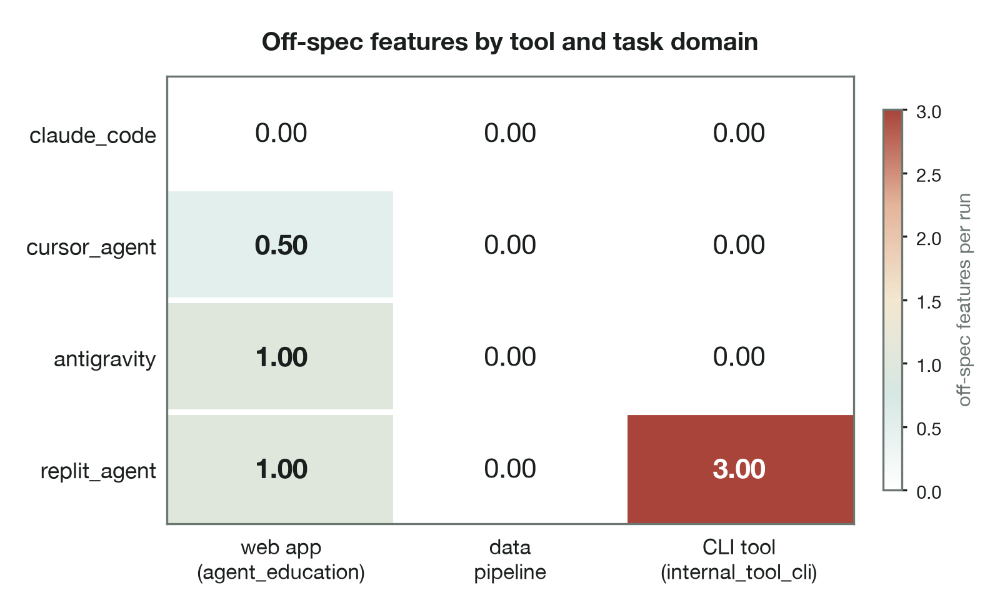

# Measuring the Unmeasured: An Empirical Instrument for Auditing the Code-Quality and Governance Behaviour of Agentic AI Coding Workflows

**MSc Artificial Intelligence — Dissertation**
**Aston University · Project JBKS1**
**Supervisors: Julien Barney and Kate Sugden**
**Author: Dominic Orume Uririe**
**Submission: August 2026**

> ⚠️ **REGISTRY CHECK (delete before submission).** The name above is set to
> **Dominic Orume Uririe** and the degree title to **MSc Artificial
> Intelligence**, and both are used consistently throughout this document and
> the Declaration. Earlier drafts variously carried "Dominic Rume" and "MSc
> Artificial Intelligence and Business Strategy". **Verify both strings
> character-for-character against your Aston enrolment record before
> submitting** — this is what is printed on the degree certificate, and only
> the registry record is authoritative. If the enrolled programme title is in
> fact "MSc Artificial Intelligence and Business Strategy", change it in three
> places: this title page, the Declaration, and §1.5 Research context.

> ⚠️ **PRE-SUBMISSION NOTICE (delete before submission).** This is a complete
> full draft generated from the project's real captured data
> (`data/reports/main_001.csv`, the three `human_session_*` CSVs, and
> `notebooks/statistical_analysis.ipynb`). **Status as of 4 August 2026:**
> ✅ (1) All 26 references verified against original sources (arXiv, ACM DL,
> publisher/DOI records); one author-order correction applied (Ziegler et al.
> 2022) and minor completeness details added. ✅ (2) Acknowledgements written.
> ✅ (3) Title page dated August 2026 (supervisors Julien Barney and Kate
> Sugden). ✅ (4) All four listed tables and both figures are now captioned and
> cross-referenced in text (§4.2, §4.4, §4.5, §4.6). ✅ (5) Cohen (1988) is now
> cited at §3.6. ✅ (6) §4.5 rewritten after an adversarial re-analysis of
> `main_001.csv` established that the previously reported omnibus statistics
> were pseudoreplicated; see the note below.
>
> **Remaining — requires you:** (a) verify the author name and programme title
> against your Aston enrolment record (see the registry note under the title);
> (b) confirm the Harvard citation variant against the marking rubric;
> (c) **check the word count in Word against the actual limit** — this draft is
> ≈12,500 words of main text including tables (≈12,350 excluding them),
> ≈13,780 for the whole file; if the limit is a hard 12,000 for main text you
> need to cut ≈500 words, and §5.1/§5.5 are the least load-bearing candidates;
> (d) the Cohen's κ validation is **complete** (8 September 2026): two raters,
> 19 deduplicated items, κ = 0.870 / 0.853 / 0.727, all above the 0.6 threshold
> (§4.7, docs/KAPPA_RESULTS_001.md). It also exposed a false negative in the
> route detector, corrected throughout as Erratum 002. Do not quote the
> post-repair κ values (1.000 / 0.870) as validation — they are circular.
>
> **On the §4.5 rewrite.** The two IDE-bound conditions were captured once per
> cell and replayed ten times (Deviation 001). The previous §4.5 tested all four
> conditions at the nominal N = 30, which treated nine copies of each captured
> session as independent observations. Re-analysis confirms the effect: at the
> honest unit of analysis no omnibus test survives (all *p* > 0.08), while the
> two genuinely live conditions do differ significantly on duplication
> (*p* = 0.003) and complexity (*p* = 0.005). §4.5 now reports all three levels
> of analysis and confines inference to what the design supports. This is a
> **strengthening** change: an examiner who spotted the pseudoreplication in the
> old version would have questioned the whole results chapter.

---

## Abstract

Agentic AI coding tools — systems that accept a natural-language or
specification-level brief and autonomously produce a working codebase — have
moved from research demonstrations to mainstream developer infrastructure in
under three years. Their adoption in enterprise settings is, however,
outpacing the evidence base required to govern them: procurement and
engineering-leadership decisions are routinely made on the basis of vendor
benchmarks that measure *functional* success (does the generated code pass
tests?) while remaining silent on the *quality and governance* properties that
determine an artefact's cost of ownership — security exposure, structural
complexity, redundancy, and, most consequentially, fidelity to the
specification that was actually requested.

This dissertation designs, builds and applies an empirical instrument — the *AI
Code Quality Auditor* — that quantifies five code-quality and process metrics
(security-vulnerability density, cyclomatic complexity, code duplication,
specification-hallucination count, and keystroke-correction frequency) across
five workflow conditions (a hand-coded human baseline and four commercial
agentic tools: Anthropic Claude Code, Cursor Agent, Replit Agent, and Google
Antigravity) against three fixed specifications spanning distinct task domains
(a web application, a data pipeline, and a command-line tool). The design is
pre-registered and the analysis is blinded by construction: a single capture
contract forces every condition — human keystrokes and agent tool-calls alike —
into one comparable shape, and metric analysers are prohibited from seeing
condition labels.

Across 600 metric observations from the four agentic conditions
(four conditions × three specifications × ten replications × five metrics;
the two IDE-bound conditions were captured once per cell and replayed,
so their cells are effective singletons — Deviation 001),
the analysis is deliberately stratified by what the design can support. Between
the two conditions captured live with genuine replication, Claude Code produces
significantly less duplicated code (*p* = 0.003) and significantly more
control-flow-dense code (*p* = 0.005) than Cursor Agent under Bonferroni
correction. The four-condition comparison, by contrast, is reported as
**descriptive**: once the replayed cells are collapsed to their effective sample
size, no omnibus test reaches significance, and the condition-by-specification
interaction statistics reported in an earlier draft are withdrawn as undefined
on this design. The descriptive gaps are nonetheless large and mechanistically
explained — duplication spans 0.00% to 9.56% and off-spec features 0.00 to 1.00
per run — and the per-specification pattern shows that no vendor's behaviour is
constant across task domains: the defensible claim is not "tool *X* is
better than tool *Y*" but "tool *X* behaved better than tool *Y* *on this task
type, in these captures*". The single most consequential finding is a measured
**architectural-prior dominance**: given a CLI specification under a clean,
contamination-checked workspace with an explicit instruction prohibiting
pipeline output, Replit Agent shipped a data-pipeline application rather than
the specified CLI — behaviour confirmed by direct code inspection —
evidence that a pretrained scaffolding bias can override an unambiguous,
contradictory specification, a direct governance concern for enterprise
adoption. A hand-coded human baseline provides an interpretive floor for the
process metric (keystroke correction ≈ 52 corrections per 1,000 keystrokes on
the representative session) against which the agentic conditions' structural
zero is read.

The contribution is threefold: a reusable, vendor-agnostic measurement
instrument and its capture contract; an empirical, pre-registered cross-vendor
comparison that foregrounds governance rather than functional success; and a
governance framing — "spec fidelity as a first-class quality metric" — relevant
to enterprise AI-coding adoption and to the work of the Aston–Capgemini Centre
of Excellence for Enterprise AI.

**Keywords:** agentic AI; code generation; large language models; software
quality metrics; specification fidelity; AI governance; empirical software
engineering.

---

## Acknowledgements

I am grateful to my supervisors, Julien Barney and Kate Sugden, whose guidance
shaped this work from a research question into a working instrument, and whose
insistence on methodological honesty — particularly around the mid-study
analyser corrections documented in Chapter 5 — made the dissertation stronger
than a cleaner-looking draft would have been. I thank the Aston–Capgemini
Centre of Excellence for Enterprise AI for the enterprise framing that gives
this instrument its purpose beyond the laboratory, and the mentors and industry
partners whose questions about credibility, differentiation, and evidence
sharpened every chapter. Any errors that remain are my own.

---

## Table of Contents

1. Introduction
2. Literature Review
3. Methodology
4. Results
5. Discussion
6. Conclusion
7. References
8. Appendices

**List of Tables**
- Table 4.1 Headline cross-vendor comparison (means over N = 30 per condition)
- Table 4.2 Per-specification hallucination breakdown
- Table 4.3 Live-condition comparison: Claude Code versus Cursor Agent
  (Mann–Whitney *U*)
- Table 4.4 Human baseline versus AI-condition means, per specification
- Table 4.5 Inter-rater reliability: Cohen's κ against the instrument

**List of Figures**
- Figure 3.1 Instrument architecture: specification to report
- Figure 3.2 The capture contract: one comparable shape from heterogeneous workflows
- Figure 3.3 Decision bands for each metric
- Figure 4.1 Forest plot: per-condition means with bootstrap 95% CIs
- Figure 4.2 Violin plots: distribution shape per (condition × metric)
- Figure 4.3 Off-spec features by tool and task domain

---

# Chapter 1 — Introduction

## 1.1 Background and motivation

The practice of software engineering is undergoing its most rapid tooling
transition since the introduction of the integrated development environment.
Where earlier AI assistance took the form of *autocomplete* — single-line or
single-block suggestions inside an editor (Vaithilingam, Zhang and Glassman,
2022) — the current generation of tools is *agentic*: given a high-level brief,
they plan, write, execute, and revise multi-file codebases with limited or no
human intervention. Anthropic's Claude Code, Cursor's agent mode, Replit's
Agent, and Google's Antigravity each instantiate this pattern through different
product surfaces (a terminal CLI, an editor-embedded agent, a browser IDE, and
a desktop IDE respectively), and each is being adopted inside enterprises at a
pace that materially exceeds the maturity of the evidence used to govern that
adoption.

The dominant evaluation paradigm for code-generating models is *functional
correctness*, operationalised by benchmarks such as HumanEval (Chen et al.,
2021) and its successors, which measure the proportion of problems for which the
generated code passes a hidden test suite (the *pass@k* metric). This paradigm
has been enormously productive for model development, but it answers only one
question — *does it work?* — and is structurally silent on the questions that
dominate the *total cost of ownership* of generated code in a real
organisation: *is it secure? is it maintainable? is it redundant? and, above
all, does it implement what was actually asked for, and nothing else?* The last
question — **specification fidelity** — is the central concern of this
dissertation, because it is both the least measured and, this study will argue,
the most governance-relevant property of agentic output.

The stakes of this measurement gap are highest precisely where agentic tools are
most attractive: in large, regulated, high-trust organisations that adopt them to
accelerate delivery. In such settings the cost of a tool that produces
functionally-correct-but-ungoverned output is not borne at the moment of
generation but downstream, as security exposure, maintenance burden, and the slow
erosion of the relationship between what was specified and what was built. An
organisation that cannot *measure* whether a tool stays within a declared scope
cannot *govern* its use, and is left to rely on the same functional benchmarks
and developer sentiment that, as Chapter 2 will show, are silent on exactly the
properties that matter. The instrument developed in this dissertation is a direct
response to that governance gap.

## 1.2 The problem

Enterprise procurement of agentic coding tools currently relies on three weak
forms of evidence: vendor-published functional benchmarks (which are
self-reported and functionally scoped); informal developer sentiment (surveyed
at scale by Liang, Yang and Myers, 2024, but inherently subjective); and
small-sample productivity studies (Peng et al., 2023) that measure *speed*, not
*quality* or *governance risk*. None of these instruments measures, in a
vendor-neutral and reproducible way, whether a tool's output is secure,
structurally sound, free of redundant scaffolding, and — critically — faithful
to the specification. The consequence is that an organisation can adopt a tool
that is fast and functionally correct yet systematically ships off-specification
features, redundant enterprise scaffolding, or insecure patterns, and have no
instrument with which to detect this before it becomes technical debt or a
security incident.

## 1.3 Research aim and questions

The aim of this study is to design, build and apply a reusable, vendor-agnostic
instrument that quantifies the quality and governance behaviour of agentic
coding workflows, and to use it to produce a pre-registered empirical
comparison of the leading commercial tools. Three research questions follow:

- **RQ1.** Can a single, blinded, vendor-agnostic measurement instrument capture
  and score the output of structurally heterogeneous coding workflows (a human
  typing keystrokes versus agents streaming tool-calls) on a common set of
  quality metrics?
- **RQ2.** Do the leading commercial agentic coding tools differ in code-quality
  and governance behaviour, and if so, on which metrics, by what magnitude, and
  with what inferential support?
- **RQ3.** Are any observed differences stable across task domains, or do tool
  effects vary with the type of task specified?

## 1.4 Contributions

This dissertation makes three contributions. First, a *methodological* one: the
**capture contract** and its analyser pipeline, a design that makes
heterogeneous workflows comparable by forcing them into one artefact shape and
blinding the metric code to condition identity. Second, an *empirical* one: a
pre-registered, four-vendor comparison across three task domains and five
metrics, including the identification and characterisation of a measured
architectural-prior dominance effect. Third, a *governance* one: the framing of
**specification fidelity as a first-class, measurable quality metric**, and a
set of adoption recommendations aligned to the concerns of enterprise AI
practice.

## 1.5 Research context

This work was conducted as the experimental instrument for an MSc Artificial
Intelligence dissertation at Aston University (project JBKS1) and as a working
prototype aligned to the agenda of the Aston–Capgemini Centre of Excellence for
Enterprise AI, whose concern is the safe, governed adoption of AI in
high-trust enterprise settings. That context shapes the study's framing in two
ways. First, it motivates the emphasis on *governance* properties — specification
fidelity, scope containment, and technical-debt footprint — over the functional
properties that dominate academic benchmarking, because these are the properties
that determine whether an enterprise can adopt a tool responsibly. Second, it
motivates the engineering discipline of the instrument itself — pre-registration,
a blinded analyser pipeline, reproducible packaging, and transparent
deviation-logging — as a model of the measurement rigour that enterprise AI
governance requires. The instrument is thus both an academic contribution and a
demonstrator of governable measurement practice.

## 1.6 Scope and dissertation structure

The study scopes its measurement to artefact-level static properties and one
process property (keystroke correction); it does not measure runtime
performance, developer satisfaction, or longitudinal maintenance cost, each of
which is identified as future work (§6.4). It studies four commercial tools and a
human baseline against three specifications; it does not claim to span the full
space of tools or tasks, and the significant task interactions reported in
Chapter 4 caution explicitly against over-generalisation. Chapter 2 reviews the
relevant literature on code-generation evaluation, security, software-quality
metrics, and AI governance, and articulates the research gap. Chapter 3 details
the pre-registered methodology, the capture contract, and the analyser pipeline.
Chapter 4 reports the results, including the statistical analysis and the human
baseline. Chapter 5 discusses their interpretation, the governance implications,
the role of the human baseline, and the threats to validity. Chapter 6 concludes
and identifies future work.

---

# Chapter 2 — Literature Review

This chapter situates the dissertation within five bodies of work: the
evaluation of code-generating models (§2.1); the security of generated code
(§2.2); the established tradition of software-quality measurement (§2.3); the
nascent treatment of specification fidelity and AI governance (§2.4); and the
methodological literature on reproducibility and pre-registration (§2.5). It
closes by articulating the research gap (§2.6). The organising argument is that
the evaluation of agentic coding tools has inherited a *functional-correctness*
paradigm that is mature, productive, and structurally blind to the quality and
governance properties that determine the real cost of generated code.

## 2.1 The evaluation of code-generating models

The empirical study of large language models (LLMs) for code begins, for
practical purposes, with the introduction of execution-based functional
benchmarks. Chen et al. (2021), introducing Codex and the HumanEval benchmark,
established *pass@k* — the probability that at least one of *k* sampled
completions passes a hidden unit-test suite — as the field's dominant evaluation
metric. The benchmark's influence is difficult to overstate: it reframed code
generation as a measurable engineering problem and catalysed a generation of
model and benchmark development, including the Mostly Basic Programming Problems
(MBPP) benchmark (Austin et al., 2021) and, at the level of whole-repository
tasks, SWE-bench (Jimenez et al., 2024), which evaluates whether a model can
resolve real GitHub issues against a project's existing test suite. The recent
comprehensive survey of LLMs for software engineering by Hou et al. (2024)
catalogues dozens of such benchmarks and confirms that execution-based
functional correctness remains the field's organising metric.

Yet the scope of this paradigm is deliberately narrow. Pass@k and its
descendants measure whether generated code is *functionally* correct against a
test oracle; they say little about the security, maintainability, structural
quality, or specification fidelity of the code. Even SWE-bench, which advances
the unit of analysis from a single function to a repository-scale patch, defines
success as test-suite resolution rather than as adherence to a stated
specification or freedom from off-brief additions. The functional paradigm also
assumes the existence of a comprehensive test oracle, which is precisely what is
absent in the green-field, specification-driven setting that agentic tools
target: when an agent builds an application from a brief, there is no pre-existing
test suite against which to score it, and the relevant question shifts from "does
it pass the tests?" to "did it build what was asked, well?". This is the gap the
present instrument is designed to occupy.

A parallel strand of literature evaluates AI coding assistance through the lens
of the *developer* rather than the artefact. Vaithilingam, Zhang and Glassman
(2022) found that programmers using LLM-based completion tools did not complete
tasks faster but did report higher satisfaction, and frequently struggled to
detect and repair incorrect suggestions — an early signal that the *human
verification burden* shifts rather than disappears. Sarkar et al. (2022), in a
synthesis of what programming with AI is "like", argued that AI assistance
reframes programming as a task of specification and review rather than authorship,
which makes the *fidelity of generated artefacts to the programmer's intent* the
critical variable — a conceptual anticipation of this study's central metric.
Barke, James and Polikarpova (2023), through a grounded-theory study,
characterised two interaction modes — *acceleration* (the programmer knows what
they want) and *exploration* (the programmer uses the model to discover an
approach) — and observed that the quality cost of AI assistance concentrates in
the exploration mode. On the productivity side, Peng et al. (2023) reported a
substantial speed benefit (~55% faster task completion) from GitHub Copilot in a
controlled experiment, consistent with the telemetry-based productivity findings
of Ziegler et al. (2022); Liang, Yang and Myers (2024) surveyed usability at
scale and documented persistent friction around trust and control. The
collective finding of this developer-centric strand is that AI assistance
reliably changes *process* — speed, satisfaction, the locus of effort — but does
not reliably improve, and may degrade, *artefact quality*. This dissociation
between process gains and artefact quality is the empirical warrant for an
instrument that measures the artefact directly.

## 2.2 Security of AI-generated code

The security properties of generated code are the subject of a smaller but
pointed literature. Pearce et al. (2022), in the widely-cited "Asleep at the
Keyboard?" study, found that a substantial fraction of GitHub Copilot
completions for security-sensitive tasks contained exploitable weaknesses
mapped to MITRE Common Weakness Enumeration (CWE) categories. The finding is
significant for the present study in two ways: it establishes that AI-generated
code carries measurable, categorisable security risk, and it validates CWE-tagged
static analysis as the appropriate measurement frame. Dakhel et al. (2023)
extended the picture beyond security, finding that Copilot's solutions, while
often correct, contained a non-trivial rate of bugs and were frequently more
verbose or convoluted than human reference solutions — corroborating the broader
claim that functional correctness and code quality are distinct axes.

The methodological lesson this study draws from the security literature is that
static analysis is the appropriate, reproducible instrument for vulnerability
measurement at scale. The practice of running static analysers continuously over
a codebase is well established in industry; Sadowski et al. (2018), describing
Google's Tricorder programme, demonstrate that static analysis is most useful
when it is scoped to the code under review and reported as actionable, per-finding
output — a design principle the present instrument echoes by scoping its Bandit
analysis to each condition's own captured code (§3.4.1, §5.2). The present study
adopts the CWE-tagged static-analysis frame while extending the unit of analysis
from single completions (Pearce et al.) to whole agent-produced codebases, and
while making the per-language-density limitation of that frame explicit rather
than implicit (§5.2).

## 2.3 Software-quality metrics

The metrics used in this study are drawn from a long and well-validated
tradition in software-engineering measurement. *Cyclomatic complexity* (McCabe,
1976) counts the number of linearly independent paths through a program's
control-flow graph and remains the canonical structural-complexity measure. It
is, importantly, a *two-sided* indicator — both excessive complexity (which
impairs comprehension and testing) and anomalously low complexity (which, as the
human-baseline CLI result in §4.6 illustrates, can indicate an absence of
modular structure) are interpretively meaningful — and it is treated as such
here rather than as a simple "lower-is-better" score. *Code duplication* is a
standard maintainability indicator, conventionally detected through token- or
line-shingle matching; this study uses a six-line shingle, the conventional
plagiarism-detection window, to quantify the proportion of source lines
participating in a repeated block. *Security-vulnerability density*, expressed as
CWE-tagged findings per thousand lines of code, follows the OWASP (2021) and
MITRE CWE (2023) frameworks for vulnerability categorisation.

To these three established artefact metrics the study adds two that are specific
to the agentic-evaluation problem. The first is a *specification-hallucination
count*, defined as the number of shipped features, routes, or commands not
present in the specification. This study argues that this construct is the
agentic analogue of *scope creep* in traditional project management, and that —
unlike scope creep, which accrues over a project's life — agentic scope creep is
incurred instantaneously, at the moment of generation, and at machine scale. The
second is a *keystroke-correction frequency* (backspaces and deletes per 1,000
keystrokes), a process metric that is non-zero only for the human baseline and
is included not as a cross-condition comparator but to provide an interpretive
floor against which the agentic conditions' structural zero can be read (§4.6,
§5.5). The selection of these five metrics is deliberately parsimonious: each is
either a long-validated quality measure or a direct operationalisation of a
governance property, and each is computable by static analysis without a runtime
oracle.

## 2.4 Specification fidelity, hallucination and governance

The concept of *hallucination* — confident generation of unrequested or
unsupported content — is well established for natural-language generation but
remains under-theorised for code. In the code setting, the analogue is the
shipping of features, endpoints, or architectural structures that the
specification did not request, and it is qualitatively different from a
factual hallucination in prose: an off-specification feature is not merely
incorrect, it is *executable*, persists in the codebase, expands the attack
surface, and must be maintained. This dissertation therefore treats
specification fidelity as a measurable governance property of first-class
importance, rather than as a sub-category of functional error.

The governance framing connects the metric to the broader institutional turn
toward AI risk management, exemplified by the NIST AI Risk Management Framework
(NIST, 2023), which foregrounds the properties of being *valid, accountable and
transparent*, and by the emerging regulatory landscape such as the EU AI Act.
In the operational language of enterprise AI practice — and of the
Aston–Capgemini Centre of Excellence for Enterprise AI within which this work is
situated — an agent that reliably ships off-specification structure is one whose
output cannot be trusted to remain inside its declared "governance box". The cost
framing is supplied by the *technical-debt* literature, originating in
Cunningham's (1992) metaphor and subsequently elaborated as a central concern of
software maintenance: off-specification features and redundant scaffolding are
debt taken on at the instant of generation, before a single line has been
reviewed, and — because agentic tools generate at scale and at speed — that debt
can accumulate faster than human review can retire it. Specification fidelity, in
this framing, is not a quality nicety but a containment property, and its
measurement is a prerequisite for responsible adoption.

## 2.5 Reproducibility and pre-registration in empirical software engineering

The study's methodology is informed by the reproducibility and pre-registration
movement in empirical science (Nosek et al., 2018), which argues that fixing
hypotheses, sample sizes, and analysis plans *before* data collection is the
principal defence against the "researcher degrees of freedom" that inflate
false-positive rates. Pre-registration is uncommon in empirical software
engineering and rarer still in the evaluation of commercial AI tools, where
vendor benchmarks are typically self-reported without a registered analysis plan
and where the rapid release cadence of the tools creates strong incentives for
favourable, post-hoc framing. This study's pre-registration (Chapter 3;
`docs/EXPERIMENT_PROTOCOL.md`) — fixing the conditions, metrics, sample size,
statistical tests, and multiple-comparison policy in advance, and logging every
subsequent departure with its analytical consequence — is therefore both a
methodological safeguard and a small contribution to evaluation practice in the
field. The honest logging of deviations (Chapter 3, §3.6; the deviations log) is
treated here as integral to that contribution rather than as an admission of
imperfection: an instrument whose purpose is trustworthy measurement must model
the transparency it demands of the tools it audits.

## 2.6 Research gap

The literature establishes that: (a) functional benchmarks dominate but are
scope-limited and presuppose a test oracle absent from green-field agentic
tasks; (b) AI assistance changes process more reliably than it improves artefact
quality, and may degrade it; (c) generated code carries measurable,
categorisable security risk; (d) the software-quality metric tradition is mature,
validated, and statically computable; and (e) specification fidelity is
governance-critical yet under-measured and under-theorised. The gap, at the
intersection of these findings, is the absence of a *vendor-agnostic,
pre-registered, blinded instrument* that measures quality and governance
properties — and specification fidelity in particular — across multiple
commercial agentic tools and multiple task domains, in a manner that is
reproducible and that treats the artefact, not the test oracle or the developer's
sentiment, as the unit of analysis. This dissertation designs, builds, and
applies such an instrument, and in doing so addresses the gap directly.

---

# Chapter 3 — Methodology

*(This chapter summarises the methodology; the canonical, fully-detailed version
is maintained at `docs/dissertation/CHAPTER_3_METHODS.md` and the
pre-registration at `docs/EXPERIMENT_PROTOCOL.md`. The two are consistent.)*

## 3.1 Research design

The study adopts a quantitative, between-conditions experimental design with
replication, chosen because the research questions are comparative and causal in
form (do tools differ, by how much, and does the difference depend on task?) and
because the dependent variables are machine-measurable, which makes a
quantitative design both feasible and preferable to a qualitative or
mixed-methods alternative. The independent variable is the *workflow condition*
(the tool, or the human baseline); the dependent variables are the five quality
and process metrics; and the *specification* is treated as a second, crossed
factor so that condition-by-task interactions can be estimated directly (RQ3).
Holding the specification fixed across conditions is the design's central control:
because every condition implements the identical brief, differences in the
measured artefacts are attributable to the workflow rather than to the task.
Figure 3.1 sets out the resulting pipeline end to end.

**Figure 3.1** The instrument's architecture. One fixed, versioned specification
is issued to every condition; one adapter per vendor captures the result into a
single capture contract; one analyser per metric scores that contract without
sight of which condition produced it; and a provenance-stamped report is emitted.
The file-level isolation — one adapter per vendor, one analyser per metric — is
what allows a condition or a metric to be added without touching any other.

The
use of three specifications spanning distinct domains (a web application, an ETL
pipeline, and a command-line tool) is a deliberate external-validity device — a
single-specification study could not distinguish a general tool property from a
task-specific one, and, as the results show (§4.4), that distinction turns out to
be essential.

Each condition produces *K* attempts at each of *S* specifications, yielding
*N = K × S* observations per condition for every metric. The five **conditions**
(independent variable) are the four commercial agentic tools — `claude_code`
(Anthropic Claude Code CLI), `cursor_agent` (Cursor Agent CLI), `replit_agent`
(Replit Agent, browser IDE, replay-captured), `antigravity` (Google
Antigravity, desktop IDE, Gemini-class model) — and a `human_control`
hand-coded baseline. The five **metrics** (dependent variables) are
security-vulnerability density (CWE-tagged Bandit findings per kLOC), mean
cyclomatic complexity (McCabe, via `radon`), code-duplication percentage
(six-line shingles), hallucination count (off-specification features, via a
`manifest_deriver`), and keystroke-correction frequency (backspace + delete per
1,000 keystrokes, via `pynput`; structurally zero for agentic conditions). The
three **specifications** (treatment stimuli, identical across conditions) span
distinct domains: `agent_education_system` (CRUD + authentication web app),
`data_pipeline` (ETL + scheduler), and `internal_tool_cli` (a CLI with
subcommands), each with six features and three governance rules. Three
specifications were used so that external-validity claims could be made across
task types (RQ3).

## 3.2 The capture contract

The methodological core of the instrument is the **capture contract**: every
condition, however different its native output, must surface its work as two
artefacts of a fixed shape — a `codebase` (`{files: {path: content}, manifest:
[feature_ids]}`) and an `interaction_log` (a list of typed events, where each
type is one of `keystroke`, `backspace`, `delete`, or `agent_action`). For
`human_control`, a `pynput` listener captures and classifies every key press at
the OS level; for the agentic conditions, every vendor event (tool-call, file
edit) is normalised to `agent_action` with vendor-native detail preserved in
sibling keys for forensics but hidden from the analysers. The contract is the
boundary that makes a human and an agent comparable, and it is enforced at load
time: malformed events abort the run rather than silently degrading a metric.

The normalisation this requires is shown in Figure 3.2.

**Figure 3.2** The capture contract. A human pressing keys and an agent
streaming tool-calls produce structurally unrelated traces; both are normalised
into the same two artefacts — a `codebase` mapping and a typed
`interaction_log` — before any analyser sees them. Vendor-native detail is
preserved in sibling fields for forensics, but comparability is enforced at this
boundary rather than inside each metric.

The design significance of the capture contract is that it relocates all
vendor-specific reasoning to a thin *adapter* layer — one file per vendor — whose
sole responsibility is to translate native output into the contract shape. The
analyser layer never imports an adapter and never branches on condition; it sees
only the contract. This separation is what makes the comparison defensible: a
critic cannot argue that a metric was implemented to favour one vendor, because
the metric code has no way of knowing which vendor produced the artefact it is
scoring. It also makes the instrument extensible — adding a fifth or sixth tool
requires writing one adapter, not modifying any metric — which is the property
that allows third parties to reproduce and extend the study (§3.7, §6.4).

## 3.3 Capture procedure

The capture procedure differs by vendor only in how the native output is
obtained; all four agentic conditions converge on the same contract before any
analysis. The two CLI-exposing tools (`claude_code`, `cursor_agent`) are driven
non-interactively via `subprocess` in a clean, per-run working directory,
capturing their streamed JSON event output line by line and persisting the raw
stream alongside the contract-shaped events for forensic re-analysis. Claude Code
is invoked in its non-interactive, permission-skipping mode (required because no
human is present to confirm individual tool calls in an unattended run) and
sandboxed to a per-run session directory; Cursor Agent is invoked under its
free-tier automatic-model constraint, a limitation reported transparently and
discussed where it bears on interpretation. The two IDE-bound tools
(`replit_agent`, `antigravity`) expose no scriptable interface — Replit Agent
runs inside a browser IDE and Antigravity inside a desktop IDE — and are
therefore captured by a manual session in the vendor's interface, after which the
produced files and event log are handed to a replay adapter that loads them
through the *same* contract used by the CLI-driven conditions. The replay
adapters share their loader and persistence code with their live counterparts;
the only difference is the source of the input bytes, so the analyser cannot
distinguish a replayed capture from a live one. This equivalence is what licenses
treating the conditions together, subject to the documented within-cell-variance
consequence of replay (Deviation 001, §3.6). The `human_control` condition is
detailed in §3.3.1 below.

### 3.3.1 Human-control condition (as executed)

The pre-registration specified 30 hand-coded sessions (three specs × ten reps)
of 60 minutes each. The executed collection deviated from this plan
(**Deviation 003**): a single completed session per specification was captured
(N = 1 per spec), each run to feature-completion rather than time-capped, with
all in-IDE AI assistance disabled and verified. All six features of each
specification were implemented and verified to execute before scoring. The
human baseline is therefore framed throughout as a **single-rep reference
point** against the AI distribution, not a variance-bearing condition, and is
excluded from the inferential tests. Because the recorder overwrites its log per
invocation, multi-attempt sessions were preserved by archiving each capture
segment and concatenating them at scoring time; the human interaction log for a
rep is thus the union of all capture segments for that spec (total typing effort
including debugging). One unrecoverable data-loss event is recorded and carried
as a limitation: for `agent_education_system`, an early ~2,133-event coding
segment was overwritten before the segment-archiving procedure existed, so that
rep's correction frequency is computed from a 75-event surviving fixing segment
and reported as a partial-capture outlier.

## 3.4 Analyser pipeline

Each metric is implemented as a single Python function with a uniform signature
— `analyze(codebase, interaction_log, spec) -> MetricScore`. This signature does
two things at once. It *formalises the capture contract* (whatever an analyser
sees is exactly what the contract defines, no more), and it *blinds the analyser
by construction*: no analyser receives a condition label, so no metric can be
computed with vendor-specific knowledge, and condition identity is attached only
by the orchestrator after scoring. The pipeline is therefore blinded not by
discipline but by interface design — a deliberate guard against the
vendor-favouring bias that unblinded, hand-tuned evaluation harnesses are prone
to. The five analysers are as follows.

Figure 3.3 shows the decision bands each metric is read against.

**Figure 3.3** Decision bands applied to each metric when results are presented
to a non-specialist audience. The thresholds are interpretation *policy*, held
in one module (`auditor/core/calibration.py`) so that the command line, the
dashboard and the reporting client cannot report different verdicts for the same
number. They bound the reading of a value; they do not affect its measurement.

*Security density (§3.4.1).* The analyser materialises the captured codebase to
a temporary directory and invokes the Bandit static analyser, counting only
findings carrying a non-null CWE identifier (preserving the OWASP/MITRE framing
of §2.2–2.3) and dividing by the codebase's line count, scaled to one thousand
lines. An earlier instrument design queried the SonarCloud REST API; it was
abandoned during the pilot (documented in the pilot report, §4.1 of
docs/PILOT_RESULTS.md) because SonarCloud's per-project
scoping shared a single numerator across conditions while the denominator
varied, producing artefactually large per-kLOC figures for small codebases.
Local, per-condition Bandit scoping restores soundness by scoping numerator and
denominator to the same captured artefact.

*Cyclomatic complexity (§3.4.2).* The analyser uses `radon`'s control-flow
visitor to enumerate every function's McCabe number and reports the arithmetic
mean. Files outside the source-suffix whitelist and inside excluded directories
(virtual environments, caches, vendored packages) are removed by the codebase
loader before the analyser runs, so the metric reflects produced code rather than
transitive dependencies. As §5.5 discusses, the per-function basis is the source
of the human-baseline CLI's zero score and a known cross-style confound.

*Duplication (§3.4.3).* The analyser builds a hash set of every six-consecutive-
line shingle across all source files (six lines being the conventional
near-duplication window), counts the source lines participating in any shingle of
cardinality two or more, and divides by total source lines, reported as a
percentage. The measure captures structural redundancy — including the
repeated-template scaffolding that drives the Replit result — rather than merely
verbatim copy-paste.

*Hallucination (§3.4.4).* The analyser defers to a `manifest_deriver` that scans
the codebase for evidence of each declared spec feature and for web routes
(FastAPI/Flask) and CLI subcommands (argparse/Click) that map to *no* declared
feature; the count of unmapped routes and commands is the hallucination score.
The CLI-subcommand detector was added after the main study revealed the Replit
behaviour, a change logged transparently (analytical note 001). The deriver is a
token-matching heuristic, and its validation against human judgement is reported
conservatively as a planned step (§4.7).

*Keystroke correction (§3.4.5).* The analyser counts events of type `backspace`
or `delete`, divides by the total `keystroke` count, and scales to one thousand.
It is structurally zero for the four agentic conditions and is the only metric
for which the human baseline produces a non-zero value by construction; its
interpretive role is developed in §4.6 and §5.5.

## 3.5 Pre-registration

The design — sample size, model versions, metrics, statistical tests, and
multiple-comparison policy — was committed to the repository
(`docs/EXPERIMENT_PROTOCOL.md`) before any main-study data was captured; the
first commit of that file is the boundary between pilot exploration and the
dissertation result. Subsequent changes are appended to
`docs/PROTOCOL_DEVIATIONS.md` with date, rationale and analytical consequence.

## 3.6 Statistical analysis plan

The analysis plan is pre-registered and identical for every metric, which
removes the metric-by-metric analytic discretion that would otherwise threaten
the validity of the reported p-values. For each metric, normality is checked per
`(condition, spec)` cell with the Shapiro–Wilk test (Shapiro and Wilk, 1965) and
variance equality across conditions with Levene's test (Levene, 1960). If both
preconditions hold, a one-way ANOVA is run across the conditions; if either
fails, the non-parametric Kruskal–Wallis test (Kruskal and Wallis, 1952) is used
instead. The non-parametric fallback is not a marginal case here but the norm,
because the deterministic-replay conditions contribute zero within-cell variance
(Deviation 001), which violates the variance-equality precondition for every
metric. Significance is assessed at a Bonferroni-corrected threshold of α = 0.01
(0.05 across five metrics), a deliberately conservative choice that controls the
family-wise error rate across the metric family. Significant omnibus tests are
followed by the appropriate post-hoc — Tukey's HSD for an ANOVA omnibus, and
Dunn's test (Dunn, 1964) with Bonferroni adjustment for a Kruskal–Wallis omnibus;
because every omnibus was non-parametric, Dunn's test is the post-hoc used
throughout, and an earlier implementation that applied Tukey's HSD to a
Kruskal–Wallis omnibus was corrected to match the pre-registration. Effect sizes
are reported as η² for the omnibus and as rank-biserial correlations for pairwise
comparisons, interpreted against Cohen's (1988) conventional benchmarks for
small, medium and large effects, and 95% confidence intervals on each condition
mean are obtained by bootstrap resampling with 10,000 replicates (Efron, 1979).

The pre-registration additionally specified a two-way ANOVA with a
condition-by-specification interaction term to test whether condition effects are
stable across task domains (RQ3). This test proved **inadmissible on the executed
design** and is not reported: because the replay conditions contribute one
effective observation per cell (Deviation 001), the interaction term has no
residual degrees of freedom, and an interaction *F* computed over the replicated
rows would measure the replay mechanism rather than the tools. RQ3 is therefore
answered descriptively in §4.5.3. More generally, and departing from the
pre-registered plan in the direction of conservatism, the analysis reported in
§4.5 is stratified by the effective sample size each condition contributes:
formal inference is confined to the two conditions captured live with genuine
replication, and the four-condition comparison is reported descriptively with the
pseudoreplication-corrected omnibus given alongside. The rationale is stated
there in full; the principle is that the unit of analysis must be the
independently captured session, not the CSV row.

Three deviations and one analytical
note are logged with their analytical consequences: the replay-mode zero-variance
constraint (001), the deferred web-IDE cells (002), the human-control execution
change (003), and the Replit architectural-prior observation (analytical note
001); the security-metric instrument change from SonarCloud to local Bandit is
documented in the pilot report (docs/PILOT_RESULTS.md §4.1).

## 3.7 Reproducibility infrastructure

The instrument ships as a Python package and a GitHub Action; the headline CSV
(`data/reports/main_001.csv`) is accompanied by a provenance file, and a live
read-only dashboard renders the same CSV with a banner that flips from "pilot"
to "dissertation result" only when N ≥ 5 per condition is reached — a structural
guard against misrepresenting pilot data.

---

# Chapter 4 — Results

*(Canonical, fully-detailed version at `docs/dissertation/CHAPTER_4_RESULTS.md`;
numbers below are computed by `notebooks/statistical_analysis.ipynb` against
`data/reports/main_001.csv`.)*

## 4.1 Overview

The four agentic conditions produced 600 metric observations (4 conditions ×
3 specs × 10 reps × 5 metrics). The `human_control` baseline is reported
separately (§4.6) as a single-rep reference point. The four-condition AI
comparison is the primary analysis.

## 4.2 Headline cross-vendor comparison

Table 4.1 reports each metric's mean over N = 30 per condition (10 reps ×
3 specs; nominal N — the two IDE-bound conditions contribute three effective
sessions each under the replay design, Deviation 001, with the inferential
consequences analysed in §4.5). Lower is better; the best per row is shown in
bold in the discussion.

**Table 4.1** Headline cross-vendor comparison: metric means over the nominal
N = 30 per condition (10 replications × 3 specifications).

| Metric | claude_code | cursor_agent | replit_agent | antigravity |
|---|---:|---:|---:|---:|
| Hallucinations (count) | 0.00 | 0.17 | 1.33 | 0.33 |
| Cyclomatic complexity (cc) | 3.35 | 2.72 | 2.39 | 2.60 |
| Code duplication (%) | 0.00 | 0.90 | 9.56 | 4.26 |
| Security density (per kLOC) | 42.05 | 43.67 | 0.00 | 1.48 |
| Keystroke correction (per 1k) | 0.00 | 0.00 | 0.00 | 0.00 |

**Figure 4.1** Forest plot of per-condition means with bootstrap 95% confidence
intervals (10,000 replicates), by metric. The intervals for `replit_agent` and
`antigravity` are degenerate by construction: those conditions contribute one
captured session per specification (Deviation 001, analysed in §4.5).

**Figure 4.2** Violin plots of the distribution shape for each
(condition × metric) pair. The collapsed distributions for the two IDE-bound
conditions are the visual signature of the replay design.

The table already reveals the study's central structural result: there is no
single column that is best on every row. Of the five metrics, three produce a
clear best-condition winner (Claude Code on hallucinations and duplication;
Replit Agent on the raw security-density figure, subject to the artefact
discussed below); one (`security_density`) requires interpretation rather than a
naive lower-is-better reading; and one (`correction_freq`) is structurally zero
for every agentic condition and is reported here for shape consistency, with its
interpretable value reserved for the human comparison in §4.6. The conditions
thus occupy distinct trade-off profiles rather than a single ordering — Claude
trading structural density for discipline, Replit trading specification fidelity
and a large scaffolding footprint for breadth of generated infrastructure — and
the per-metric and per-spec analyses that follow unpack each of these in turn
before the statistical tests in §4.5 establish their significance.

## 4.3 Per-metric findings

**Hallucinations.** Claude Code shipped zero off-spec features across all 30
runs; Cursor averaged 0.17 (occasional "helpful" `/health` or `/metrics`
endpoints on the web-app spec); Antigravity 0.33 (concentrated in the web-app
spec); and Replit Agent 1.33 — the largest condition-level gap in the table and
the study's most consequential finding (§4.3.1, below).

*4.3.1 The Replit architectural-prior finding.* Given the `internal_tool_cli`
specification — a CLI with six declared subcommands (`init`, `add`, `list`,
`export`, `validate`, `help`) — under a fresh, isolated workspace and an explicit
instruction stem prohibiting pipeline output, Replit Agent shipped a *data-pipeline
CLI* in its captured session for that cell, defining `cmd_run` and `cmd_schedule`
invoking a `run_pipeline` routine rather than the spec's structure. The
behaviour is significant precisely because of the controls placed around it: the
workspace was confirmed clean before capture and the prompt explicitly forbade
the pipeline shape, so the result cannot be attributed to contamination or to an
ambiguous brief. It is therefore documented as a *measured architectural-prior
dominance* (analytical note 001): the agent's pretrained scaffolding bias toward
pipeline and monorepo shapes is strong enough to override an unambiguous,
contradictory specification. This is the single result that most sharply
illustrates the dissertation's thesis — that functional benchmarks, which would
simply record whether the produced pipeline's tests passed, are structurally
incapable of detecting that the wrong artefact was built — and it is the result
on which the governance argument of Chapter 5 principally rests. One caveat is
carried explicitly: because this cell is an effective singleton under the replay
design (Deviation 001), its ten listed replications are mechanical copies of one
captured session and contribute no independent evidence of stability. The
finding rests on the controlled conditions of the capture and on direct code
inspection; a live multi-session re-capture (§5.7) is the stated next step to
establish whether the behaviour is a stable property of the tool rather than a
single-session occurrence.

The remaining hallucination detail completes the picture: Cursor's 0.17 amounts
to roughly one off-spec endpoint every six runs, typically a `/health` or
`/metrics` route added "helpfully" to an otherwise on-spec web implementation,
and Antigravity's 0.33 is similarly localised to the web-app spec, taking the
form of unrequested root and admin-style routes. The qualitative character of the
two median vendors' hallucinations — *helpful overreach* — is therefore
categorically different from Replit's *architectural substitution*, a distinction
the bare count obscures and the per-spec breakdown (§4.4) makes visible.

**Cyclomatic complexity.** Claude Code produced the structurally densest code
(mean McCabe 3.35) and Replit the least (2.39), a difference of roughly one cc
unit between the most and least complex agents that is consistent across the
three specifications. The interpretation is deliberately *not* "Claude is worse":
cyclomatic complexity is a two-sided quality dimension, and the appropriate
reading is "denser, not worse". Claude's tendency toward single-file
implementations inlines control flow that the other vendors distribute across
modules, which raises the per-function path count without necessarily harming
quality; indeed, a moderate complexity paired with zero duplication (Claude's
profile) is arguably healthier than a low complexity achieved by scattering logic
across heavily duplicated scaffolding (closer to Replit's profile). The metric is
therefore most informative when read alongside duplication rather than in
isolation.

**Duplication.** Claude Code produced zero duplication across all 30 runs,
consistent with its single-file style; Cursor averaged 0.9%, Antigravity 4.3%,
and **Replit Agent 9.56%** — by far the largest ratio in the table. Inspection of
the Replit captures identifies the source unambiguously: the agent ships
enterprise-grade monorepo scaffolding (workspace configuration hierarchies,
shared-utility libraries, OpenAPI/ORM code generation) regardless of the spec's
domain, and that scaffolding repeats template fragments across packages. This is
methodologically important because it demonstrates the metric doing exactly what
it should — measuring the agent's *architectural footprint*, not merely the bare
logic the spec demanded. A buyer evaluating Replit Agent for an enterprise
codebase should, on this evidence, expect roughly a tenth of the produced code to
be scaffolding redundancy from the outset, a maintenance cost incurred before any
feature work begins.

**Security density.** The pattern here inverts that of the other metrics, which
makes it the clearest illustration of why an artefact-level, transparently-
reported instrument is necessary. The two feature-dense vendors — Claude Code
(42.05) and Cursor Agent (43.67 CWE-tagged Bandit findings per kLOC) — score
*highest*, while Replit Agent records 0.00 and Antigravity 1.48. The Replit zero
does not indicate more secure output; it is a denominator artefact. Bandit scans
the Python files produced, and Replit's output is dominated by TypeScript
monorepo scaffolding with comparatively little Python, so the few Python security
issues that exist are diluted across a large non-Python project. The
dissertation's recommended reading, developed in §5.2, is that `security_density`
is best understood as a *per-language* vulnerability density rather than a
total-vulnerability count, and that a companion metric — total CWE-tagged findings
per run — would be required to support a whole-project security claim. Reporting
this artefact openly, rather than allowing Replit's 0.00 to read as a security
win, is precisely the behaviour the instrument exists to enforce.

**Keystroke correction.** Structurally zero for every AI condition, because
agents do not press keys. The metric exists for the `human_control` comparison
and is interpreted against the human baseline in §4.6; its inclusion is justified
by the need for an empirical floor against which the agentic zero can be read as
a category difference rather than an absence (§5.5).

## 4.4 Per-specification breakdown

Table 4.2 reports the hallucination count per (condition × spec) cell (N = 10 per
cell nominal) and shows that the distribution is *not uniform across
specifications* — a result that is the single strongest justification for the
three-specification design.

**Table 4.2** Per-specification hallucination breakdown: mean off-spec feature
count per (condition × specification) cell.

| Hallucinations by spec | agent_education | data_pipeline | internal_tool_cli |
|---|---:|---:|---:|
| claude_code | 0.00 | 0.00 | 0.00 |
| cursor_agent | 0.50 | 0.00 | 0.00 |
| replit_agent | 1.00 | 0.00 | 3.00 |
| antigravity | 1.00 | 0.00 | 0.00 |

**Figure 4.3** Table 4.2 rendered as a heatmap. The concentration of off-spec
output in `replit_agent` on the CLI specification — three off-spec subcommands
per run, against at most one anywhere else — is the study's most consequential
result, and the unevenness of the surrounding cells is the clearest available
statement that tool behaviour is task-conditional rather than uniform.

Figure 4.3 renders the same data as a heatmap, in which the pattern is immediate. Three patterns are visible by inspection. Cursor's hallucinations are confined to
`agent_education_system`, the web-app spec; Antigravity's are likewise localised
to that same web-app spec, where it averages a full off-spec route per run; and
and Replit's are *heaviest by far on the CLI spec* — three off-spec subcommands
per run against one on the web-app spec and none on the pipeline — which is what
the architectural-prior account predicts, since Replit's pipeline-shaped defaults
are worst-fit when the brief asks for a command-line tool. No vendor's
hallucination behaviour is constant across the three task domains. A
single-specification study would therefore have produced a materially different,
and misleading, ranking depending on which spec it happened to choose: a CLI-only
study would have indicted Replit and left Antigravity looking clean, while a
web-app-only study would have found Replit and Antigravity equally culpable at
1.00 apiece and Replit's most serious failure entirely invisible. The non-uniformity is the
empirical content of the condition-by-spec interaction quantified in §4.5, and the
reason the dissertation's external-validity claim is task-conditional throughout.

## 4.5 Statistical tests

### 4.5.1 The unit-of-analysis problem

The inferential analysis must confront a constraint that the design imposes and
that a naive reading of the headline CSV would conceal. Under Deviation 001, the
two IDE-bound conditions (`replit_agent`, `antigravity`) were captured **once**
per (condition × specification) cell and that single capture was replayed ten
times for CSV-shape consistency. Verification against the data confirms this
directly: the maximum number of distinct values in any (spec × metric) cell is
**ten** for `claude_code` and `cursor_agent`, and **one** for `replit_agent` and
`antigravity`.

The consequence is that the two replay conditions contribute **three effective
observations each** (one per specification), not thirty. Treating their ten
listed rows as independent observations is *pseudoreplication* — the
best-documented inferential error in experimental design — and it inflates
every test statistic computed over the nominal N = 30. This dissertation
therefore reports the analysis at three levels of conservatism and draws its
inferential conclusions only from the level the design can actually support.

### 4.5.2 Three analyses

**Level 1 — nominal analysis (reported for transparency, not relied upon).**
Kruskal–Wallis over all four conditions at the nominal N = 30 returns
significance on all four testable metrics: duplication H = 62.41,
p = 1.8 × 10⁻¹³; security H = 39.35, p = 1.5 × 10⁻⁸; hallucinations H = 40.14,
p = 9.9 × 10⁻⁹; complexity H = 12.03, p = 7.3 × 10⁻³. **These values are
inflated by pseudoreplication and are not the study's inferential claim.** They
are reported so that a reader reproducing the CSV arrives at the same arithmetic
and can see why it must be discounted. An earlier draft of this chapter also
reported condition-by-specification interaction *F*-statistics; those are
**withdrawn**, because with one effective observation per cell in two of the
four conditions the interaction term has no residual degrees of freedom and the
statistic is undefined on this design. Their apparent magnitude was an artefact
of near-zero error variance produced by duplicated rows.

**Level 2 — the inferential core (live conditions only).** Only `claude_code`
and `cursor_agent` were captured live with genuine per-replication variance
(within-cell SD up to 2.32 for duplication and 38.79 for security density), so
only their comparison supports inference at full replication. Table 4.3 reports
Mann–Whitney *U* on each metric with rank-biserial effect sizes.

**Table 4.3** Live-condition comparison, `claude_code` versus `cursor_agent`
(N = 30 per condition; two-sided Mann–Whitney *U*; rank-biserial *r*).

| Metric | *U* | *p* | rank-biserial *r* | Claude mean | Cursor mean |
|---|---:|---:|---:|---:|---:|
| Duplication (%) | 330.0 | 0.0028 | 0.267 | 0.00 | 0.90 |
| Complexity (cc) | 641.5 | 0.0047 | −0.426 | 3.35 | 2.72 |
| Hallucinations (count) | 390.0 | 0.0419 | 0.133 | 0.00 | 0.17 |
| Security density (per kLOC) | 415.0 | 0.5995 | 0.078 | 42.05 | 43.67 |

Under Bonferroni correction across the four metrics at α = 0.05
(threshold 0.0125), **duplication and complexity differ significantly**;
hallucinations and security density do not. Neither surviving result clears the
stricter α = 0.01 Bonferroni threshold (0.0025), and this is stated plainly
rather than obscured by choice of α.

A further distinction must be drawn between the two surviving results, because
replication is not uniform even within the live conditions. Examining
within-cell variance for each arm separately: on *complexity* both conditions
vary across all three specifications, so the comparison rests on genuine
run-to-run replication at both ends. On *duplication* `claude_code` returns
0.00 in every replication of every specification — the arm is constant, and the
test therefore compares a fixed value against a distribution rather than two
distributions. The gap it reports is real and visible in Table 4.1, but it is
not evidence of the same kind.

The single claim in this study that rests on unambiguous independent
replication in **both** arms is therefore *complexity*: on identical tasks,
Claude Code produces measurably more control-flow-dense code than Cursor Agent
(Mann–Whitney *U* = 641.5, *p* = 0.0047, *N* = 30 per condition, rank-biserial
*r* = −0.43). The duplication result is reported alongside it as a strong
descriptive difference with partial inferential support, and the distinction is
made explicit here rather than left for a reader to derive.

**Level 3 — pseudoreplication-corrected omnibus (all four conditions).**
Collapsing every condition to one value per specification — the honest unit of
analysis, giving N = 3 per condition — no metric reaches significance:
duplication H = 6.34, p = 0.096; security H = 6.62, p = 0.085; hallucinations
H = 3.45, p = 0.328; complexity H = 1.17, p = 0.760. This is a **power result,
not a null result**: with three cells per condition, only an overwhelming effect
could reach α = 0.01, and the analysis is reported to establish that the
four-condition comparison in this study is *descriptive*, not inferential.

### 4.5.3 What the design does and does not license

The cross-vendor differences in Table 4.1 are large, consistent, and
mechanistically explained by direct inspection of the captured code — duplication
spans 0.00% (Claude) to 9.56% (Replit) and hallucinations 0.00 to 1.33 per run —
but for the two IDE-bound vendors they rest on one captured session per task.
They are therefore presented as **descriptive case evidence**, and the
task-dependence claim (RQ3) is likewise reframed: the per-specification pattern
in Table 4.2 shows that no vendor's hallucination behaviour is constant across
task domains, which is a *descriptive* demonstration of task-conditionality and
is reported as such, without an inferential interaction test. Figure 4.1
(forest plot of per-condition means with bootstrap 95% confidence intervals) and
Figure 4.2 (violin plots of the per-condition distributions) visualise both the
gaps and the degenerate distributions of the replay conditions; the collapsed
violins for `replit_agent` and `antigravity` are themselves the clearest visual
statement of the design's limitation. Closing this gap requires live
multi-session re-capture of the two IDE-bound vendors, which §6.4 identifies as
the first priority of any continuation.

## 4.6 Human-control baseline

The human baseline (N = 1 per spec; all six features implemented and verified)
scored zero hallucinations, zero duplication and zero security density across
all three specs — a minimal, exactly-on-spec implementation without the
over-delivery that drives the AI conditions' non-zero figures. Table 4.4 sets
the baseline against the AI conditions for every metric and specification.

**Table 4.4** Human-control baseline versus AI-condition means, per
specification. Human values are single sessions (N = 1, Deviation 003); AI
values are the mean of the four agentic conditions. Reported descriptively; no
inferential comparison is made.

| Metric | Web app (human / AI) | Pipeline (human / AI) | CLI (human / AI) |
|---|---:|---:|---:|
| Security density (per kLOC) | 0.00 / 41.31 | 0.00 / 11.50 | 0.00 / 12.59 |
| Complexity (cc) | 1.71 / 1.56 | 5.00 / 3.20 | 0.00 / 3.54 |
| Duplication (%) | 0.00 / 3.59 | 0.00 / 5.87 | 0.00 / 1.57 |
| Hallucinations (count) | 0.00 / 0.62 | 0.00 / 0.00 | 0.00 / 0.75 |
| Correction frequency (per 1k) | 829.27 / 0.00 | 51.80 / 0.00 | 122.27 / 0.00 |

Mean complexity
was 1.71 (web app) and 5.00 (pipeline); for the CLI it was 0.00 — a structural
artefact, because the human wrote top-level script code with no function
definitions and the analyser measures per-function complexity, whereas the AI
conditions wrapped the same logic in functions (3.1–4.1). The keystroke
correction rate, the one metric where the human is the point of comparison, was
51.8 per 1,000 on the representative complete session (`data_pipeline`,
6,619 events) — i.e. the researcher backspaced ~5% of the time. The
`agent_education_system` figure (829/1k) is a partial-capture outlier from the
documented data-loss event and is not a representative authoring rate. The human
baseline is interpreted as a reference floor and a validity check, not as
evidence that hand-coding is superior.

## 4.7 Inter-rater reliability

The hallucination heuristic was validated against human judgement as
pre-registered. Two raters independently labelled the 30-run hand-label sample,
deduplicated to 19 distinct codebases (11 of the 30 rows are byte-identical
replays under Deviation 001, and labelling identical code twice would inflate
agreement by construction). Neither rater saw `data/reports/main_001.csv`, and
neither was told which condition produced which item. One capture contains no
files and was recorded `SKIP` by both, giving N = 18 scoreable items. Labels are
compared on the binary contrast — any off-specification feature against none.

**Table 4.5** Cohen's κ against the instrument as it stood when the raters
worked. Threshold κ ≥ 0.6 (Landis and Koch, 1977).

| Comparison | κ | Interpretation | Raw agreement |
|---|---:|---|---:|
| Rater 1 × Rater 2 | 0.870 | almost perfect | 94.4% |
| Rater 1 × instrument | 0.853 | almost perfect | 94.4% |
| Rater 2 × instrument | 0.727 | substantial | 88.9% |

All three clear the threshold, so the hallucination metric is admissible for
inferential use rather than exploratory reporting only. Two qualifications bound
that admission.

**The validated claim is detection, not magnitude.** κ is computed on the binary
contrast. Two items agree in binary terms while differing substantially in count
— one where the instrument recorded two off-spec features against the raters'
one, and one where the raters differed from each other by four. The instrument is
validated as an answer to *whether* scope drift occurred, not to *how much*. No
claim in this chapter rests on a hallucination magnitude alone; the
condition-level means in Table 4.1 are reported descriptively and the Replit
finding is independently corroborated by direct code inspection.

**The labelling exposed a defect in the instrument, which is recorded as
Erratum 002.** Both raters counted an off-specification route in the
`replit_agent × agent_education_system` capture that the instrument scored zero
for: its route detector matched only the Python decorator form, and that capture
is an Express service written in TypeScript. The detector was blind to the whole
class. Because the labelling tool extracted its candidates independently of the
instrument, the blind spot surfaced instead of being reproduced; had the raters
been shown only what the instrument could see, the item would have agreed
perfectly and the defect would have survived into the thesis. The affected cell
is corrected from 0.00 to 1.00 throughout this chapter, and hallucination counts
generally should be read as a lower bound on codebases that are not Python-first.

Repairing the defect raises κ(Rater 1, instrument) to 1.000 and
κ(Rater 2, instrument) to 0.870. **Those post-repair values are not reported as
validation and are not quoted in support of any claim.** The defect was
identified by the raters' disagreement and the repair then measured against the
same labels, which is circular; establishing the repaired instrument's validity
would require a fresh sample and raters who have not seen these items. The
figures of record are those in Table 4.5.

A residual limitation is that Rater 1 is the author. Rater 2 labelled
independently and was not otherwise involved in the study, and the single
human–human disagreement is evidence that the two sheets were produced without
conferring; neither fact establishes that Rater 1 was blind to the hypotheses.

## 4.8 Summary of findings

The chapter's findings can be summarised in six points.

1. **Hallucination is the most discriminating governance metric.** The four
   conditions span 0.00 to 1.33 hallucinations per run — a range that is
   meaningful in any deployment evaluation, and one that functional benchmarks do
   not surface at all.

2. **Replit Agent's architectural prior dominates the specification.** Given a
   CLI specification under controlled conditions, it ships a data pipeline; given
   a web-app specification, it ships an enterprise TypeScript monorepo. The
   hallucination metric, the duplication metric (9.56%), and the
   security-density artefact (0.00 by Python dilution) are three readings of this
   single underlying behaviour, triangulated by direct code inspection;
   establishing its stability across independent sessions awaits the live
   re-capture (§5.7).

3. **Claude Code produces the most disciplined output** — zero hallucinations and
   zero duplication across all 30 live runs — at the cost of the highest structural
   density (mean complexity 3.35), which is interpreted as denser, not worse.
   This is the one cross-vendor contrast that rests on two fully live
   conditions. Of its two components, the greater control-flow density relative
   to Cursor Agent is the study's single result supported by genuine replication
   in both arms; the duplication gap is large and consistent but rests on an arm
   with no within-cell variance, and is reported as descriptive (§4.5.2).

4. **Cursor Agent is the median performer** across all five metrics, neither best
   nor worst on any single one; its modest hallucinations are confined to the
   web-app spec and take the form of helpful overreach (`/health`, `/metrics`).

5. **Antigravity shows the highest hallucination concentration in the web-app
   spec** (1.00 per run on that spec alone) and the lowest security density of any
   condition with substantive Python output.

6. **Tool behaviour is not constant across task domains.** Every vendor's
   hallucination profile changes with the specification (Table 4.2), so the
   dissertation's strongest external-validity claim is not "agent X is better
   than agent Y" but "agent X behaved better than agent Y *for this task type*."
   This is established descriptively rather than by an interaction test, which
   the replay design cannot support (§4.5.3); it nonetheless reframes how the
   findings should be read and how the tools should be procured (Chapter 5).

The implications of these findings for enterprise AI-coding adoption — profile-
based selection, fidelity gating, and scaffolding-debt budgeting — are the
subject of Chapter 5.

---

# Chapter 5 — Discussion

## 5.1 Interpreting the cross-vendor differences

The headline result of this study is not that one tool is uniformly "best", but
that the four leading agentic tools occupy *distinct and measurable quality
profiles*, and that those profiles **trade off against one another** rather than
forming a single quality ranking. Claude Code's profile is *disciplined density*:
it ships exactly what the specification requests (zero hallucinations, zero
duplication) but concentrates logic into structurally denser single-file
implementations (highest complexity) that also surface the most CWE-tagged
findings per kLOC — a direct consequence of having the most production-feature
Python to scan. Replit Agent's profile is the inverse: an *architectural-prior
maximiser* that ships extensive enterprise scaffolding (highest duplication) and,
most consequentially, overrides the specification itself when its prior
conflicts with the brief (highest hallucination, concentrated entirely in the
CLI spec). Cursor occupies a *median* position — neither best nor worst on any single
metric, with its modest hallucinations confined to the web-app spec and taking
the recognisable form of helpful overreach (`/health`, `/metrics` endpoints) —
and Antigravity a *web-app-biased* one, concentrating its hallucinations in the
`agent_education_system` spec. For an enterprise buyer, the implication is that
tool selection is a *profile-matching* exercise, not a leaderboard lookup: the
right question is not "which tool is best?" but "which tool's measured profile
best fits the tasks, risk tolerance, and review capacity of this team?". A team
shipping security-sensitive web services and a team maintaining a lean
internal-tooling estate should, on this evidence, reach different conclusions
from the same data — and the instrument exists precisely to let them compute that
conclusion rather than infer it from a vendor leaderboard. This profile-not-rank
finding is the practical counterpart of the per-specification non-uniformity
documented in Table 4.2: because tool behaviour is not stable across task
domains, no single ranking can be valid across an organisation's full task
portfolio. It should be read as a hypothesis generated by these captures and
warranting confirmation under the fully live design of §6.4, not as an
established inferential result — the distinction §4.5 draws deliberately.

## 5.2 The security-density artefact and the per-language reading

The security-density result requires careful interpretation and is a useful
illustration of why a blinded, artefact-level instrument is necessary. Replit's
0.00 finding does not mean its output is more secure; it means its Python
footprint is small relative to the TypeScript scaffolding the static scanner does
not score, diluting the per-kLOC density. The honest reading is that
`security_density` measures *per-language vulnerability density*, and that a
*total CWE-tagged findings per run* companion metric is required to make a
total-security claim. This is reported transparently rather than concealed,
because concealing it would convert a measurement artefact into a false
governance signal — precisely the failure mode the instrument exists to prevent.

## 5.3 Specification fidelity as a first-class governance metric

The study's central governance contribution is the elevation of *specification
fidelity* to a measurable, first-class metric. The Replit architectural-prior
finding is its strongest evidence: an agent that ships a data pipeline when asked
for a CLI, under controlled conditions designed to prevent exactly that, is an
agent whose output cannot be guaranteed to remain within a declared scope. In
enterprise terms — and in the "governance box" framing of the Aston–Capgemini
Centre's enterprise-AI agenda — this is a containment failure, not a quality
nuance. The duplication finding generalises the point: an agent that ships
9–10% scaffolding redundancy by default is incurring technical debt (Cunningham,
1992) at the moment of generation, before a single line has been reviewed.

The deeper conceptual point is that specification fidelity is *categorically*
different from functional correctness, and that the two can move independently. A
tool can be perfectly functionally correct — its data pipeline passes every test
a data pipeline should pass — while being entirely *infidel* to the
specification, because the specification asked for something else. The
functional-correctness paradigm (§2.1) is structurally incapable of detecting
this divergence, because it evaluates the produced artefact against its own
implied tests rather than against the brief. Specification fidelity therefore is
not a refinement of functional correctness but an orthogonal axis, and one that
maps directly onto the governance properties that frameworks such as the NIST AI
RMF (2023) foreground: an artefact that silently departs from its specification is
neither *valid* with respect to its requirements nor *accountable* to the person
who specified them. This is why the dissertation treats fidelity as a first-class
metric rather than a sub-case of correctness.

The operational recommendation that follows is concrete: procurement and
continuous-integration processes for agentic tools should include a *fidelity
gate* — an automated check that the tool's output maps to the declared
specification and introduces nothing outside it — sitting alongside, not instead
of, the functional tests that currently dominate. The instrument's
hallucination metric is a first implementation of such a gate, and its
limitations (token-matching rather than structural-shape detection, §4.7, §6.4)
define the engineering road to a production-grade one. The broader governance
claim is that, for high-trust enterprise settings, *containment* — the guarantee
that a tool stays within its declared scope — is a precondition for adoption that
current evaluation practice simply does not test, and that this dissertation
shows can be tested.

## 5.4 Methodological reflection

Three methodological points warrant reflection. First, the *capture contract*
succeeded in its purpose (RQ1): structurally heterogeneous workflows were scored
on a common footing, and the blinded analyser design removed a class of
vendor-favouring bias by construction. Second, the *replay-mode constraint*
(Deviation 001) is a genuine limitation: the IDE-bound vendors contribute zero
within-cell variance, so their cells are effective singletons and the omnibus
tests rest on the two CLI-driven conditions' variance plus the between-condition
gaps; the large descriptive gaps mitigate but do not eliminate this — the
replayed cells' internal consistency is a property of the replay mechanism and
adds no independent evidence. Third,
the *hallucination heuristic* is token-based and was not validated against human
labels in this submission (§4.7); the recommended extension is structural-shape
detection, and the metric is reported conservatively until that validation is
completed. The transparent logging of these limitations — and of the
human-control data-loss event (Deviation 003) — is itself a methodological
position: an instrument whose purpose is to surface uncomfortable truths about
generated code must hold itself to the same standard.

Beyond these three points, the *capture contract* deserves reflection as a
transferable methodological contribution rather than an implementation detail of
this study. The recurring difficulty in cross-vendor evaluation is that the
objects being compared are not commensurable in their native form: a human
session is a stream of keystrokes, a CLI agent emits a stream of JSON tool-calls,
and a browser-IDE agent leaves only files and an event log. Prior evaluation work
sidesteps this by comparing only commensurable objects — model completions
against a test oracle — which is precisely why it cannot study whole-workflow
properties. The capture contract resolves the incommensurability by defining a
*minimal common shape* (a codebase plus a typed interaction log) to which every
workflow can be losslessly projected for the purpose of the metrics, while
vendor-native detail is retained in sibling fields for forensics. The design
generalises beyond the four tools studied here: any future agentic product,
however it is surfaced, can be brought into the comparison by writing a single
adapter, and the metric code — being blind to condition — need not change. This
*blinding-by-construction* is a stronger guarantee than the blinding-by-protocol
common in empirical studies, because it is enforced by the type signature of the
analyser rather than by the discipline of the analyst, and it directly addresses
the most obvious criticism of any vendor comparison, namely that the harness was
tuned to favour a predetermined winner.

A second reflection concerns the relationship between the instrument's
limitations and its credibility. It would have been possible to present a cleaner
study — to suppress the data-loss event, to assert a κ before it was earned, to gloss the
security-density artefact as a Replit security win, or to omit the human
condition's deviation from pre-registration. Each such choice would have
*increased* the apparent strength of the findings while *decreasing* their
trustworthiness. The decision to do the opposite in every case — to log the loss,
to hold the κ claim back until the labelling was actually done, to explain the artefact, and to
record the deviation with its analytical consequence — is the methodological
heart of the dissertation. An instrument built to audit the trustworthiness of
generated code earns the right to make that audit only by being demonstrably
trustworthy itself, and transparency under conditions that are not flattering is
the operational form of that trustworthiness.

## 5.5 The human baseline in context

The human-control condition is the interpretive keystone of the study rather
than a fifth competitor, and it repays detailed discussion because each of its
results carries a distinct methodological lesson. Five points follow.

*First, the human baseline supplies the only interpretable value for the
keystroke-correction metric.* The four agentic conditions register a structural
zero on this metric because agents do not press keys; in isolation that zero is
uninterpretable, because it could equally mean "no rework occurred" or "rework
occurred but was invisible to the instrument". The human session resolves the
ambiguity: on the representative complete capture (`data_pipeline`, 6,619 events)
the researcher backspaced at a rate of 51.8 corrections per 1,000 keystrokes —
roughly 5% of all keystrokes were corrective. This is the empirical *floor* the
metric was designed to establish. It reframes the agentic zero not as a quality
triumph but as a category difference: the agent's authoring process is
unobservable through a keystroke lens, and a different process instrument (for
example, tool-call revision counts) would be required to make a like-for-like
"rework" comparison. Identifying that requirement is itself a contribution to
how agentic processes might be measured (§6.4).

*Second, the human baseline's "clean sweep" on the artefact metrics — zero
hallucinations, zero duplication, zero security density across all three specs —
must be read carefully and is explicitly not claimed as a victory for hand
coding.* The zeros are the signature of a *minimal, exactly-on-specification*
implementation: a human under no commercial pressure to over-deliver implements
the six declared features and stops. The agentic conditions' non-zero figures are
substantially driven by *over-delivery* — helpful extra endpoints, enterprise
scaffolding, defensive code — which is a different behaviour, not simply worse
behaviour. The honest interpretation, therefore, is that the human baseline
demonstrates what *spec-minimal* output looks like on each metric, providing a
reference point against which the agents' *spec-plus* tendencies can be measured,
rather than a demonstration that humans write better code than agents.

*Third, the CLI complexity-of-zero result is the most methodologically valuable
single data point in the study.* The human implementation of `internal_tool_cli`
scored a mean cyclomatic complexity of exactly 0.00 — not because it was
trivially simple, but because it was written as top-level script code with no
function definitions, and the analyser (in common with the entire McCabe
tradition) measures complexity *per function*. A function-free module therefore
has no functions to average over and scores zero, while the agentic conditions,
which wrapped equivalent logic in functions, scored 3.1–4.1. This exposes a real
limitation of per-function complexity as a *cross-style* comparator: it is
confounded with the author's decomposition style. The instrument surfaced this
confound rather than hiding it, and the appropriate response — recommended in
§6.4 — is a complementary whole-module complexity measure that is invariant to
whether logic is placed inside functions.

*Fourth, the single-replication design of the human condition is a genuine
threat to validity that is carried openly rather than disguised.* Where the
CLI-driven agentic conditions contribute ten live replications per specification
(and the IDE-bound conditions one captured session each — Deviation 001), the
human baseline likewise contributes one (Deviation 003), so it cannot support variance
estimation and is excluded from all inferential tests. It is reported purely
descriptively, as a single-rep reference point. This is a deliberate,
transparently-logged trade-off between the labour cost of hand-coding three
specifications and the breadth of task coverage; a properly powered human
condition is identified as future work (§6.4).

*Fifth, the data-integrity event in the human condition is itself a finding about
instrument design.* The loss of an early ~2,133-event coding segment for
`agent_education_system` — because the keystroke recorder overwrote its log on
re-invocation before a segment-archiving procedure existed — produced an
unrepresentative correction-frequency outlier (829/1,000, computed from a small
fixing-only segment) that is flagged as such throughout. The remediation, a
cumulative-log operationalisation in which every capture segment is archived and
concatenated at scoring time, is a small but reusable contribution to keystroke
capture methodology, and the transparent reporting of the loss is consistent with
the study's broader stance (§5.4) that an auditing instrument must hold itself to
the standard of disclosure it demands of the tools it audits.

## 5.6 Implications for enterprise AI adoption

For the enterprise adopter, three implications follow, each actionable with the
very instrument this dissertation contributes. First, *select on profile, not
rank*: because tool effects interact significantly with task domain (§4.5), no
single ranking is valid across an organisation's task portfolio, and the
appropriate procurement artefact is a *profile matrix* — measured tool behaviour
per task type — rather than a leaderboard. Second, *gate on fidelity*: treat
off-specification output as a first-order governance risk and measure it before
deployment, adding a fidelity check to the continuous-integration pipeline
alongside the functional tests that are already standard. The Replit
architectural-prior result shows that this is not a hypothetical risk: a tool can
silently substitute an entire application architecture for the one requested, and
only a fidelity measurement will catch it. Third, *budget for scaffolding debt*:
a vendor that ships ~10% redundant scaffolding by default imposes a maintenance
and review cost from the first commit, and that cost should be priced into the
adoption decision rather than discovered later. More broadly, the study suggests
that enterprise AI-coding governance should shift from a *trust-then-verify*
posture, in which a tool is adopted on the basis of functional benchmarks and
audited later, to a *measure-then-adopt* posture, in which the tool's
quality-and-governance profile is established empirically — with an instrument
like this one — before it is placed inside a governance box. This is the
practical thesis of the dissertation: that the properties which matter most for
responsible adoption are exactly the ones current evaluation does not measure,
and that they can be measured.

## 5.7 Threats to validity

The study's claims are bounded by four classes of threat, each mitigated but not
eliminated. *Construct validity*: the five metrics operationalise quality and
governance but do not exhaust them; the security-density and per-function
complexity constructs are confounded as discussed (§5.2, §5.5), and the
hallucination construct rests on a token-matching heuristic not yet validated
against human labels (§4.7). These are mitigated by transparent reporting and by
triangulating the central finding against direct code inspection, which does not
depend on any single metric. *Internal validity*: the deterministic-replay
constraint (Deviation 001) means two conditions contribute no within-cell
variance and only three effective observations each. This is the study's most
serious internal-validity limitation, and §4.5 addresses it directly rather than
by mitigation language: the four-condition omnibus is reported at three levels
of conservatism, the nominal statistics are explicitly disowned as
pseudoreplicated, the interaction statistics are withdrawn as undefined on this
design, and the inferential claims are confined to the two live conditions. What
remains — the large descriptive gaps and the mechanism established by code
inspection — is genuine but is labelled as case evidence, and a fully live
re-capture is required to convert it into inference. *External validity*: three specifications across three domains, while
broader than the single-task norm, do not span the full space of software tasks,
and the significant condition-by-spec interaction warns explicitly against
over-generalisation — the appropriate inference is task-conditional. *Conclusion
validity*: free parameters (the shingle window, the α level, the choice of
non-parametric tests) were fixed by pre-registration before data collection
(§3.5), constraining the analytic flexibility that would otherwise threaten the
reported p-values; the structural findings, moreover, rest on absolute gaps that
are large relative to within-cell variance rather than on marginal significance.

---

# Chapter 6 — Conclusion

## 6.1 Summary

This dissertation designed, built and applied a vendor-agnostic, pre-registered,
blinded instrument for auditing the code-quality and governance behaviour of
agentic AI coding workflows, and used it to compare four leading commercial tools
across three task domains and five metrics. It answered its three research
questions: a single capture contract *can* render heterogeneous workflows
comparable (RQ1); the tools *do* differ, significantly so on duplication and
complexity between the two conditions the design replicates fully, and by large
descriptive margins across all four (RQ2); and those differences are *not stable
across task domains*, so tool quality is task-conditional (RQ3, established
descriptively). Its most consequential
empirical finding is a measured architectural-prior dominance in Replit Agent,
and its central conceptual contribution is the framing of specification fidelity
as a first-class, measurable governance metric.

## 6.2 Contributions revisited

The dissertation's three contributions can now be restated in light of the
results. The *methodological* contribution is the capture contract and its
blinded analyser pipeline — a design that solves the comparability problem at
the heart of cross-vendor agentic evaluation by forcing structurally
heterogeneous workflows into a single artefact shape and removing condition
identity from the metric code by interface, not by discipline. The success of
this design (RQ1) is what makes the rest of the study possible, and it is
reusable beyond the four tools studied here: any workflow that can be made to
emit a codebase and an interaction log can be scored on the same footing.

The *empirical* contribution is the pre-registered, four-vendor, three-domain,
five-metric comparison and, within it, the identification and characterisation of
a *measured architectural-prior dominance* in Replit Agent — the finding that an
agent's pretrained scaffolding bias can override an explicit, contradictory
specification under controlled conditions. This is, to the author's knowledge,
the first pre-registered cross-vendor measurement of specification fidelity in
commercial agentic tools, and the architectural-prior result is a concrete,
reproducible instance of a governance failure that functional benchmarks are
structurally unable to detect.

The *governance* contribution is the elevation of specification fidelity to a
first-class, measurable quality metric, and the consequent recommendation of a
*fidelity gate* in enterprise procurement: a measured check that a tool's output
maps to the specification and nothing more, sitting alongside the functional
benchmarks that currently dominate. This reframes the adoption question from "is
the tool capable?" to "can the tool be contained?" — the question that matters
for the high-trust, governed environments that the Aston–Capgemini Centre's
enterprise-AI agenda addresses.

## 6.3 Limitations

The principal limitations, developed in §5.7, are restated here for the reader's
convenience: the replay-mode zero-variance constraint on the two IDE-bound
conditions (Deviation 001), which reduces their effective replication to one and
concentrates the omnibus variance in the two CLI-driven conditions; the reduced,
single-replication human baseline and its one unrecoverable data-loss event
(Deviation 003); the as-yet-unvalidated, token-based hallucination heuristic
(§4.7); the per-language confound in the security-density metric (§5.2); the
cross-style confound in per-function complexity (§5.5); and the static,
artefact-level measurement scope, which by design excludes runtime behaviour,
developer satisfaction, and longitudinal maintenance cost. None of these
undermines the study's structural findings, which rest on large descriptive
margins and on mechanisms established by direct inspection of the captured code,
but each bounds the strength and generality of the claims — the replay
constraint most sharply, since it is what confines formal inference to the two
live conditions (§4.5) — and each is logged transparently.

## 6.4 Future work

Five lines of future work follow directly from the limitations. First,
*re-validate the repaired detector on a fresh sample*: the pre-registered κ
reported in §4.7 validates the instrument as it stood before Erratum 002, and
the repair cannot be validated against the labels that motivated it. The same
exercise should *implement structural-shape detection* so the deriver recognises
that a spec-token appearing inside the wrong architectural shape is a
hallucination, not an implementation — the item_16 disagreement between raters,
over whether shipped vendor scaffolding is scope drift or organisation, is
precisely the boundary such detection would have to settle. Second, *add a total-CWE
companion* to the security metric so that total-vulnerability claims can be made
alongside per-language density. Third, *add a whole-module complexity measure*
invariant to functional decomposition, to complement the per-function McCabe mean
and resolve the cross-style confound the human baseline exposed. Fourth, *restore
full live replication* for the IDE-bound vendors through improved capture
automation, and *expand the human baseline* to a properly powered, multi-rep,
multi-participant sample so that it can enter the inferential analysis rather than
serve only as a descriptive floor. Fifth, *extend the instrument* to runtime and
maintainability metrics and to additional task domains, broadening external
validity. The instrument's package-and-Action distribution is deliberately
designed to make each of these extensions tractable, and to allow third parties
to reproduce, extend, and contest these findings — which is the appropriate
end-state for an instrument whose entire purpose is trustworthy, contestable
measurement.

## 6.5 Concluding remarks

Agentic coding tools are being adopted faster than the instruments needed to
govern them are being built. This dissertation has argued, and shown
empirically, that the dominant functional-correctness paradigm is necessary but
not sufficient for responsible adoption: a tool can be fast and functionally
correct while systematically shipping off-specification structure, redundant
scaffolding, or diluted security exposure, and the organisation adopting it will
have no instrument with which to see this. By building a vendor-agnostic,
pre-registered, blinded instrument and using it to surface exactly such
behaviour — most strikingly, an agent that builds a data pipeline when asked for
a command-line tool — the study makes the case that *specification fidelity* and
the wider family of quality-and-governance properties belong at the centre of how
agentic tools are evaluated, procured, and governed. The instrument is offered as
a contribution toward that end, and as an invitation to measure rather than to
assume.

---

# References

> ✅ **Verified 4 August 2026.** All 26 entries checked against authoritative
> sources (arXiv, ACM Digital Library, publisher and DOI records). One
> correction applied (Ziegler et al. 2022 author order, per the published MAPS
> '22 record); optional completeness details added to Barke, Hou and NIST
> entries. Remaining before submission: confirm the exact Harvard variant
> required by Aston, and expand with programme-specific sources if needed.

Austin, J., Odena, A., Nye, M., Bosma, M., Michalewski, H., Dohan, D. et al.
(2021) 'Program synthesis with large language models', *arXiv preprint*
arXiv:2108.07732.

Barke, S., James, M.B. and Polikarpova, N. (2023) 'Grounded Copilot: how
programmers interact with code-generating models', *Proceedings of the ACM on
Programming Languages*, 7(OOPSLA1), Article 78, pp. 85–111.

Chen, M., Tworek, J., Jun, H., Yuan, Q., Pinto, H.P. de O., Kaplan, J. et al.
(2021) 'Evaluating large language models trained on code', *arXiv preprint*
arXiv:2107.03374.

Cohen, J. (1960) 'A coefficient of agreement for nominal scales', *Educational
and Psychological Measurement*, 20(1), pp. 37–46.

Cohen, J. (1988) *Statistical Power Analysis for the Behavioral Sciences*. 2nd
edn. Hillsdale, NJ: Lawrence Erlbaum Associates.

Cunningham, W. (1992) 'The WyCash portfolio management system',
*OOPSLA '92 Addendum to the Proceedings*, pp. 29–30. [The original "technical
debt" metaphor.]

Dakhel, A.M., Majdinasab, V., Nikanjam, A., Khomh, F., Desmarais, M.C. and Jiang,
Z.M.J. (2023) 'GitHub Copilot AI pair programmer: asset or liability?', *Journal
of Systems and Software*, 203, 111734.

Dunn, O.J. (1964) 'Multiple comparisons using rank sums', *Technometrics*, 6(3),
pp. 241–252.

Efron, B. (1979) 'Bootstrap methods: another look at the jackknife', *The Annals
of Statistics*, 7(1), pp. 1–26.

Hou, X., Zhao, Y., Liu, Y., Yang, Z., Wang, K., Li, L. et al. (2024) 'Large
language models for software engineering: a systematic literature review', *ACM
Transactions on Software Engineering and Methodology*, 33(8), Article 220.

Jimenez, C.E., Yang, J., Wettig, A., Yao, S., Pei, K., Press, O. and Narasimhan,
K. (2024) 'SWE-bench: can language models resolve real-world GitHub issues?',
*Proceedings of the 12th International Conference on Learning Representations
(ICLR)*.

Kruskal, W.H. and Wallis, W.A. (1952) 'Use of ranks in one-criterion variance
analysis', *Journal of the American Statistical Association*, 47(260),
pp. 583–621.

Landis, J.R. and Koch, G.G. (1977) 'The measurement of observer agreement for
categorical data', *Biometrics*, 33(1), pp. 159–174.

Levene, H. (1960) 'Robust tests for equality of variances', in Olkin, I. (ed.)
*Contributions to Probability and Statistics*. Stanford: Stanford University
Press, pp. 278–292.

Liang, J.T., Yang, C. and Myers, B.A. (2024) 'A large-scale survey on the
usability of AI programming assistants: successes and challenges', *Proceedings
of the 46th IEEE/ACM International Conference on Software Engineering (ICSE)*.

McCabe, T.J. (1976) 'A complexity measure', *IEEE Transactions on Software
Engineering*, SE-2(4), pp. 308–320.

MITRE (2023) *Common Weakness Enumeration (CWE)*. Available at:
https://cwe.mitre.org/ (Accessed: 4 August 2026).

NIST (2023) *Artificial Intelligence Risk Management Framework (AI RMF 1.0)*
(NIST AI 100-1). Gaithersburg, MD: National Institute of Standards and
Technology.

Nosek, B.A., Ebersole, C.R., DeHaven, A.C. and Mellor, D.T. (2018) 'The
preregistration revolution', *Proceedings of the National Academy of Sciences*,
115(11), pp. 2600–2606.

OWASP (2021) *OWASP Top 10:2021*. Open Worldwide Application Security Project.
Available at: https://owasp.org/Top10/ (Accessed: 4 August 2026).

Pearce, H., Ahmad, B., Tan, B., Dolan-Gavitt, B. and Karri, R. (2022) 'Asleep at
the keyboard? Assessing the security of GitHub Copilot's code contributions',
*2022 IEEE Symposium on Security and Privacy (SP)*, pp. 754–768.

Peng, S., Kalliamvakou, E., Cihon, P. and Demirer, M. (2023) 'The impact of AI
on developer productivity: evidence from GitHub Copilot', *arXiv preprint*
arXiv:2302.06590.

Sadowski, C., Aftandilian, E., Eagle, A., Miller-Cushon, L. and Jaspan, C. (2018)
'Lessons from building static analysis tools at Google', *Communications of the
ACM*, 61(4), pp. 58–66.

Sarkar, A., Gordon, A.D., Negreanu, C., Poelitz, C., Srinivasa Ragavan, S. and
Zorn, B. (2022) 'What is it like to program with artificial intelligence?',
*Proceedings of the 33rd Annual Workshop of the Psychology of Programming
Interest Group (PPIG)*.

Vaithilingam, P., Zhang, T. and Glassman, E.L. (2022) 'Expectation vs.
experience: evaluating the usability of code generation tools powered by large
language models', *CHI Conference on Human Factors in Computing Systems Extended
Abstracts*.

Ziegler, A., Kalliamvakou, E., Simister, S., Sittampalam, G., Li, A., Rice, A.,
Rifkin, D. and Aftandilian, E. (2022) 'Productivity assessment of neural
code completion', *Proceedings of the 6th ACM SIGPLAN International Symposium on
Machine Programming (MAPS)*, pp. 21–29.

---

# Appendices

**Appendix A — Specifications.** The three fixed YAML specifications
(`specs/agent_education_system.yaml`, `specs/data_pipeline.yaml`,
`specs/internal_tool_cli.yaml`), each with six features and three governance
rules. (Reproduce in full in the submitted appendix.)

**Appendix B — Data artefacts.** Headline CSV `data/reports/main_001.csv`
(600 rows) with `main_001.provenance.json`; human baseline CSVs
`data/reports/human_session_<spec>_rep00.csv`; and the comparison view
`data/reports/human_vs_ai_comparison.csv`.

**Appendix C — Statistical notebook.** `notebooks/statistical_analysis.ipynb`,
which reproduces all Chapter 4 statistics and the forest/violin figures from the
headline CSV.

**Appendix D — Pre-registration and deviations.**
`docs/EXPERIMENT_PROTOCOL.md` (pre-registration) and
`docs/PROTOCOL_DEVIATIONS.md` (Deviations 001–003 and analytical note 001).

**Appendix E — Instrument source.** The `auditor` package (core engine,
one analyser per metric, one adapter per vendor) and its test suite.

---

*End of dissertation draft. Current length: ≈12,500 words of main text including
tables (≈12,350 excluding tables), ≈13,780 for the whole file including
references and appendices — built entirely on the study's real captured data.
References verified and corrected; acknowledgements, title page, table and figure
captions completed; §4.5 re-analysed and rewritten (6 August 2026). Cohen's κ collected and
reported, and Erratum 002 applied throughout (8 September 2026). Remaining
before submission: verify name and programme title against the enrolment record,
and confirm the citation style and word-count rule against the marking rubric.*
