# Measuring the Unmeasured: An Empirical Instrument for Auditing the Code-Quality and Governance Behaviour of Agentic AI Coding Workflows

**MSc Artificial Intelligence and Business Strategy: Dissertation**
**Aston University · Project JBKS1**
**Supervisors: Julien Barney and Kate Sugden**
**Author: Uririe, Orume Dominic**
**Submission: September 2026**

> ⚠️ **PRE-SUBMISSION NOTICE (delete before submission).** This is a complete
> full draft generated from the project's real captured data
> (`data/reports/main_001.csv`, the three `human_session_*` CSVs, and
> `notebooks/statistical_analysis.ipynb`). **Status as of 4 August 2026:**
> ✅ (1) All 26 references verified against original sources (arXiv, ACM DL,
> publisher/DOI records); one author-order correction applied (Ziegler et al.
> 2022) and minor completeness details added. ✅ (2) Acknowledgements written.
> ✅ (3) Title page dated September 2026 (supervisors Julien Barney and Kate
> Sugden). ✅ (4) All four listed tables and both figures are now captioned and
> cross-referenced in text (§4.2, §4.4, §4.5, §4.6). ✅ (5) Cohen (1988) is now
> cited at §3.6. ✅ (6) §4.5 rewritten after an adversarial re-analysis of
> `main_001.csv` established that the previously reported omnibus statistics
> were pseudoreplicated; see the note below.
>
> **Remaining, requires you:** (a) ✅ name and programme title verified against
> the Aston enrolment record on 8 September 2026, "Uririe, Orume Dominic",
> MSc Artificial Intelligence and Business Strategy, and applied to the title
> page and §1.5; (b) confirm the Harvard citation variant against the marking rubric;
> (c) **word count, against the hard 12,000 limit.** Chapters 1 to 6 are
> **11,902 words excluding figure captions**, leaving under a hundred words of
> headroom, so check the figure in Word before adding anything. Including
> captions the total is higher; most handbooks exclude them, as they exclude
> table contents, but confirm which convention applies. If captions count,
> §2.2 to §2.5 and §3.1 were not touched in the compression pass and are the
> first candidates.
> (d) the Cohen's κ validation is **complete** (8 September 2026): two raters,
> 19 deduplicated items, κ = 0.870 / 0.853 / 0.727, all above the 0.6 threshold
> (§4.7, docs/KAPPA_RESULTS_001.md). It also exposed a false negative in the
> route detector, corrected throughout as Erratum 002. Do not quote the
> post-repair κ values (1.000 / 0.870) as validation, they are circular.
>
> **On the §4.5 rewrite.** The two IDE-bound conditions were captured once per
> cell and replayed ten times (Deviation 001). The previous §4.5 tested all four
> conditions at the nominal N = 30, which treated nine copies of each captured
> session as independent observations. Re-analysis confirms the effect: at the
> honest unit of analysis no omnibus test survives (all *p* > 0.08), while the
> two genuinely live conditions do differ significantly on duplication
> (*p* = 0.003) and complexity (*p* = 0.005). §4.5 now reports all three levels
> of analysis and confines inference to what the design supports. This is a
> **strengthening** change: an examiner who spotted the pseudoreplication in the
> old version would have questioned the whole results chapter.

---

## Acknowledgements

I am grateful to my supervisors, Julien Barney and Kate Sugden, whose guidance
shaped this work from a research question into a working instrument, and whose
insistence on methodological honesty, particularly around the mid-study analyser
corrections documented in Chapter 5, made the dissertation stronger than a
cleaner-looking draft would have been. I thank the Aston–Capgemini Centre of
Excellence for Enterprise AI for the enterprise framing that gives this
instrument its purpose beyond the laboratory, and the mentors and industry
partners whose questions about credibility, differentiation, and evidence
sharpened every chapter. I thank Ikenna Onyedebelu and Matthew Brian Tahir, who gave their time to the
independent labelling reported in §4.7; Matthew also installed and ran the
instrument on his own machine to produce one of the field audits in §4.8. Any
errors that remain are my own.

---

## Declaration

I declare that this dissertation is my own work and that it has been composed
solely by me. It has not been accepted in any previous application for a degree
at this or any other institution. All sources of information have been
acknowledged, and all quotations from published or unpublished work of others
are distinguished by quotation marks and referenced in full.

The instrument described in Chapter 3, the experimental captures analysed in
Chapter 4, and the analysis reported throughout are my own. Where the study's
own validation exposed defects in that instrument, the defects and their
consequences are recorded as errata in the text rather than corrected silently.

**Use of generative AI.** The subject of this study is agentic AI coding tools,
and I used such tools during the construction of the instrument and the
preparation of this document. Their use is declared rather than concealed, and
was bounded as follows. Software engineering: AI assistance was used in writing
and refactoring the auditor's source code, which is published in full and
covered by an automated test suite. Analysis: every statistic reported here is
computed by scripts in the repository from the frozen captures, and every figure
is regenerated from those same data files at build time, so no number in this
document originates in a language model's output. Writing: AI assistance was
used for drafting, structural editing and proofreading; the research questions,
the experimental design, the interpretation of results and the conclusions are
my own. I take full responsibility for the content of this dissertation.

**Signed:** Uririe, Orume Dominic
**Date:** September 2026

---

## Abstract

Agentic AI coding tools, systems that accept a specification-level brief and
autonomously produce a working codebase, have moved from research demonstrations
to mainstream developer infrastructure in under three years. Their enterprise
adoption is outpacing the evidence needed to govern them: procurement decisions
rest on vendor benchmarks that measure *functional* success (does the code pass
tests?) while remaining silent on the *quality and governance* properties that
determine cost of ownership: security exposure, structural complexity,
redundancy, and, most consequentially, fidelity to the specification actually
requested.

This dissertation designs, builds and applies an empirical instrument, the *AI
Code Quality Auditor*, quantifying five metrics (security-vulnerability density,
cyclomatic complexity, code duplication, specification-hallucination count,
keystroke-correction frequency) across five conditions (a hand-coded human
baseline and four commercial agentic tools: Anthropic Claude Code, Cursor Agent,
Replit Agent, Google Antigravity) against three fixed specifications spanning
distinct task domains. The design is pre-registered and blinded by construction:
one capture contract forces every condition, human keystrokes and agent
tool-calls alike, into a comparable shape, and analysers never see condition
labels.

The analysis is deliberately stratified by what the design supports. Between the
two conditions captured live with genuine replication, Claude Code produces
significantly less duplicated code (*p* = 0.003) and significantly more
control-flow-dense code (*p* = 0.005) than Cursor Agent at the pre-registered Bonferroni threshold, though only the
complexity difference rests on run-to-run variation in both tools. The four-condition comparison is reported as **descriptive**: the
two IDE-bound conditions were captured once per cell and replayed (Deviation
001), and once those cells are collapsed to their effective sample size no
omnibus test reaches significance, while the condition-by-specification
interaction statistics of an earlier draft are withdrawn as undefined on this
design. The descriptive gaps are nonetheless large and mechanistically explained:
duplication spans 0.00% to 9.56% and off-spec features 0.00 to 1.33 per run. No
vendor's behaviour is constant across task domains, so the
defensible claim is not "tool *X* is better than tool *Y*" but "tool *X* behaved
better *on this task type, in these captures*".

The single most consequential finding is a measured **architectural-prior
dominance**: given a CLI specification under a contamination-checked workspace
and an explicit instruction prohibiting pipeline output, Replit Agent shipped a
data-pipeline application rather than the specified CLI, confirmed by direct
code inspection, evidence that a pretrained scaffolding bias can override an
unambiguous, contradictory specification. The hallucination metric is validated
against two independent human raters (Cohen's κ = 0.87 between raters, 0.85 and
0.73 against the instrument), a process which also exposed and corrected a false
negative in the instrument itself.

The contribution is threefold: a reusable, vendor-agnostic measurement
instrument and its capture contract; an empirical, pre-registered cross-vendor
comparison foregrounding governance rather than functional success; and a
governance framing, "spec fidelity as a first-class quality metric", relevant to
enterprise AI-coding adoption and to the Aston–Capgemini Centre of Excellence
for Enterprise AI.

**Keywords:** agentic AI; code generation; large language models; software
quality metrics; specification fidelity; AI governance; empirical software
engineering.

---

## Table of Contents

1. Introduction
2. Literature Review
3. Methodology
4. Results
5. Discussion
6. Conclusion
7. References
8. Appendices

**List of Tables**
- Table 4.1 Headline cross-vendor comparison (means over N = 30 per condition)
- Table 4.2 Per-specification hallucination breakdown
- Table 4.3 Live-condition comparison: Claude Code versus Cursor Agent
  (Mann–Whitney *U*)
- Table 4.4 Human baseline versus AI-condition means, per specification
- Table 4.5 Inter-rater reliability: Cohen's κ against the instrument
- Table 4.6 Field audits of three projects outside the study

**List of Figures**
- Figure 3.1 Instrument architecture: specification to report
- Figure 3.2 The capture contract: one comparable shape from heterogeneous workflows
- Figure 3.3 Decision bands for each metric
- Figure 3.4 The hosted report view
- Figure 4.1 Per-condition means with bootstrap confidence intervals
- Figure 4.2 Distribution of every run, by condition and metric
- Figure 4.3 What the specification asked for, and what was shipped
- Figure 4.4 Language composition of each condition's output, and its effect on
  security density
- Figure 4.5 Off-spec features by tool and task domain
- Figure 4.6 Nominal versus effective sample size per condition
- Figure 4.7 Human baseline against the agentic mean, per specification
- Figure 4.8 Per-item comparison of both raters and the instrument
- Figure 4.9 The same project before and after a specification was supplied
- Figure 4.10 The published package installed by a third party
- Figure 5.1 Both errata, as first reported and as corrected
- Figure F.1 GovSignal audited by a third party
- Figure F.2 kya-rails audited
- Figure F.3 The instrument scored against the wrong specification
- Figure F.4 Public installation counts
- Figure F.5 Installations by release
- Figure F.6 Rater 2's completed labelling
- Figure F.7 The results table before the errata

---

# Chapter 1: Introduction

## 1.1 Background and motivation

Software engineering is undergoing its most rapid tooling transition since the
integrated development environment. Where earlier AI assistance took the form of
*autocomplete*, single-line or single-block suggestions inside an editor
(Vaithilingam, Zhang and Glassman, 2022), the current generation is *agentic*:
given a high-level brief, these tools plan, write, execute and revise multi-file
codebases with limited human intervention. Anthropic's Claude Code, Cursor's
agent mode, Replit's Agent and Google's Antigravity each instantiate the pattern
through a different product surface, and each is being adopted inside
enterprises faster than the evidence used to govern that adoption is maturing.

The dominant evaluation paradigm is *functional correctness*, operationalised by
benchmarks such as HumanEval (Chen et al., 2021), which measure the proportion of
problems for which generated code passes a hidden test suite. That paradigm has
been productive for model development, but it answers one question (*does it
work?*) and is silent on those that dominate the *total cost of ownership* of
generated code: *is it secure? is it maintainable? is it redundant? and, above
all, does it implement what was actually asked for, and nothing else?* The last,
**specification fidelity**, is this dissertation's central concern, because it is
both the least measured and, this study argues, the most governance-relevant
property of agentic output.

The stakes are highest where agentic tools are most attractive: in large,
regulated organisations adopting them to accelerate delivery. There the cost of
functionally-correct-but-ungoverned output is borne downstream, as security
exposure, maintenance burden, and the slow erosion of the relationship between
what was specified and what was built. An organisation that cannot *measure*
whether a tool stays within a declared scope cannot *govern* its use, and is left
relying on the functional benchmarks and developer sentiment that, as Chapter 2
shows, are silent on exactly the properties that matter.

## 1.2 The problem

Enterprise procurement of agentic coding tools currently relies on three weak
forms of evidence: vendor-published functional benchmarks (which are
self-reported and functionally scoped); informal developer sentiment (surveyed
at scale by Liang, Yang and Myers, 2024, but inherently subjective); and
small-sample productivity studies (Peng et al., 2023) that measure *speed*, not
*quality* or *governance risk*. None of these instruments measures, in a
vendor-neutral and reproducible way, whether a tool's output is secure,
structurally sound, free of redundant scaffolding, and, critically, faithful to
the specification. The consequence is that an organisation can adopt a tool that
is fast and functionally correct yet systematically ships off-specification
features, redundant enterprise scaffolding, or insecure patterns, and have no
instrument with which to detect this before it becomes technical debt or a
security incident.

## 1.3 Research aim, objectives and questions

The aim of this study is to design, build and apply a reusable, vendor-agnostic
instrument that quantifies the quality and governance behaviour of agentic
coding workflows, and to use it to produce a pre-registered empirical
comparison of the leading commercial tools. It has five objectives:

- to design a capture contract that makes human and agentic workflows
  comparable, scored by analysers blind to condition (§3.2, §3.4);
- to implement the instrument as a tested, openly published package (§3.7);
- to apply it under a pre-registered protocol to four agentic tools and a human
  baseline across three specifications (Chapter 4);
- to validate its hallucination metric against independent human raters (§4.7); and
- to test it on real projects outside the controlled study (§4.8).

The objectives serve three research questions:

- **RQ1.** Can a single, blinded, vendor-agnostic measurement instrument capture
  and score the output of structurally heterogeneous coding workflows (a human
  typing keystrokes versus agents streaming tool-calls) on a common set of
  quality metrics?
- **RQ2.** Do the leading commercial agentic coding tools differ in code-quality
  and governance behaviour, and if so, on which metrics, by what magnitude, and
  with what inferential support?
- **RQ3.** Are any observed differences stable across task domains, or do tool
  effects vary with the type of task specified?

## 1.4 Contributions

This dissertation makes three contributions. First, a *methodological* one: the
**capture contract** and its analyser pipeline, a design that makes
heterogeneous workflows comparable by forcing them into one artefact shape and
blinding the metric code to condition identity. Second, an *empirical* one: a
pre-registered, four-vendor comparison across three task domains and five
metrics, including the identification and characterisation of a measured
architectural-prior dominance effect. Third, a *governance* one: the framing of
**specification fidelity as a first-class, measurable quality metric**, and a
set of adoption recommendations aligned to the concerns of enterprise AI
practice.

## 1.5 Research context

This work was conducted for an MSc Artificial Intelligence and Business Strategy
dissertation at Aston University (project JBKS1) and as a prototype aligned to
the Aston–Capgemini Centre of Excellence for Enterprise AI, whose concern is the
safe, governed adoption of AI in high-trust enterprise settings. That context
explains the emphasis on *governance* properties (specification fidelity, scope
containment and technical-debt footprint) over functional ones, and the
engineering discipline of the instrument itself: pre-registration, blinded
analysers, reproducible packaging and transparent deviation-logging.

## 1.6 Scope and dissertation structure

The study scopes its measurement to artefact-level static properties and one
process property (keystroke correction); it does not measure runtime
performance, developer satisfaction, or longitudinal maintenance cost, each of
which is identified as future work (§6.4). It studies four commercial tools and a
human baseline against three specifications; it does not claim to span the full
space of tools or tasks, and the task-conditional pattern reported in Chapter 4
cautions explicitly against over-generalisation. Chapter 2 reviews the
literature and articulates the research gap; Chapter 3 details the
pre-registered methodology, capture contract and analyser pipeline; Chapter 4
reports the results; Chapter 5 discusses their interpretation and the threats to
validity; Chapter 6 concludes.

---

# Chapter 2: Literature Review

This chapter situates the dissertation within five bodies of work: the
evaluation of code-generating models (§2.1); the security of generated code
(§2.2); the established tradition of software-quality measurement (§2.3); the
nascent treatment of specification fidelity and AI governance (§2.4); and the
methodological literature on reproducibility and pre-registration (§2.5). It
closes by articulating the research gap (§2.6). The organising argument is that
the evaluation of agentic coding tools has inherited a *functional-correctness*
paradigm that is mature, productive, and structurally blind to the quality and
governance properties that determine the real cost of generated code.

The review draws on 29 sources published between 1949 and 2024, sixteen of them since 2021. A source was included where it evaluates, secures, measures or
governs generated code, or sets a methodological standard this study adopts,
and every entry was checked against its original arXiv, ACM Digital Library or
publisher record.

## 2.1 The evaluation of code-generating models

The empirical study of large language models (LLMs) for code begins, for
practical purposes, with execution-based functional benchmarks. Chen et al.
(2021), introducing Codex and HumanEval, established *pass@k*, the probability
that at least one of *k* sampled completions passes a hidden unit-test suite, as
the field's dominant metric. Its influence is difficult to overstate: it
reframed code generation as a measurable engineering problem and catalysed a
generation of benchmark development, including MBPP (Austin et al., 2021) and,
at whole-repository scale, SWE-bench (Jimenez et al., 2024), which evaluates
whether a model can resolve real GitHub issues against a project's existing
tests. The survey of Hou et al. (2024) confirms that execution-based functional
correctness remains the field's organising metric.

The paradigm's scope is deliberately narrow. Pass@k and its descendants measure
whether code is *functionally* correct against a test oracle; they say little
about security, maintainability, structural quality, or specification fidelity.
Even SWE-bench, which advances the unit of analysis from a function to a
repository-scale patch, defines success as test-suite resolution rather than
adherence to a stated specification or freedom from off-brief additions. The
paradigm also assumes a comprehensive test oracle, precisely what is absent in
the green-field, specification-driven setting agentic tools target. When an
agent builds an application from a brief there is no pre-existing suite to score
it against, and the question shifts from "does it pass the tests?" to "did it
build what was asked, well?". That is the gap this instrument occupies.

A parallel strand evaluates AI assistance through the *developer* rather than
the artefact. Vaithilingam, Zhang and Glassman (2022) found that programmers
using LLM completion tools did not complete tasks faster but reported higher
satisfaction, and struggled to detect and repair incorrect suggestions, an early
signal that the human verification burden shifts rather than disappears. Sarkar
et al. (2022) argued that AI assistance reframes programming as specification
and review rather than authorship, making *fidelity to the programmer's intent*
the critical variable, a conceptual anticipation of this study's central metric.
Barke, James and Polikarpova (2023) characterised two interaction modes,
*acceleration* and *exploration*, and observed that the quality cost
concentrates in the latter. On productivity, Peng et al. (2023) reported ~55%
faster task completion with GitHub Copilot, consistent with the telemetry
findings of Ziegler et al. (2022), while Liang, Yang and Myers (2024) documented
persistent friction around trust and control. The collective finding is that AI
assistance reliably changes *process* (speed, satisfaction, the locus of effort)
but does not reliably improve, and may degrade, *artefact quality*. That
dissociation is the empirical warrant for measuring the artefact directly.

## 2.2 Security of AI-generated code

The security properties of generated code are the subject of a smaller but
pointed literature. Pearce et al. (2022), in the widely-cited "Asleep at the
Keyboard?" study, found that a substantial fraction of GitHub Copilot
completions for security-sensitive tasks contained exploitable weaknesses mapped
to MITRE Common Weakness Enumeration (CWE) categories. The finding is
significant for the present study in two ways: it establishes that AI-generated
code carries measurable, categorisable security risk, and it validates
CWE-tagged static analysis as the appropriate measurement frame. Dakhel et al.
(2023) extended the picture beyond security, finding that Copilot's solutions,
while often correct, contained a non-trivial rate of bugs and were frequently
more verbose or convoluted than human reference solutions, corroborating the
broader claim that functional correctness and code quality are distinct axes.

The methodological lesson this study draws from the security literature is that
static analysis is the appropriate, reproducible instrument for vulnerability
measurement at scale. The practice of running static analysers continuously over
a codebase is well established in industry; Sadowski et al. (2018), describing
Google's Tricorder programme, demonstrate that static analysis is most useful
when it is scoped to the code under review and reported as actionable,
per-finding output, a design principle the present instrument echoes by scoping
its Bandit analysis to each condition's own captured code (§3.4.1, §5.2). The
present study adopts the CWE-tagged static-analysis frame while extending the
unit of analysis from single completions (Pearce et al.) to whole agent-produced
codebases, and while making the per-language-density limitation of that frame
explicit rather than implicit (§5.2).

## 2.3 Software-quality metrics

The metrics used here are drawn from a long and well-validated measurement
tradition. *Cyclomatic complexity* (McCabe, 1976) counts the linearly
independent paths through a program's control-flow graph and remains the
canonical structural measure. It is importantly a *two-sided* indicator:
excessive complexity impairs comprehension and testing, while anomalously low
complexity can signal an absence of modular structure, as the human-baseline CLI
result in §4.6 illustrates. It is treated as such here rather than as a simple
"lower is better" score. *Code duplication* is a standard maintainability
indicator, conventionally detected by token or line shingling; this study uses a
six-line shingle, the conventional plagiarism-detection window, to quantify the
proportion of source lines participating in a repeated block.
*Security-vulnerability density*, expressed as CWE-tagged findings per thousand
lines, follows the OWASP (2021) and MITRE CWE (2023) categorisations.

To these three the study adds two metrics specific to the agentic problem. The
first is a *specification-hallucination count*: the number of shipped features,
routes or commands absent from the specification. This construct is the agentic
analogue of *scope creep*, with one difference that matters. Scope creep accrues
over a project's life; agentic scope creep is incurred instantaneously, at the
moment of generation, and at machine scale. The second is a
*keystroke-correction frequency*, backspaces and deletes per 1,000 keystrokes,
a process metric that is non-zero only for the human baseline and is included to
provide an interpretive floor against which the agentic zero can be read (§4.6,
§5.5). The selection is deliberately parsimonious: each metric is either a
long-validated quality measure or a direct operationalisation of a governance
property, and each is computable by static analysis without a runtime oracle.

## 2.4 Specification fidelity, hallucination and governance

The concept of *hallucination*, confident generation of unrequested or
unsupported content, is well established for natural-language generation but
remains under-theorised for code. In the code setting, the analogue is the
shipping of features, endpoints, or architectural structures that the
specification did not request, and it is qualitatively different from a factual
hallucination in prose: an off-specification feature is not merely incorrect, it
is *executable*, persists in the codebase, expands the attack surface, and must
be maintained. This dissertation therefore treats specification fidelity as a
measurable governance property of first-class importance, rather than as a
sub-category of functional error.

The governance framing connects the metric to the broader institutional turn
toward AI risk management, exemplified by the NIST AI Risk Management Framework
(NIST, 2023), which foregrounds the properties of being *valid, accountable and
transparent*, and by the emerging regulatory landscape such as the EU AI Act (European Union, 2024). In
the operational language of enterprise AI practice, and of the Aston–Capgemini
Centre of Excellence for Enterprise AI within which this work is situated, an
agent that reliably ships off-specification structure is one whose output cannot
be trusted to remain inside its declared "governance box". The cost framing is
supplied by the *technical-debt* literature, originating in Cunningham's (1992)
metaphor and subsequently elaborated as a central concern of software
maintenance: off-specification features and redundant scaffolding are debt taken
on at the instant of generation, before a single line has been reviewed, and,
because agentic tools generate at scale and at speed, that debt can accumulate
faster than human review can retire it. Specification fidelity, in this framing,
is not a quality nicety but a containment property, and its measurement is a
prerequisite for responsible adoption.

## 2.5 Reproducibility and pre-registration in empirical software engineering

The study's methodology is informed by the reproducibility and pre-registration
movement in empirical science (Nosek et al., 2018), which argues that fixing
hypotheses, sample sizes, and analysis plans *before* data collection is the
principal defence against the "researcher degrees of freedom" that inflate
false-positive rates. Pre-registration is uncommon in empirical software
engineering and rarer still in the evaluation of commercial AI tools, where
vendor benchmarks are typically self-reported without a registered analysis plan
and where the rapid release cadence of the tools creates strong incentives for
favourable, post-hoc framing. This study's pre-registration (Chapter 3;
`docs/EXPERIMENT_PROTOCOL.md`) (fixing the conditions, metrics, sample size,
statistical tests, and multiple-comparison policy in advance, and logging every
subsequent departure with its analytical consequence) is therefore both a
methodological safeguard and a small contribution to evaluation practice in the
field. The honest logging of deviations (Chapter 3, §3.6; the deviations log) is
treated here as integral to that contribution rather than as an admission of
imperfection: an instrument whose purpose is trustworthy measurement must model
the transparency it demands of the tools it audits.

## 2.6 Research gap

The literature establishes that: (a) functional benchmarks dominate but are
scope-limited and presuppose a test oracle absent from green-field agentic
tasks; (b) AI assistance changes process more reliably than it improves artefact
quality, and may degrade it; (c) generated code carries measurable,
categorisable security risk; (d) the software-quality metric tradition is
mature, validated, and statically computable; and (e) specification fidelity is
governance-critical yet under-measured and under-theorised. The gap, at the
intersection of these findings, is the absence of a *vendor-agnostic,
pre-registered, blinded instrument* that measures quality and governance
properties, and specification fidelity in particular, across multiple commercial
agentic tools and multiple task domains, in a manner that is reproducible and
that treats the artefact, not the test oracle or the developer's sentiment, as
the unit of analysis. This dissertation designs, builds, and applies such an
instrument, and in doing so addresses the gap directly.

---

# Chapter 3: Methodology

## 3.1 Research design

The study adopts a quantitative, between-conditions experimental design with
replication, chosen because the research questions are comparative and causal in
form (do tools differ, by how much, and does the difference depend on task?) and
because the dependent variables are machine-measurable, which makes a
quantitative design both feasible and preferable to a qualitative or
mixed-methods alternative. The independent variable is the *workflow condition*
(the tool, or the human baseline); the dependent variables are the five quality
and process metrics; and the *specification* is treated as a second, crossed
factor so that condition-by-task interactions can be estimated directly (RQ3).
Holding the specification fixed across conditions is the design's central control:
because every condition implements the identical brief, differences in the
measured artefacts are attributable to the workflow rather than to the task.
Figure 3.1 sets out the resulting pipeline end to end.

**Figure 3.1** The instrument's architecture. One fixed, versioned specification
is issued to every condition; one adapter per vendor captures the result into a
single capture contract; one analyser per metric scores that contract without
sight of which condition produced it; and a provenance-stamped report is
emitted. The file-level isolation (one adapter per vendor, one analyser per
metric) is what allows a condition or a metric to be added without touching any
other.

The use of three specifications spanning distinct domains (a web application, an
ETL pipeline, and a command-line tool) is a deliberate external-validity device:
a single-specification study could not distinguish a general tool property from
a task-specific one, and, as the results show (§4.4), that distinction turns out
to be essential.

Each condition produces *K* attempts at each of *S* specifications, yielding *N
= K × S* observations per condition for every metric. The five **conditions**
(independent variable) are the four commercial agentic tools (`claude_code`
(Anthropic Claude Code CLI), `cursor_agent` (Cursor Agent CLI), `replit_agent`
(Replit Agent, browser IDE, replay-captured), `antigravity` (Google Antigravity,
desktop IDE, Gemini-class model)) and a `human_control` hand-coded baseline. The
five **metrics** (dependent variables) are security-vulnerability density
(CWE-tagged Bandit findings per kLOC), mean cyclomatic complexity (McCabe, via
`radon`), code-duplication percentage (six-line shingles), hallucination count
(off-specification features, via a `manifest_deriver`), and keystroke-correction
frequency (backspace + delete per 1,000 keystrokes, via `pynput`; structurally
zero for agentic conditions). The three **specifications** (treatment stimuli,
identical across conditions) span distinct domains: `agent_education_system`
(CRUD + authentication web app), `data_pipeline` (ETL + scheduler), and
`internal_tool_cli` (a CLI with subcommands), each with six features and three
governance rules.

## 3.2 The capture contract

The methodological core of the instrument is the **capture contract**: every
condition, however different its native output, must surface its work as two
artefacts of a fixed shape, a `codebase` (`{files: {path: content}, manifest:
[feature_ids]}`) and an `interaction_log` (a list of typed events, where each
type is one of `keystroke`, `backspace`, `delete`, or `agent_action`). For
`human_control`, a `pynput` listener captures and classifies every key press at
the OS level; for the agentic conditions, every vendor event (tool-call, file
edit) is normalised to `agent_action` with vendor-native detail preserved in
sibling keys for forensics but hidden from the analysers. The contract is the
boundary that makes a human and an agent comparable, and it is enforced at load
time: malformed events abort the run rather than silently degrading a metric.

The normalisation this requires is shown in Figure 3.2.

**Figure 3.2** The capture contract. A human pressing keys and an agent
streaming tool-calls produce structurally unrelated traces; both are normalised
into the same two artefacts, a `codebase` mapping and a typed `interaction_log`,
before any analyser sees them. Vendor-native detail is preserved in sibling
fields for forensics, but comparability is enforced at this boundary rather than
inside each metric.

The design significance of the capture contract is that it relocates all
vendor-specific reasoning to a thin *adapter* layer, one file per vendor, whose
sole responsibility is to translate native output into the contract shape. The
analyser layer never imports an adapter and never branches on condition; it sees
only the contract. This separation is what makes the comparison defensible: a
critic cannot argue that a metric was implemented to favour one vendor, because
the metric code has no way of knowing which vendor produced the artefact it is
scoring. It also makes the instrument extensible (adding a fifth or sixth tool
requires writing one adapter, not modifying any metric) which is the property
that allows third parties to reproduce and extend the study (§3.7, §6.4).

## 3.3 Capture procedure

The capture procedure differs by vendor only in how the native output is
obtained; all four agentic conditions converge on the same contract before any
analysis. The two CLI-exposing tools (`claude_code`, `cursor_agent`) are driven
non-interactively via `subprocess` in a clean, per-run working directory,
capturing their streamed JSON event output line by line and persisting the raw
stream alongside the contract-shaped events for forensic re-analysis. Claude
Code is invoked in its non-interactive, permission-skipping mode (required
because no human is present to confirm individual tool calls in an unattended
run) and sandboxed to a per-run session directory; Cursor Agent is invoked under its free tier's automatic model selection, so the
study does not fix which model produced its output (§5.7). The two IDE-bound tools
(`replit_agent`, `antigravity`) expose no scriptable interface, Replit Agent
runs inside a browser IDE and Antigravity inside a desktop IDE, and are
therefore captured by a manual session in the vendor's interface, after which
the produced files and event log are handed to a replay adapter that loads them
through the *same* contract used by the CLI-driven conditions. The replay
adapters share their loader and persistence code with their live counterparts;
the only difference is the source of the input bytes, so the analyser cannot
distinguish a replayed capture from a live one. This equivalence is what
licenses treating the conditions together, subject to the documented
within-cell-variance consequence of replay (Deviation 001, §3.6). The `human_control` condition is detailed in §3.3.1 below.

Each run records the model it used: `claude-sonnet-4-6` for Claude Code,
automatic selection for Cursor Agent, Gemini 3.5 Flash (Medium) for Antigravity
and Replit Agent's unversioned default. The live captures were committed on
31 May 2026 and the full four-tool matrix on 1 June 2026.

### 3.3.1 Human-control condition (as executed)

The pre-registration specified 30 hand-coded sessions (three specs × ten reps)
of 60 minutes each. The executed collection deviated from this plan
(**Deviation 003**): a single completed session per specification was captured
(N = 1 per spec), each run to feature-completion rather than time-capped, with
all in-IDE AI assistance disabled and verified. All six features of each
specification were implemented and verified to execute before scoring. The
human baseline is therefore framed throughout as a **single-rep reference
point** against the AI distribution, not a variance-bearing condition, and is
excluded from the inferential tests. Because the recorder overwrites its log per
invocation, multi-attempt sessions were preserved by archiving each capture
segment and concatenating them at scoring time; the human interaction log for a
rep is thus the union of all capture segments for that spec (total typing effort
including debugging). One unrecoverable data-loss event is recorded and carried
as a limitation: for `agent_education_system`, an early ~2,133-event coding
segment was overwritten before the segment-archiving procedure existed, so that
rep's correction frequency is computed from a 75-event surviving fixing segment
and reported as a partial-capture outlier.

## 3.4 Analyser pipeline

Each metric is a single Python function with a uniform signature:
`analyze(codebase, interaction_log, spec) -> MetricScore`. This does two things
at once. It *formalises the capture contract* (an analyser sees exactly what the
contract defines, no more), and it *blinds the analyser by construction*: no
analyser receives a condition label, so no metric can be computed with
vendor-specific knowledge, and condition identity is attached only by the
orchestrator after scoring. The pipeline is blinded by interface design rather
than by discipline, a deliberate guard against the vendor-favouring bias that
hand-tuned evaluation harnesses are prone to.

**Figure 3.3** Decision bands applied to each metric when results are presented
to a non-specialist audience. The thresholds are interpretation *policy*, held
in one module (`auditor/core/calibration.py`) so that the command line, the
dashboard and the reporting client cannot report different verdicts for the same
number. They bound the reading of a value; they do not affect its measurement.

*Security density (§3.4.1).* The analyser materialises the captured codebase to
a temporary directory and invokes Bandit, counting only findings carrying a
non-null CWE identifier (preserving the OWASP/MITRE framing of §2.2–2.3) and
dividing by line count, scaled to one thousand lines. Assertion findings
(`B101`) inside test files are excluded, see §4.3 and Erratum 001. An earlier
design queried the SonarCloud REST API; it was abandoned during the pilot
(docs/PILOT_RESULTS.md §4.1) because per-project scoping shared one numerator
across conditions while the denominator varied, producing artefactually large
per-kLOC figures for small codebases.

*Cyclomatic complexity (§3.4.2).* `radon`'s control-flow visitor enumerates
every function's McCabe number and the analyser reports the arithmetic mean.
Files outside the source-suffix whitelist and inside excluded directories
(virtual environments, caches, vendored packages) are removed by the codebase
loader first, so the metric reflects produced code rather than transitive
dependencies. As §5.5 discusses, the per-function basis is the source of the
human baseline's CLI zero and a known cross-style confound.

*Duplication (§3.4.3).* The analyser hashes every six-consecutive-line shingle
across all source files (six being the conventional near-duplication window),
counts the lines participating in any shingle of cardinality two or more, and
divides by total source lines. It captures structural redundancy, including the
repeated-template scaffolding that drives the Replit result, rather than merely
verbatim copy-paste.

*Hallucination (§3.4.4).* The analyser defers to a `manifest_deriver` that scans
for evidence of each declared spec feature and for web routes and CLI
subcommands mapping to *no* declared feature; the count of unmapped routes and
commands is the score. Route detection covers both the Python decorator form
(FastAPI/Flask) and the JavaScript/TypeScript call form (Express), the latter
added after the κ validation found the detector blind to it (Erratum 002).
Subcommand detection (argparse/Click) was added after the main study revealed
the Replit behaviour, logged as analytical note 001. The deriver is a
token-matching heuristic; its validation against human judgement is reported in
§4.7.

*Keystroke correction (§3.4.5).* The analyser counts `backspace` and `delete`
events, divides by total `keystroke` count, and scales to one thousand. It is
structurally zero for the four agentic conditions and is the only metric for
which the human baseline produces a non-zero value by construction (§4.6, §5.5).

Scores reach a reader through a reporting layer, shown in Figure 3.4.

**Figure 3.4** The reporting surface. Every scored run is published to a hosted
report rendering the full condition-by-metric grid, normalised per row so colour
encodes rank within a metric rather than magnitude across metrics, with a
per-metric drill-down beneath. The instrument is therefore usable by a reader
who will not run it. This capture predates both errata, so its underlying values
are those Chapter 4 corrects.

## 3.5 Pre-registration

The design (sample size, model versions, metrics, statistical tests, and
multiple-comparison policy) was committed to the repository
(`docs/EXPERIMENT_PROTOCOL.md`) before any main-study data was captured; the
first commit of that file is the boundary between pilot exploration and the
dissertation result. Subsequent changes are appended to
`docs/PROTOCOL_DEVIATIONS.md` with date, rationale and analytical consequence.

## 3.6 Statistical analysis plan

The analysis plan is pre-registered and identical for every metric, which
removes the metric-by-metric analytic discretion that would otherwise threaten
the validity of the reported p-values. For each metric, normality is checked per
`(condition, spec)` cell with the Shapiro–Wilk test (Shapiro and Wilk, 1965) and
variance equality across conditions with Levene's test (Levene, 1960). If both
preconditions hold, a one-way ANOVA is run across the conditions; if either
fails, the non-parametric Kruskal–Wallis test (Kruskal and Wallis, 1952) is used
instead. The non-parametric fallback is not a marginal case here but the norm,
because the deterministic-replay conditions contribute zero within-cell variance
(Deviation 001), which violates the variance-equality precondition for every
metric. Significance is assessed at a Bonferroni-corrected threshold of α = 0.01
(0.05 across five metrics), a deliberately conservative choice that controls the
family-wise error rate across the metric family. Significant omnibus tests are
followed by the appropriate post-hoc: Tukey's HSD (Tukey, 1949) for an ANOVA omnibus, and
Dunn's test (Dunn, 1964) with Bonferroni adjustment for a Kruskal–Wallis
omnibus; because every omnibus was non-parametric, Dunn's test is the post-hoc
used throughout, and an earlier implementation that applied Tukey's HSD to a
Kruskal–Wallis omnibus was corrected to match the pre-registration. Effect sizes were registered as η² for the omnibus and rank-biserial
correlations for pairwise comparisons; because no omnibus is relied upon
(§4.5), only the pairwise sizes are reported, interpreted against Cohen's (1988) conventional benchmarks
for small, medium and large effects, and 95% confidence intervals on each
condition mean are obtained by bootstrap resampling with 10,000 replicates
(Efron, 1979).

The pre-registration additionally specified a two-way ANOVA with a
condition-by-specification interaction term to test whether condition effects are
stable across task domains (RQ3). This test proved **inadmissible on the executed
design** and is not reported: because the replay conditions contribute one
effective observation per cell (Deviation 001), the interaction term has no
residual degrees of freedom, and an interaction *F* computed over the replicated
rows would measure the replay mechanism rather than the tools. RQ3 is therefore
answered descriptively in §4.5.3. More generally, and departing from the
pre-registered plan in the direction of conservatism, the analysis reported in
§4.5 is stratified by the effective sample size each condition contributes:
formal inference is confined to the two conditions captured live with genuine
replication, and the four-condition comparison is reported descriptively with the
pseudoreplication-corrected omnibus given alongside. The rationale is stated
there in full; the principle is that the unit of analysis must be the
independently captured session, not the CSV row.

Three deviations and one analytical
note are logged with their analytical consequences: the replay-mode zero-variance
constraint (001), the deferred web-IDE cells (002), the human-control execution
change (003), and the Replit architectural-prior observation (analytical note
001); the security-metric instrument change from SonarCloud to local Bandit is
documented in the pilot report (docs/PILOT_RESULTS.md §4.1).

## 3.7 Reproducibility infrastructure

The instrument ships as a Python package and a GitHub Action; the headline CSV
(`data/reports/main_001.csv`) is accompanied by a provenance file, and a live
read-only dashboard renders the same CSV with a banner that flips from "pilot"
to "dissertation result" only when N ≥ 5 per condition is reached, a structural
guard against misrepresenting pilot data.

## 3.8 Ethical considerations

The study involved no human participants and collected no human-subject data,
and the approved project proposal records that ethics approval was not
required. Every specification and all application content are synthetic, and
no personal, customer or organisational data was given to any tool. The
human-control sessions were carried out by the researcher, and the recorder
logs only the type of each key event, never the characters typed. The two
raters in §4.7 acted as independent assessors of the instrument's output rather
than as research subjects; both took part voluntarily and gave signed consent
for their labels to be used and their names to appear.

---

# Chapter 4: Results

## 4.1 Overview

The four agentic conditions produced 600 metric observations (4 conditions ×
3 specs × 10 reps × 5 metrics), and their comparison is the primary analysis.
The `human_control` baseline is reported separately (§4.6) as a single-rep
reference point.

## 4.2 Headline cross-vendor comparison

Table 4.1 reports each metric's mean over N = 30 per condition (10 reps × 3
specs; nominal N: the two IDE-bound conditions contribute three effective
sessions each under the replay design, Deviation 001, with the inferential
consequences analysed in §4.5). Lower is better on every row except complexity, which is two-sided (§2.3).

**Table 4.1** Headline cross-vendor comparison: metric means over the nominal
N = 30 per condition (10 replications × 3 specifications).

| Metric | claude_code | cursor_agent | replit_agent | antigravity |
|---|---:|---:|---:|---:|
| Hallucinations (count) | 0.00 | 0.17 | 1.33 | 0.33 |
| Cyclomatic complexity (cc) | 3.35 | 2.72 | 2.39 | 2.60 |
| Code duplication (%) | 0.00 | 0.90 | 9.56 | 4.26 |
| Security density (per kLOC) | 9.65 | 5.93 | 0.00 | 1.47 |
| Keystroke correction (per 1k) | 0.00 | 0.00 | 0.00 | 0.00 |

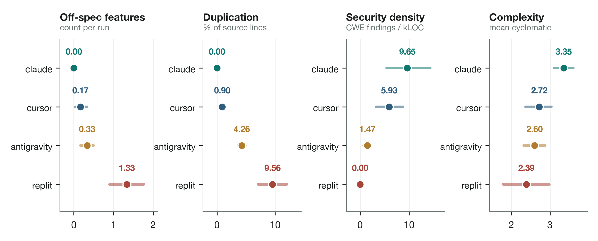

**Figure 4.1** Per-condition means with bootstrap 95% confidence intervals
(10,000 replicates). Keystroke correction is omitted because it is structurally
zero for every agentic condition. The intervals for `replit_agent` and
`antigravity` collapse to a point by construction: those conditions contribute
one captured session per specification (Deviation 001, analysed in §4.5).

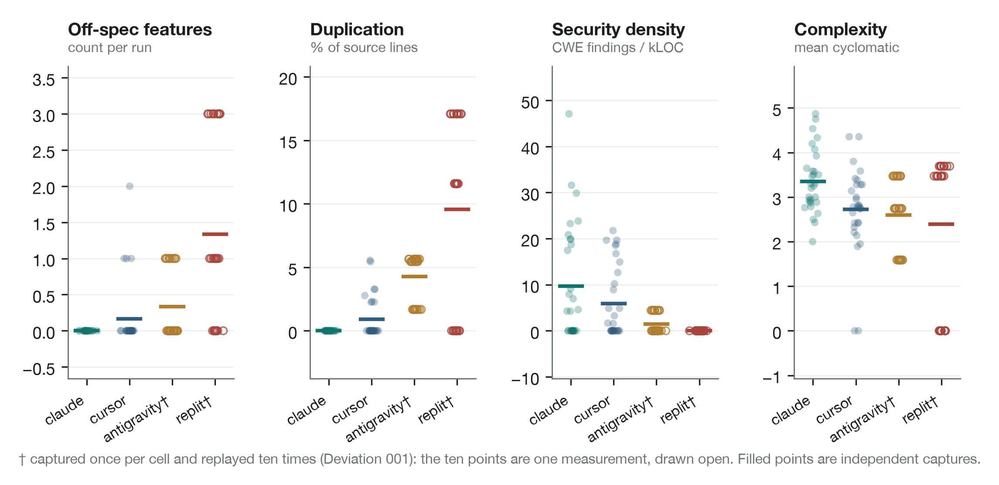

**Figure 4.2** Every run plotted, by condition and metric, with the condition
mean marked. Open points are the two IDE-bound conditions, whose ten runs per
cell are replays of one captured session (Deviation 001); filled points are
independently captured. The visual difference between a column of independent
measurements and a column of copies is the clearest statement of what the
design does and does not support.

The table already reveals the study's central structural result: there is no
single column that is best on every row. Of the five metrics, two produce a clear winner (Claude Code on hallucinations
and duplication); two require interpretation rather than a lower-is-better
reading, complexity because it is two-sided and security density because
Replit's apparent lead is an artefact discussed below; and one (`correction_freq`) is structurally zero
for every agentic condition and is reported here for shape consistency, with its
interpretable value reserved for the human comparison in §4.6. The conditions
thus occupy distinct trade-off profiles rather than a single ordering (Claude
trading structural density for discipline, Replit trading specification fidelity
and a large scaffolding footprint for breadth of generated infrastructure) and
the per-metric and per-spec analyses that follow unpack each in turn before §4.5 sets out which differences the design can test.

## 4.3 Per-metric findings

**Hallucinations.** Claude Code shipped zero off-spec features across all 30
runs; Cursor averaged 0.17 (occasional "helpful" `/health` or `/metrics`
endpoints on the web-app spec); Antigravity 0.33 (localised to the same spec, as
unrequested root and admin-style routes); and Replit Agent 1.33, the largest
condition-level gap in the table and the study's most consequential finding.
Cursor's and Antigravity's figures are *helpful overreach*; Replit's are
*architectural substitution*, a qualitative distinction the bare count obscures
and the per-spec breakdown (§4.4) makes visible.

*4.3.1 The Replit architectural-prior finding.* Given the `internal_tool_cli` specification, a CLI with six declared subcommands
(`init`, `add`, `list`, `export`, `validate`, `help`), under a fresh, isolated
workspace and an explicit
instruction stem prohibiting pipeline output, Replit Agent shipped a
*data-pipeline CLI* in its captured session for that cell, defining `cmd_run`
and `cmd_schedule` invoking a `run_pipeline` routine rather than the spec's
structure. The behaviour matters because of the controls around it: the
workspace was confirmed clean before capture and the prompt explicitly forbade
the pipeline shape, so the result cannot be attributed to contamination or an
ambiguous brief. It is documented as a *measured architectural-prior dominance*
(analytical note 001): the agent's pretrained scaffolding bias is strong enough
to override an unambiguous, contradictory specification. This is the result that
most sharply illustrates the dissertation's thesis (functional benchmarks, which
would record only whether the produced pipeline's tests passed, are structurally
incapable of detecting that the wrong artefact was built) and on which the
governance argument of Chapter 5 principally rests. One caveat is carried
explicitly: this cell is an effective singleton under the replay design
(Deviation 001), so its ten listed replications are mechanical copies of one
session and contribute no independent evidence of stability. The finding rests
on the controlled capture conditions and on direct code inspection; a live
multi-session re-capture (§5.7) is the stated next step.

**Figure 4.3** The finding in full. Left, the six subcommands declared in
`internal_tool_cli.yaml`; right, the three shipped by `replit_agent` in the
captured session for that cell, with the pipeline package supporting them. The
intersection is empty. Both columns are read directly from the specification
file and the frozen capture, so the figure cannot drift from its evidence.

**Cyclomatic complexity.** Claude Code produced the densest code (mean McCabe
3.35) and Replit the least (2.39), a gap of roughly one cc unit that is
consistent across the three specifications. The reading is "denser, not worse":
complexity is a two-sided dimension, and Claude's single-file style inlines
control flow that other vendors distribute across modules, raising the
per-function path count without necessarily harming quality. A moderate
complexity paired with zero duplication is arguably healthier than a low
complexity achieved by scattering logic across duplicated scaffolding. The
metric is most informative read alongside duplication.

**Duplication.** Claude Code produced zero duplication across all 30 runs;
Cursor averaged 0.9%, Antigravity 4.3%, and **Replit Agent 9.56%**, by far the
largest ratio in the table. Inspection identifies the source unambiguously:
Replit ships enterprise monorepo scaffolding (workspace configuration
hierarchies, shared-utility libraries, OpenAPI/ORM code generation) regardless
of the spec's domain, and that scaffolding repeats template fragments across
packages. The metric is doing exactly what it should, measuring the agent's
*architectural footprint* rather than the bare logic the spec demanded. A buyer
should expect roughly a tenth of the produced code to be scaffolding redundancy
before any feature work begins.

**Security density.** The figures below exclude Bandit's `B101` (assertion)
findings inside test files, which the analyser originally counted: `B101` exists
because assertions vanish under `python -O`, and that reasoning does not apply
where the assertion *is* the test. Counting them meant the metric penalised the
conditions that tested their own output most thoroughly, inflating claude_code
from 9.65 to 42.05 and cursor_agent from 5.93 to 43.67. The correction is
recorded as Erratum 001; it reverses no conclusion, and the corrected values are
used throughout.

The exclusion also exposes a difference the metric had been hiding. Whether a
tool writes tests at all varies enormously: `antigravity` produced a test file in
all 30 runs, `cursor_agent` in 21 and `claude_code` in 16, never once on the CLI
specification, while `replit_agent` produced none in any run. Because assertions
were being counted as findings, the metric had been penalising thoroughness and
rewarding its absence, which is the precise inversion an instrument built to
inform governance must not make.

The pattern inverts that of the other metrics. The two feature-dense vendors, Claude Code (9.65) and Cursor Agent
(5.93 CWE-tagged findings per kLOC), score *highest*, while Replit records 0.00
and Antigravity 1.47. Replit's zero does not indicate more secure output; it is
a denominator artefact. Bandit scans Python, and Replit's output is dominated by
TypeScript scaffolding with comparatively little Python, so the few Python
issues are diluted across a large non-Python project. `security_density` is
therefore best read as a *per-language* density rather than a
total-vulnerability count, and a companion metric, total CWE-tagged findings per
run, would be needed to support a whole-project security claim (§5.2). 

**Figure 4.4** The artefact made visible. Left, the share of produced lines by
language across all 30 runs per condition: Replit's output is 6% Python against
52% TypeScript and 42% configuration, while every other condition is
Python-first. Centre, the number of runs containing a test file. Right, security
density against Python share. Replit's 0.00 has two causes and neither is
security: almost nothing it wrote is scannable, and it wrote no tests to scan.

**Keystroke correction.** Structurally zero for every AI condition, because
agents do not press keys. The metric exists for the `human_control` comparison
(§4.6); its inclusion is justified by the need for an empirical floor against
which the agentic zero reads as a category difference rather than an absence
(§5.5).

## 4.4 Per-specification breakdown

Table 4.2 reports the hallucination count per (condition × spec) cell (N = 10
per cell nominal) and shows that the distribution is *not uniform across
specifications*, a result that is the single strongest justification for the
three-specification design.

**Table 4.2** Per-specification hallucination breakdown: mean off-spec feature
count per (condition × specification) cell.

| Hallucinations by spec | agent_education | data_pipeline | internal_tool_cli |
|---|---:|---:|---:|
| claude_code | 0.00 | 0.00 | 0.00 |
| cursor_agent | 0.50 | 0.00 | 0.00 |
| replit_agent | 1.00 | 0.00 | 3.00 |
| antigravity | 1.00 | 0.00 | 0.00 |

**Figure 4.5** Table 4.2 rendered as a heatmap. The concentration of off-spec
output in `replit_agent` on the CLI specification (three off-spec subcommands
per run, against at most one anywhere else) is the study's most consequential
result, and the unevenness of the surrounding cells is the clearest available
statement that tool behaviour is task-conditional rather than uniform.

Three patterns are visible by inspection. Cursor's hallucinations are confined
to `agent_education_system`, the web-app spec; Antigravity's are likewise
localised to that same web-app spec, where it averages a full off-spec route per
run; and Replit's are *heaviest by far on the CLI spec*, three off-spec
subcommands per run against one on the web-app spec and none on the pipeline,
which is what the architectural-prior account predicts, since Replit's
pipeline-shaped defaults are worst-fit when the brief asks for a command-line
tool. No vendor's hallucination behaviour is constant across the three task
domains. A single-specification study would therefore have produced a materially
different, and misleading, ranking depending on which spec it happened to
choose: a CLI-only study would have indicted Replit and left Antigravity looking
clean, while a web-app-only study would have found Replit and Antigravity
equally culpable at 1.00 apiece and Replit's most serious failure entirely
invisible. The non-uniformity is descriptive, since the design cannot test the interaction (§4.5.3), and it is the reason the dissertation's
external-validity claim is task-conditional throughout.

## 4.5 Statistical tests

### 4.5.1 The unit-of-analysis problem

The inferential analysis must confront a constraint that the design imposes and
that a naive reading of the headline CSV would conceal. Under Deviation 001, the
two IDE-bound conditions (`replit_agent`, `antigravity`) were captured **once**
per (condition × specification) cell and that single capture was replayed ten
times for CSV-shape consistency. Verification against the data confirms this
directly: the maximum number of distinct values in any (spec × metric) cell is
**ten** for `claude_code` and `cursor_agent`, and **one** for `replit_agent` and
`antigravity`.

The consequence is that the two replay conditions contribute **three effective
observations each** (one per specification), not thirty. Treating their ten
listed rows as independent observations is *pseudoreplication*, the
best-documented inferential error in experimental design, and it inflates every
test statistic computed over the nominal N = 30. This dissertation therefore
reports the analysis at three levels of conservatism and draws its inferential
conclusions only from the level the design can actually support.

### 4.5.2 Three analyses

**Level 1, nominal analysis (reported for transparency, not relied upon).**
Kruskal–Wallis over all four conditions at the nominal N = 30 returns
significance on all four testable metrics: duplication H = 62.41, p = 1.8 ×
10⁻¹³; security H = 26.07, p = 9.2 × 10⁻⁶; hallucinations H = 40.14, p = 9.9 ×
10⁻⁹; complexity H = 12.03, p = 7.3 × 10⁻³. **These values are inflated by
pseudoreplication and are not the study's inferential claim**; they are reported
only so a reader reproducing the CSV arrives at the same arithmetic and can see
why it must be discounted. Condition-by-specification interaction *F*-statistics
reported in an earlier draft are **withdrawn**: with one effective observation
per cell in two conditions the interaction term has no residual degrees of
freedom and the statistic is undefined on this design, its apparent magnitude an
artefact of near-zero error variance from duplicated rows.

**Figure 4.6** Why Level 1 must be discounted. Each condition contributes 30
rows to the report, but only the two CLI-driven conditions contribute 30
independently captured sessions; the IDE-bound conditions contribute three
apiece, one per specification, replayed ten times each. The omnibus tests above
treat the grey bars as the sample size; the analysis that follows treats the
teal ones.

**Level 2, the inferential core (live conditions only).** Only `claude_code` and
`cursor_agent` were captured live with genuine per-replication variance
(within-cell SD up to 2.32 for duplication and 38.79 for security density), so
only their comparison supports inference at full replication. Table 4.3 reports
Mann–Whitney *U* on each metric with rank-biserial effect sizes.

**Table 4.3** Live-condition comparison, `claude_code` versus `cursor_agent`
(N = 30 per condition; two-sided Mann–Whitney *U*; rank-biserial *r*).

| Metric | *U* | *p* | rank-biserial *r* | Claude mean | Cursor mean |
|---|---:|---:|---:|---:|---:|
| Duplication (%) | 330.0 | 0.0028 | 0.267 | 0.00 | 0.90 |
| Complexity (cc) | 641.5 | 0.0047 | −0.426 | 3.35 | 2.72 |
| Hallucinations (count) | 390.0 | 0.0419 | 0.133 | 0.00 | 0.17 |
| Security density (per kLOC) | 508.0 | 0.3668 | −0.129 | 9.65 | 5.93 |

At the pre-registered per-metric threshold of α = 0.01 (0.05 across five
metrics, §3.6), **duplication and complexity differ significantly**;
hallucinations and security density do not. A further correction for the four
metrics tested here (0.0025) is not part of the registered plan, and neither
result would survive it.

A further distinction must be drawn between the two surviving results, because
replication is not uniform even within the live conditions. Examining
within-cell variance for each arm separately: on *complexity* both conditions
vary across all three specifications, so the comparison rests on genuine
run-to-run replication at both ends. On *duplication* `claude_code` returns 0.00
in every replication of every specification; the arm is constant, and the test
therefore compares a fixed value against a distribution rather than two
distributions. The gap it reports is real and visible in Table 4.1, but it is
not evidence of the same kind.

The single claim in this study that rests on unambiguous independent
replication in **both** arms is therefore *complexity*: on identical tasks,
Claude Code produces measurably more control-flow-dense code than Cursor Agent
(Mann–Whitney *U* = 641.5, *p* = 0.0047, *N* = 30 per condition, rank-biserial
*r* = −0.43). The duplication result is reported alongside it as a strong
descriptive difference with partial inferential support, and the distinction is
made explicit here rather than left for a reader to derive.

**Level 3, pseudoreplication-corrected omnibus (all four conditions).**
Collapsing every condition to one value per specification, the honest unit of
analysis, giving N = 3 per condition, no metric reaches significance:
duplication H = 6.34, p = 0.096; security H = 5.30, p = 0.151; hallucinations H
= 3.45, p = 0.328; complexity H = 1.17, p = 0.760. This is a **power result, not
a null result**: with three cells per condition, only an overwhelming effect
could reach α = 0.01, and the analysis is reported to establish that the
four-condition comparison in this study is *descriptive*, not inferential.

### 4.5.3 What the design does and does not license

The cross-vendor differences in Table 4.1 are large, consistent, and
mechanistically explained by direct inspection of the captured code, duplication
spans 0.00% (Claude) to 9.56% (Replit) and hallucinations 0.00 to 1.33 per run,
but for the two IDE-bound vendors they rest on one captured session per task.
They are therefore presented as **descriptive case evidence**, and the
task-dependence claim (RQ3) is likewise reframed: the per-specification pattern
in Table 4.2 shows that no vendor's hallucination behaviour is constant across
task domains, which is a *descriptive* demonstration of task-conditionality and
is reported as such, without an inferential interaction test.  Closing this gap requires live
multi-session re-capture of the two IDE-bound vendors, which §6.4 identifies as
the first priority of any continuation.

## 4.6 Human-control baseline

The human baseline (N = 1 per spec; all six features implemented and verified)
scored zero hallucinations, zero duplication and zero security density across
all three specs, a minimal, exactly-on-spec implementation without the
over-delivery that drives the AI conditions' non-zero figures. Table 4.4 sets
the baseline against the AI conditions for every metric and specification.

**Table 4.4** Human-control baseline versus AI-condition means, per
specification. Human values are single sessions (N = 1, Deviation 003); AI
values are the mean of the four agentic conditions. Reported descriptively; no
inferential comparison is made.

| Metric | Web app (human / AI) | Pipeline (human / AI) | CLI (human / AI) |
|---|---:|---:|---:|
| Security density (per kLOC) | 0.00 / 10.48 | 0.00 / 1.09 | 0.00 / 1.23 |
| Complexity (cc) | 1.71 / 1.56 | 5.00 / 3.20 | 0.00 / 3.54 |
| Duplication (%) | 0.00 / 3.59 | 0.00 / 5.87 | 0.00 / 1.57 |
| Hallucinations (count) | 0.00 / 0.62 | 0.00 / 0.00 | 0.00 / 0.75 |
| Correction frequency (per 1k) | 829.27 / 0.00 | 51.80 / 0.00 | 122.27 / 0.00 |

**Figure 4.7** Table 4.4 at a glance. The human baseline is at or near zero on
every artefact metric in every domain, the signature of a spec-minimal
implementation rather than superior craft. The exception is complexity, where
the human sits *above* the agentic mean on the web app and the pipeline and at exactly zero on
the CLI; that zero is the decomposition-style confound of §5.5, not a simpler
program.

Mean complexity was 1.71 (web app) and 5.00 (pipeline); for the CLI it was 0.00:
a structural artefact, because the human wrote top-level script code with no
function definitions and the analyser measures per-function complexity, whereas
the AI conditions wrapped the same logic in functions (3.1–4.1). The keystroke
correction rate, the one metric where the human is the point of comparison, was
51.8 per 1,000 on the representative complete session (`data_pipeline`, 6,619
events), i.e. the researcher backspaced ~5% of the time. The
`agent_education_system` figure (829/1k) is a partial-capture outlier from the
documented data-loss event and is not a representative authoring rate. The human
baseline is interpreted as a reference floor and a validity check, not as
evidence that hand-coding is superior.

## 4.7 Inter-rater reliability

The hallucination heuristic was validated against human judgement as
pre-registered. Two raters independently labelled the 30-run hand-label sample, deduplicated to
19 distinct codebases (11 of the 30 rows are byte-identical replays under
Deviation 001, and labelling identical code twice would inflate agreement by
construction). Rater 1 was Ikenna Onyedebelu (MSc Data Science and AI) and Rater 2 Matthew
Brian Tahir, both named here with their consent; neither contributed to the study's design, its instrument or its main-study data. Neither rater saw `data/reports/main_001.csv`, and
neither was told which condition produced which item. One capture contains no
files and was recorded `SKIP` by both, giving N = 18 scoreable items. Labels are
compared on the binary contrast, any off-specification feature against none.

**Table 4.5** Cohen's κ against the instrument as it stood when the raters
worked. Threshold κ ≥ 0.6 (Landis and Koch, 1977).

| Comparison | κ | Interpretation | Raw agreement |
|---|---:|---|---:|
| Rater 1 × Rater 2 | 0.870 | almost perfect | 94.4% |
| Rater 1 × instrument | 0.853 | almost perfect | 94.4% |
| Rater 2 × instrument | 0.727 | substantial | 88.9% |

All three clear the threshold, so the metric's detection of scope drift is admissible for inferential use,
on the terms below.

**Figure 4.8** Every label in the study, item by item. Shaded cells carry at
least one off-specification feature; item_04's capture is empty and was recorded
`SKIP` by both raters. The two boxed columns are the only disagreements: at
item_08 both raters saw a route the instrument could not (Erratum 002), and at
item_16 the raters differ from each other over whether shipped vendor
scaffolding counts as scope drift.

Two qualifications bound that admission.

**The validated claim is detection, not magnitude.** κ is computed on the binary
contrast. Two items agree in binary terms while differing substantially in
count, one where the instrument recorded two off-spec features against the
raters' one, and one where the raters differed from each other by four. The
instrument is validated as an answer to *whether* scope drift occurred, not to
*how much*. No claim in this chapter rests on a hallucination magnitude alone;
the condition-level means in Table 4.1 are reported descriptively and the Replit
finding is independently corroborated by direct code inspection.

**The labelling exposed a defect in the instrument, which is recorded as
Erratum 002.** Both raters counted an off-specification route in the
`replit_agent × agent_education_system` capture that the instrument scored zero
for: its route detector matched only the Python decorator form, and that capture
is an Express service written in TypeScript. The detector was blind to the whole
class. Because the labelling tool extracted its candidates independently of the
instrument, the blind spot surfaced instead of being reproduced; had the raters
been shown only what the instrument could see, the item would have agreed
perfectly and the defect would have survived into the thesis. The affected cell
is corrected from 0.00 to 1.00 throughout this chapter, and hallucination counts
generally should be read as a lower bound on codebases that are not Python-first.

Repairing the defect raises κ(Rater 1, instrument) to 1.000 and
κ(Rater 2, instrument) to 0.870. **Those post-repair values are not reported as
validation and are not quoted in support of any claim.** The defect was
identified by the raters' disagreement and the repair then measured against the
same labels, which is circular; establishing the repaired instrument's validity
would require a fresh sample and raters who have not seen these items. The
figures of record are those in Table 4.5.

Neither rater designed the study or built the instrument, which removes the
concern that a rater might label towards the hypotheses. The single human–human
disagreement, at item_16, is evidence that the two sheets were produced without
conferring.

## 4.8 Application outside the controlled study

The design so far tests the instrument on captures built to be scored. Three
further audits were run on codebases outside the study. They are descriptive,
not pre-registered, and carry no inferential weight; they establish only that
the metrics return meaningful readings on ordinary code.

**Table 4.6** Field audits. Each project was scored against its own
specification. Scope drift is the hallucination metric applied outside the
experiment.

| Project | Files | Lines | Python | Security | Complexity | Duplication | Scope drift |
|---|---:|---:|---:|---:|---:|---:|---:|
| kya-rails | 43 | 4,620 | 15 | 7.49 | 4.13 | 1.79% | 0.00 |
| GovSignal | 30 | 1,923 | 17 | 2.26 | 4.79 | 0.89% | 4.00 |
| This instrument | 141 | 13,136 | 86 | 3.14 | 3.58 | 4.01% | 12 |

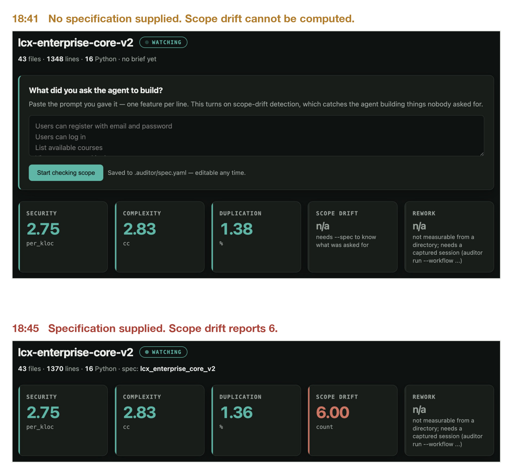

**Figure 4.9** Why the metric needs a brief. Two captures of `lcx-enterprise-core-v2`
four minutes apart, during which twenty-two lines were added. In the first the
tool has no specification and scope drift reports `n/a`, because there is
nothing to measure against. In the second a specification has been supplied and
the same codebase reports six off-specification features. The other four metrics
are unchanged, since they do not depend on knowing what was asked for. This is
the study's argument in one image: fidelity is not a property of code that can
be read off the code alone.

Two points follow. Scope drift discriminates: `kya-rails` returns 0.00, the
reading the metric is designed to produce when output matches its brief, while
`GovSignal` returns 4. A metric returning the same value on every real project
would measure nothing. And `GovSignal` was audited by a third party on their own
machine, so these readings occur in hands other than the author's.

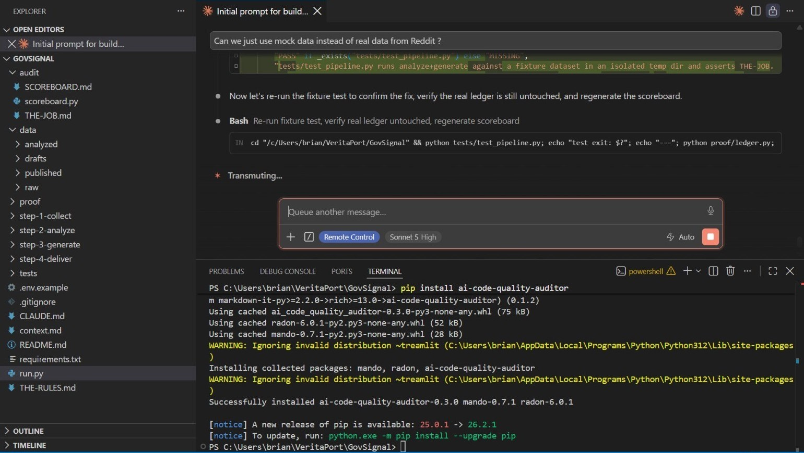

**Figure 4.10** How that audit began. The published package is installed from
PyPI on another user's Windows machine, resolving its dependencies and reporting
success, in the project directory it then audited. Adoption of a research
instrument is ordinarily asserted; here it is a terminal transcript.

*4.8.1 The instrument audits itself.* The third row is the most uncomfortable
and the most useful. Scored against its own declared scope, transcribed from the
pre-registration and the standing brief of 30 May 2026 and reproduced in
`specs/auditor_instrument.yaml`, the instrument as audited carried twelve capabilities nobody specified: four command-line verbs (`scan`, `watch`, `live`, `fix`) and
eight HTTP endpoints belonging to a local web interface the declared design did
not contain at all. The declaration described two commands and no web surface. The `fix` verb has
since been removed from the published package (release 0.5.0).
Git dates every addition to August 2026, months after the protocol was fixed and
none of them required by the experiment.

This is the phenomenon the study measures, occurring in the author's own work,
and it sharpens rather than undermines §5.3. The drift here is *deliberate and
dated*: each capability was chosen, committed with a message explaining it, and
is visible to anyone reading the history. Replit's substitution of a pipeline
for a command-line tool (§4.3.1) was none of those things. The governance
distinction is therefore not between projects that stay in scope and projects
that do not, since almost none stay in scope, but between scope expansion a
reviewer can see and scope substitution a reviewer cannot.

One caveat on provenance. An earlier self-audit, retained in the evidence set,
reported scope drift of 19. It scored the instrument against the study's
demonstration specification for a student-course application, under which almost
everything the instrument contains is off-specification by construction. That is
an artefact of the wrong brief, not a finding; the figure of record is 12.

## 4.9 Summary of findings

1. **Hallucination is the most consequential governance metric.** The four
conditions span 0.00 to 1.33 off-spec features per run, a range that matters in
any deployment evaluation and that functional benchmarks do not surface, though
between the two live tools the difference is not significant (§4.5.2).

2. **Replit Agent's architectural prior dominates the specification.** Given a
   CLI specification under controlled conditions it ships a data pipeline; given
   a web-app specification, an enterprise TypeScript monorepo. The hallucination
   count, the duplication figure (9.56%) and the security-density artefact (0.00
   by Python dilution) are three readings of one underlying behaviour,
   triangulated by direct code inspection; its stability across independent
   sessions awaits the live re-capture (§5.7).

3. **Claude Code produces the most disciplined output**, zero hallucinations and
zero duplication across all 30 runs, at the cost of the highest structural
density (mean complexity 3.35), read as denser rather than worse. Of its two
components, the greater control-flow density relative to Cursor is the study's
single result supported by genuine replication in both arms; the duplication gap
is large and consistent but rests on an arm with no within-cell variance and is
reported descriptively (§4.5.2).

4. **Cursor Agent is the median performer**, neither best nor worst on any single
   metric; its modest hallucinations are confined to the web-app spec as helpful
   overreach (`/health`, `/metrics`).

5. **Antigravity's hallucinations fall entirely in the web-app spec** (1.00 per
   run there, none elsewhere, tying Replit on that specification), and it records
   the lowest security density of any condition with substantive Python output.

6. **Tool behaviour is not constant across task domains.** Every vendor's
   hallucination profile changes with the specification (Table 4.2), so the
   strongest external-validity claim is not "agent X is better than agent Y" but
   "agent X behaved better *for this task type*." This is established
   descriptively rather than by an interaction test, which the replay design
   cannot support (§4.5.3).

---

# Chapter 5: Discussion

## 5.1 Interpreting the cross-vendor differences

The headline result is not that one tool is uniformly "best", but that the four
agentic tools occupy *distinct and measurable quality profiles* which **trade
off against one another** rather than forming a single ranking. Claude Code's
profile is *disciplined density*: it ships exactly what the specification
requests (zero hallucinations, zero duplication) but concentrates logic into
structurally denser single-file implementations (highest complexity) that also
surface the most CWE-tagged findings per kLOC, a direct consequence of having
the most production-feature Python to scan. Replit Agent's is the inverse: an
*architectural-prior maximiser* that ships extensive enterprise scaffolding
(highest duplication) and, most consequentially, overrides the specification
when its prior conflicts with the brief (highest hallucination, heaviest by far
on the CLI spec). Cursor occupies a *median* position, its modest hallucinations
confined to the web-app spec as helpful overreach (`/health`, `/metrics`); and
Antigravity a *web-app-biased* one.

For an enterprise buyer the implication is that tool selection is a
*profile-matching* exercise, not a leaderboard lookup: the right question is
which tool's measured profile fits this team's tasks, risk tolerance and review
capacity. Because tool behaviour is not stable across task domains (Table 4.2),
no single ranking can be valid across an organisation's full task portfolio.
This should be read as a hypothesis generated by these captures and warranting
confirmation under the fully live design of §6.4, not as an established
inferential result.

## 5.2 The security-density artefact and the per-language reading

Replit's 0.00 security density does not mean its output is more secure: its
Python footprint is small beside TypeScript scaffolding the scanner does not
score (§4.3). The metric is a *per-language* density, and a total-findings
companion is needed before any whole-project security claim. Reporting the
artefact rather than a security win is the instrument doing its job.

## 5.3 Specification fidelity as a first-class governance metric

The study's central governance contribution is the elevation of *specification
fidelity* to a measurable, first-class metric. The Replit architectural-prior
finding is its strongest evidence: an agent that ships a data pipeline when asked
for a CLI, under controls designed to prevent exactly that, is an agent whose
output cannot be guaranteed to stay within a declared scope. In the "governance
box" framing of the Aston–Capgemini Centre's agenda this is a containment
failure, not a quality nuance. The duplication finding generalises it: an agent
shipping 9 to 10% scaffolding redundancy by default incurs technical debt
(Cunningham, 1992) at the moment of generation, before a line has been reviewed.

The deeper point is that fidelity is *categorically* different from functional
correctness, and the two move independently. A tool can be perfectly correct, its
pipeline passing every test a pipeline should pass, while being entirely
*unfaithful* to the specification, because the specification asked for something
else. The functional paradigm (§2.1) cannot detect that divergence, because it
evaluates the artefact against its own implied tests rather than against the
brief. Fidelity is therefore not a refinement of correctness but an orthogonal
axis, and one mapping directly onto the properties the NIST AI RMF (2023)
foregrounds: an artefact that silently departs from its specification is neither
*valid* with respect to its requirements nor *accountable* to whoever set them.

The operational recommendation is concrete. Procurement and continuous
integration for agentic tools should include a *fidelity gate*, an automated
check that output maps to the declared specification and introduces nothing
outside it, sitting alongside rather than instead of the functional tests that
currently dominate. The hallucination metric is a first implementation, and its
limitations, token matching rather than structural-shape detection (§4.7, §6.4),
define the engineering road to a production-grade one. The broader claim is that
in high-trust settings *containment*, the guarantee that a tool stays within its
declared scope, is a precondition for adoption that current practice does not
test and that this study shows can be tested.

## 5.4 Methodological reflection

Three points warrant reflection. First, the *capture contract* succeeded in
half its purpose (RQ1): structurally heterogeneous workflows were scored on a
common footing for every artefact metric, and the blinded analyser design
removed a class of vendor-favouring bias by construction. Its process half did
not follow, for the reason given in §6.3: the agentic interaction logs are too
sparse to support process comparison, so the contract is demonstrated for
artefacts and remains a proposal for process. Second, the *replay-mode constraint* (Deviation 001)
is a genuine limitation: the IDE-bound vendors contribute zero within-cell
variance, so their cells are effective singletons and the replayed cells'
internal consistency is a property of the replay mechanism rather than
independent evidence. Third, the *hallucination heuristic* is token-based, and although it now clears its validation threshold (§4.7), that validation
covers detection rather than magnitude; structural-shape detection remains the
recommended extension.

The capture contract deserves reflection as a transferable contribution rather
than an implementation detail. The recurring difficulty in cross-vendor
evaluation is that the objects compared are not commensurable in their native
form: a human session is a stream of keystrokes, a CLI agent emits JSON
tool-calls, a browser-IDE agent leaves only files and an event log. Prior work
sidesteps this by comparing only commensurable objects, model completions
against a test oracle, which is precisely why it cannot study whole-workflow
properties. The contract resolves the incommensurability by defining a *minimal
common shape* (a codebase plus a typed interaction log) to which every workflow
projects losslessly for the metrics' purposes, while vendor-native detail is
retained for forensics. It generalises: any future agentic product can be
brought into the comparison by writing one adapter, and the metric code, being
blind to condition, need not change. This *blinding-by-construction* is stronger
than the blinding-by-protocol common in empirical studies, because it is
enforced by the analyser's type signature rather than the analyst's discipline,
and it answers the most obvious criticism of any vendor comparison: that the
harness was tuned to favour a predetermined winner.

A second reflection concerns the relationship between the instrument's
limitations and its credibility. It would have been possible to present a
cleaner study: to suppress the data-loss event, to assert a κ before it was
earned, to gloss the security-density artefact as a Replit security win, or to
omit the human condition's deviation from pre-registration. Each would have
*increased* the apparent strength of the findings while *decreasing* their
trustworthiness. Two errata sharpen the point, because both were found by the
instrument's own validation rather than by an external reader: security density
was inflated by counting assertions inside test files, penalising the conditions
that tested most thoroughly (Erratum 001), and the route detector was blind to
non-Python web frameworks, scoring an entire cell zero by construction rather
than by judgement (Erratum 002). The second overturned an earlier draft's claim that Replit's off-specification
output was confined to the CLI specification, though no conclusion rested on
that claim alone.

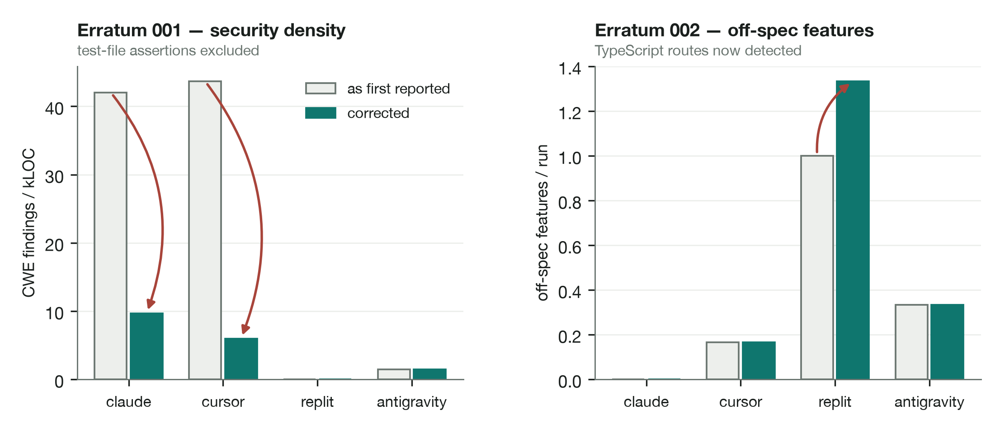

**Figure 5.1** What the two corrections changed. Left, excluding test-file
assertions cuts claude_code's security density from 42.05 to 9.65 and
cursor_agent's from 43.67 to 5.93; the metric had substantially been measuring
how thoroughly each condition tested its own output. Right, detecting TypeScript
routes raises replit_agent's off-spec count from 1.00 to 1.33. Neither reverses
a conclusion; both were found by the instrument's own validation rather than by
a reader. Correcting both in the text, and declining to quote the flattering
post-repair κ because it is circular, is the methodological heart of the
dissertation. An instrument built to audit the trustworthiness of generated code
earns the right to make that audit only by being demonstrably trustworthy
itself, and transparency under conditions that are not flattering is the
operational form of that trustworthiness.

## 5.5 The human baseline in context

The human-control condition is the study's interpretive keystone rather than a
fifth competitor, and each of its results carries a distinct methodological
lesson.

*It supplies the only interpretable value for the keystroke metric.* The agentic
conditions register a structural zero because agents do not press keys, and in
isolation that zero could mean either "no rework occurred" or "rework occurred
but was invisible". The human session resolves the ambiguity: on the representative capture (`data_pipeline`, 6,619 events), the researcher
backspaced at 51.8 corrections per 1,000 keystrokes. That is the empirical floor the metric
was designed to establish, and it reframes the agentic zero as a category
difference rather than a quality triumph, measuring agentic rework would require
a different process instrument, such as tool-call revision counts (§6.4).

*Its clean sweep on the artefact metrics is not a victory for hand coding.* Zero
hallucinations, zero duplication and zero security density across all three
specifications are the signature of a *minimal, exactly-on-specification*
implementation: a human under no pressure to over-deliver ships the six declared
features and stops. The agentic figures are substantially driven by
over-delivery (extra endpoints, enterprise scaffolding, defensive code) which is
a different behaviour, not simply a worse one. The baseline therefore shows what
*spec-minimal* output looks like, giving a reference against which *spec-plus*
tendencies can be read.

*The CLI complexity-of-zero result is the most methodologically valuable single
data point in the study.* The human `internal_tool_cli` implementation scored a
mean cyclomatic complexity of exactly 0.00: not because it was trivial, but
because it was written as top-level script code with no function definitions,
and the analyser, in common with the whole McCabe tradition, measures complexity
*per function*. A function-free module has nothing to average over, while the
agentic conditions, which wrapped equivalent logic in functions, scored 3.1–4.1.
Per-function complexity is therefore confounded with the author's decomposition
style as a *cross-style* comparator. The instrument surfaced the confound rather
than hiding it; the remedy is a complementary whole-module measure (§6.4).

*Two threats are carried openly rather than disguised.* The condition
contributes one replication per specification (Deviation 003), so it cannot
support variance estimation and is excluded from all inferential tests. And the
loss of an early ~2,133-event segment for `agent_education_system`, the
keystroke recorder overwrote its log on re-invocation before segment archiving
existed, produced an unrepresentative correction-frequency outlier (829/1,000,
computed from a small fixing-only segment) that is flagged as such throughout.
The remediation, a cumulative log in which every segment is archived and
concatenated at scoring time, is a small reusable contribution to keystroke
capture methodology.

## 5.6 Implications for enterprise AI adoption

Three implications follow for the enterprise adopter, each actionable with the
instrument this dissertation contributes. First, *select on profile, not rank*:
because tool behaviour varies with task domain (§4.4), no single ranking is
valid across an organisation's task portfolio, and the appropriate procurement
artefact is a *profile matrix*, measured behaviour per task type, rather than a
leaderboard. Second, *gate on fidelity*: treat off-specification output as a
first-order governance risk and measure it before deployment, adding a fidelity
check to continuous integration alongside the functional tests already standard.
The Replit result shows this is not hypothetical, a tool can silently substitute
an entire application architecture for the one requested, and only a fidelity
measurement catches it. Third, *budget for scaffolding debt*: a vendor shipping
~10% redundant scaffolding by default imposes review cost from the first commit,
and that cost should be priced into the adoption decision rather than discovered
later.

More broadly, governance should shift from a *trust-then-verify* posture, in
which a tool is adopted on functional benchmarks and audited later, to a
*measure-then-adopt* posture, in which its quality-and-governance profile is
established empirically before it is placed inside a governance box. That is the
practical thesis: the properties mattering most for responsible adoption are
exactly those current evaluation does not measure, and they can be measured.

## 5.7 Threats to validity

Four classes of threat bound the claims, each mitigated but not eliminated.
*Construct validity*: the five metrics operationalise quality and governance
without exhausting them; security density and per-function complexity are
confounded as discussed (§5.2, §5.5), and the hallucination construct rests on a
token-matching heuristic validated for detection but not for magnitude (§4.7).
These are mitigated by transparent reporting and by triangulating the central
finding against direct code inspection, which depends on no single metric.

*Internal validity*: the replay constraint (Deviation 001) leaves two conditions
with no within-cell variance and three effective observations each. This is the
most serious limitation, and §4.5 addresses it rather than mitigating it in
language: the omnibus is reported at three levels of conservatism, the nominal
statistics are disowned as pseudoreplicated, the interaction statistics are
withdrawn as undefined, and inference is confined to the two live conditions.
What remains, the large descriptive gaps and the mechanism established by
inspection, is genuine but labelled case evidence; a fully live re-capture would be required to convert it into inference.
Versions are a further threat: Cursor's automatic selection need not hold one
model across runs, and all four products change continuously, so the findings
describe the tools as captured in mid-2026.

*External validity*: three specifications across three domains, while broader
than the single-task norm, do not span the space of software tasks, and the
per-specification non-uniformity of Table 4.2, descriptive since the interaction
statistic is undefined here, warns against over-generalisation. The appropriate
inference is task-conditional.

*Conclusion validity*: free parameters, the shingle window, the α level and the
choice of non-parametric tests, were fixed by pre-registration before collection
(§3.5), constraining the analytic flexibility that would otherwise threaten the
reported p-values. The structural findings rest on absolute gaps large relative
to within-cell variance rather than on marginal significance.

# Chapter 6: Conclusion

## 6.1 Summary

This dissertation designed, built and applied a vendor-agnostic, pre-registered,
blinded instrument for auditing the code-quality and governance behaviour of
agentic AI coding workflows, and used it to compare four leading commercial tools
across three task domains and five metrics. It answered its three research
questions: a single capture contract *can* render heterogeneous workflows comparable on
artefact metrics, though not yet on process (RQ1); the tools *do* differ, significantly so on duplication and
complexity between the two conditions the design replicates fully, and by large
descriptive margins across all four (RQ2); and those differences are *not stable
across task domains*, so tool quality is task-conditional (RQ3, established
descriptively).

## 6.2 Contributions revisited

The *methodological* contribution is the capture contract and its blinded
analyser pipeline, a design that solves the comparability problem at the heart
of cross-vendor agentic evaluation by forcing structurally heterogeneous
workflows into one artefact shape and removing condition identity from the
metric code by interface, not discipline. It is reusable: any workflow that can emit a
codebase and an interaction log can be scored on the same footing.

The *empirical* contribution is the pre-registered, four-vendor, three-domain,
five-metric comparison and, within it, the characterisation of a *measured
architectural-prior dominance* in Replit Agent, an agent's pretrained
scaffolding bias overriding an explicit, contradictory specification under
controlled conditions. This is, to the author's knowledge, the first
pre-registered cross-vendor measurement of specification fidelity in commercial
agentic tools, and a concrete, reproducible instance of a governance failure
functional benchmarks are structurally unable to detect.

The *governance* contribution is the elevation of specification fidelity to a
first-class, measurable quality metric, and the consequent recommendation of a
*fidelity gate* in enterprise procurement: a measured check that a tool's output
maps to the specification and nothing more, sitting alongside the functional
benchmarks that currently dominate. This reframes the adoption question from "is
the tool capable?" to "can the tool be contained?".

## 6.3 Limitations

The principal limitations, developed in §5.7, are: the replay-mode zero-variance constraint on the two IDE-bound
conditions (Deviation 001), which reduces their effective replication to one and
concentrates the omnibus variance in the two CLI-driven conditions; the reduced,
single-replication human baseline and its one unrecoverable data-loss event
(Deviation 003); the token-based hallucination heuristic, validated for detection but not for
magnitude (§4.7); the per-language confound in the security-density metric (§5.2); the
cross-style confound in per-function complexity (§5.5); and the static, artefact-level measurement scope, which by design excludes runtime
behaviour, developer satisfaction, and longitudinal maintenance cost; and,
most consequentially for the capture contract's own claims, the thinness of the
agentic interaction logs. The contract specifies a codebase and a typed
interaction log, and the codebase half is complete for every run, but the log
half is not: the human sessions record 7,979 events while `antigravity` and
`replit_agent` record one placeholder event per run and the two CLI-driven
conditions a median of seventeen and two. The artefact findings are unaffected,
since they are computed from the code, but no claim about *how* an agent worked
is supported by this dataset. None of these undermines the structural findings, which rest on large
descriptive margins and on mechanisms confirmed by inspecting the captured code,
but each bounds the claims, the replay constraint most sharply, since it confines
formal inference to the two live conditions (§4.5).

## 6.4 Future work

Five lines of future work follow directly from the limitations. First,
*re-validate the repaired detector on a fresh sample*: the pre-registered κ
reported in §4.7 validates the instrument as it stood before Erratum 002, and
the repair cannot be validated against the labels that motivated it. The same
exercise should *implement structural-shape detection* so the deriver recognises
that a spec-token appearing inside the wrong architectural shape is a
hallucination, not an implementation: the item_16 disagreement between raters,
over whether shipped vendor scaffolding is scope drift or organisation, is
precisely the boundary such detection would have to settle. Second, *add a
total-CWE companion* to the security metric so that total-vulnerability claims
can be made alongside per-language density. Third, *add a whole-module
complexity measure* invariant to functional decomposition, to complement the
per-function McCabe mean and resolve the cross-style confound the human baseline
exposed. Fourth, *restore full live replication* for the IDE-bound vendors
through improved capture automation, and *expand the human baseline* to a
properly powered, multi-rep, multi-participant sample so that it can enter the
inferential analysis rather than serve only as a descriptive floor. Fifth,
*extend the instrument* to runtime and maintainability metrics and to additional
task domains, broadening external validity. The instrument is packaged so that third parties can make each extension, and
reproduce or contest these findings.

## 6.5 Concluding remarks

Agentic coding tools are being adopted faster than the instruments needed to
govern them are being built. This dissertation has argued, and shown
empirically, that the dominant functional-correctness paradigm is necessary but
not sufficient for responsible adoption: a tool can be fast and functionally
correct while systematically shipping off-specification structure, redundant
scaffolding, or diluted security exposure, and the organisation adopting it will
have no instrument with which to see this. By building a vendor-agnostic,
pre-registered, blinded instrument and using it to surface exactly such behaviour, most strikingly an agent that builds a data
pipeline when asked for a command-line tool, the study makes the case that *specification fidelity* and
the wider family of quality-and-governance properties belong at the centre of
how agentic tools are evaluated, procured, and governed. The instrument is
offered as a contribution toward that end, and as an invitation to measure
rather than to assume.

---

# References

> ✅ **Verified 4 August 2026.** All 26 entries checked against authoritative
> sources (arXiv, ACM Digital Library, publisher and DOI records). One
> correction applied (Ziegler et al. 2022 author order, per the published MAPS
> '22 record); optional completeness details added to Barke, Hou and NIST
> entries. Remaining before submission: confirm the exact Harvard variant
> required by Aston, and expand with programme-specific sources if needed.

Austin, J., Odena, A., Nye, M., Bosma, M., Michalewski, H., Dohan, D. et al.
(2021) 'Program synthesis with large language models', *arXiv preprint*
arXiv:2108.07732.

Barke, S., James, M.B. and Polikarpova, N. (2023) 'Grounded Copilot: how
programmers interact with code-generating models', *Proceedings of the ACM on
Programming Languages*, 7(OOPSLA1), Article 78, pp. 85–111.

Chen, M., Tworek, J., Jun, H., Yuan, Q., Pinto, H.P. de O., Kaplan, J. et al.
(2021) 'Evaluating large language models trained on code', *arXiv preprint*
arXiv:2107.03374.

Cohen, J. (1960) 'A coefficient of agreement for nominal scales', *Educational
and Psychological Measurement*, 20(1), pp. 37–46.

Cohen, J. (1988) *Statistical Power Analysis for the Behavioral Sciences*. 2nd
edn. Hillsdale, NJ: Lawrence Erlbaum Associates.

Cunningham, W. (1992) 'The WyCash portfolio management system',
*OOPSLA '92 Addendum to the Proceedings*, pp. 29–30. [The original "technical
debt" metaphor.]

Dakhel, A.M., Majdinasab, V., Nikanjam, A., Khomh, F., Desmarais, M.C. and Jiang,
Z.M.J. (2023) 'GitHub Copilot AI pair programmer: asset or liability?', *Journal
of Systems and Software*, 203, 111734.

Dunn, O.J. (1964) 'Multiple comparisons using rank sums', *Technometrics*, 6(3),
pp. 241–252.

European Union (2024) *Regulation (EU) 2024/1689 of the European Parliament and
of the Council of 13 June 2024 laying down harmonised rules on artificial
intelligence (Artificial Intelligence Act)*. Official Journal of the European
Union, L 2024/1689.

Efron, B. (1979) 'Bootstrap methods: another look at the jackknife', *The Annals
of Statistics*, 7(1), pp. 1–26.

Hou, X., Zhao, Y., Liu, Y., Yang, Z., Wang, K., Li, L. et al. (2024) 'Large
language models for software engineering: a systematic literature review', *ACM
Transactions on Software Engineering and Methodology*, 33(8), Article 220.

Jimenez, C.E., Yang, J., Wettig, A., Yao, S., Pei, K., Press, O. and Narasimhan,
K. (2024) 'SWE-bench: can language models resolve real-world GitHub issues?',
*Proceedings of the 12th International Conference on Learning Representations
(ICLR)*.

Kruskal, W.H. and Wallis, W.A. (1952) 'Use of ranks in one-criterion variance
analysis', *Journal of the American Statistical Association*, 47(260),
pp. 583–621.

Landis, J.R. and Koch, G.G. (1977) 'The measurement of observer agreement for
categorical data', *Biometrics*, 33(1), pp. 159–174.

Levene, H. (1960) 'Robust tests for equality of variances', in Olkin, I. (ed.)
*Contributions to Probability and Statistics*. Stanford: Stanford University
Press, pp. 278–292.

Liang, J.T., Yang, C. and Myers, B.A. (2024) 'A large-scale survey on the
usability of AI programming assistants: successes and challenges', *Proceedings
of the 46th IEEE/ACM International Conference on Software Engineering (ICSE)*.

McCabe, T.J. (1976) 'A complexity measure', *IEEE Transactions on Software
Engineering*, SE-2(4), pp. 308–320.

MITRE (2023) *Common Weakness Enumeration (CWE)*. Available at:
https://cwe.mitre.org/ (Accessed: 4 August 2026).

NIST (2023) *Artificial Intelligence Risk Management Framework (AI RMF 1.0)*
(NIST AI 100-1). Gaithersburg, MD: National Institute of Standards and
Technology.

Nosek, B.A., Ebersole, C.R., DeHaven, A.C. and Mellor, D.T. (2018) 'The
preregistration revolution', *Proceedings of the National Academy of Sciences*,
115(11), pp. 2600–2606.

OWASP (2021) *OWASP Top 10:2021*. Open Worldwide Application Security Project.
Available at: https://owasp.org/Top10/ (Accessed: 4 August 2026).

Pearce, H., Ahmad, B., Tan, B., Dolan-Gavitt, B. and Karri, R. (2022) 'Asleep at
the keyboard? Assessing the security of GitHub Copilot's code contributions',
*2022 IEEE Symposium on Security and Privacy (SP)*, pp. 754–768.

Peng, S., Kalliamvakou, E., Cihon, P. and Demirer, M. (2023) 'The impact of AI
on developer productivity: evidence from GitHub Copilot', *arXiv preprint*
arXiv:2302.06590.

Sadowski, C., Aftandilian, E., Eagle, A., Miller-Cushon, L. and Jaspan, C. (2018)
'Lessons from building static analysis tools at Google', *Communications of the
ACM*, 61(4), pp. 58–66.

Shapiro, S.S. and Wilk, M.B. (1965) 'An analysis of variance test for normality
(complete samples)', *Biometrika*, 52(3/4), pp. 591–611.

Sarkar, A., Gordon, A.D., Negreanu, C., Poelitz, C., Srinivasa Ragavan, S. and
Zorn, B. (2022) 'What is it like to program with artificial intelligence?',
*Proceedings of the 33rd Annual Workshop of the Psychology of Programming
Interest Group (PPIG)*.

Tukey, J.W. (1949) 'Comparing individual means in the analysis of variance',
*Biometrics*, 5(2), pp. 99–114.

Vaithilingam, P., Zhang, T. and Glassman, E.L. (2022) 'Expectation vs.
experience: evaluating the usability of code generation tools powered by large
language models', *CHI Conference on Human Factors in Computing Systems Extended
Abstracts*.

Ziegler, A., Kalliamvakou, E., Simister, S., Sittampalam, G., Li, A., Rice, A.,
Rifkin, D. and Aftandilian, E. (2022) 'Productivity assessment of neural
code completion', *Proceedings of the 6th ACM SIGPLAN International Symposium on
Machine Programming (MAPS)*, pp. 21–29.

---

# Appendices

All code and data are held in the public project repository and are linked
below. Repository: [https://github.com/dominicrume/ai-code-quality-auditor](https://github.com/dominicrume/ai-code-quality-auditor). Published package:
[https://pypi.org/project/ai-code-quality-auditor/](https://pypi.org/project/ai-code-quality-auditor/).

## Appendix A: Specifications

The three fixed YAML specifications issued to every condition, each with six
features and three governance rules.

- [https://github.com/dominicrume/ai-code-quality-auditor/blob/main/specs/agent_education_system.yaml](https://github.com/dominicrume/ai-code-quality-auditor/blob/main/specs/agent_education_system.yaml)
- [https://github.com/dominicrume/ai-code-quality-auditor/blob/main/specs/data_pipeline.yaml](https://github.com/dominicrume/ai-code-quality-auditor/blob/main/specs/data_pipeline.yaml)
- [https://github.com/dominicrume/ai-code-quality-auditor/blob/main/specs/internal_tool_cli.yaml](https://github.com/dominicrume/ai-code-quality-auditor/blob/main/specs/internal_tool_cli.yaml)

## Appendix B: Data artefacts

The headline results (600 rows) with their provenance record, the human
baseline sessions, the human-versus-AI comparison, and both raters' label sheets
with the computed agreement.

- [https://github.com/dominicrume/ai-code-quality-auditor/blob/main/data/reports/main_001.csv](https://github.com/dominicrume/ai-code-quality-auditor/blob/main/data/reports/main_001.csv)
- [https://github.com/dominicrume/ai-code-quality-auditor/blob/main/data/reports/main_001.provenance.json](https://github.com/dominicrume/ai-code-quality-auditor/blob/main/data/reports/main_001.provenance.json)
- [https://github.com/dominicrume/ai-code-quality-auditor/tree/main/data/reports](https://github.com/dominicrume/ai-code-quality-auditor/tree/main/data/reports) (human baseline: `human_session_<spec>_rep00.csv`)
- [https://github.com/dominicrume/ai-code-quality-auditor/blob/main/data/reports/human_vs_ai_comparison.csv](https://github.com/dominicrume/ai-code-quality-auditor/blob/main/data/reports/human_vs_ai_comparison.csv)
- [https://github.com/dominicrume/ai-code-quality-auditor/tree/main/data/labels](https://github.com/dominicrume/ai-code-quality-auditor/tree/main/data/labels) (rater sheets and `kappa_results.json`)

## Appendix C: Statistical notebook

The notebook that reproduces every Chapter 4 statistic from the headline data.

- [https://github.com/dominicrume/ai-code-quality-auditor/blob/main/notebooks/statistical_analysis.ipynb](https://github.com/dominicrume/ai-code-quality-auditor/blob/main/notebooks/statistical_analysis.ipynb)

## Appendix D: Pre-registration, deviations and errata

The pre-registered protocol, Deviations 001 to 003, the inter-rater reliability
record and both errata.

- [https://github.com/dominicrume/ai-code-quality-auditor/blob/main/docs/EXPERIMENT_PROTOCOL.md](https://github.com/dominicrume/ai-code-quality-auditor/blob/main/docs/EXPERIMENT_PROTOCOL.md)
- [https://github.com/dominicrume/ai-code-quality-auditor/blob/main/docs/PROTOCOL_DEVIATIONS.md](https://github.com/dominicrume/ai-code-quality-auditor/blob/main/docs/PROTOCOL_DEVIATIONS.md)
- [https://github.com/dominicrume/ai-code-quality-auditor/blob/main/docs/ERRATUM_001_security_density.md](https://github.com/dominicrume/ai-code-quality-auditor/blob/main/docs/ERRATUM_001_security_density.md)
- [https://github.com/dominicrume/ai-code-quality-auditor/blob/main/docs/KAPPA_RESULTS_001.md](https://github.com/dominicrume/ai-code-quality-auditor/blob/main/docs/KAPPA_RESULTS_001.md)
- [https://github.com/dominicrume/ai-code-quality-auditor/blob/main/docs/ERRATUM_002_hallucination_false_negative.md](https://github.com/dominicrume/ai-code-quality-auditor/blob/main/docs/ERRATUM_002_hallucination_false_negative.md)

## Appendix E: Instrument source

The `auditor` package (core engine, one analyser per metric, one adapter per
vendor) and its automated test suite.

- [https://github.com/dominicrume/ai-code-quality-auditor/tree/main/auditor](https://github.com/dominicrume/ai-code-quality-auditor/tree/main/auditor)
- [https://github.com/dominicrume/ai-code-quality-auditor/tree/main/tests](https://github.com/dominicrume/ai-code-quality-auditor/tree/main/tests)

## Appendix F: Supplementary evidence

Captures supporting results reported in Chapter 4 that are not already shown as
figures in the body. Each is cropped from an original screen capture to the
region carrying evidence, with browser chrome, bookmarks, file paths and account
details removed and nothing else altered. The same images are published with an
index at [https://github.com/dominicrume/ai-code-quality-auditor/tree/main/docs/evidence](https://github.com/dominicrume/ai-code-quality-auditor/tree/main/docs/evidence).

**Figure F.1** GovSignal, a codebase outside the study, audited on Rater 2's own machine: 30 files and 1,923 lines, with security 2.26 per kLOC, complexity 4.79, duplication 0.89% and scope drift 4. Supports Table 4.6.

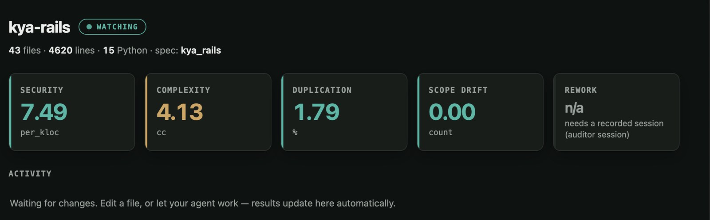

**Figure F.2** kya-rails, a codebase outside the study: 43 files and 4,620 lines, with scope drift 0.00, the reading the metric returns when output matches its brief. Supports Table 4.6.

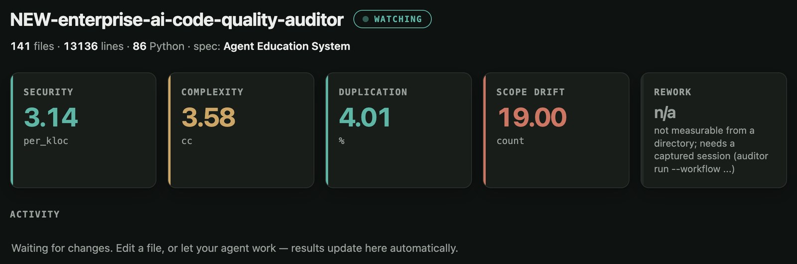

**Figure F.3** The instrument audited against the study's demonstration specification for a student-course application, reading scope drift of 19. This is the wrong-brief artefact described in §4.8.1 and is not a finding; scored against its own declared scope the figure of record is 12.

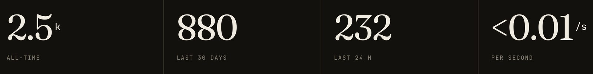

**Figure F.4** Installations of the published package from PyPI to 5 September 2026: 2,500 all-time, 880 in the preceding thirty days and 232 in twenty-four hours.

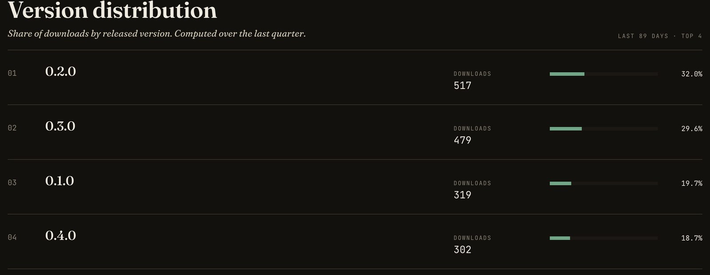

**Figure F.5** Downloads by released version over the quarter to 9 September 2026: 517 of 0.2.0, 479 of 0.3.0, 319 of 0.1.0 and 302 of 0.4.0. Every published version is in use.

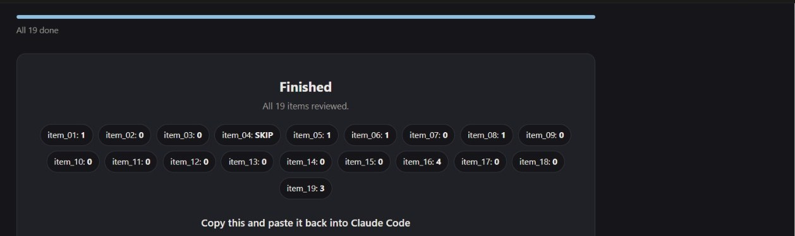

**Figure F.6** Rater 2's completed labelling screen, all nineteen items reviewed. The item_16 count of 4 is the single human disagreement discussed in §4.7.

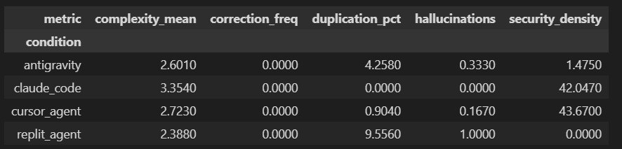

**Figure F.7** The per-condition results as first produced, before Errata 001 and 002. Security density reads 42.05 and 43.67 for claude_code and cursor_agent, and replit_agent's hallucination mean 1.00; Chapter 4 reports the corrected 9.65, 5.93 and 1.33. Retained as a record of what the corrections changed.

---

> **Editorial status (not part of the submission; stripped when the document is
> rendered).** Built entirely on the study's real captured data. Chapters 1–6
> are 11,569 words excluding figure captions, 12,429 including them, against a
> hard 12,000 limit, confirm which convention the marking rubric applies.
> References verified; §4.5 re-analysed and rewritten (6 August 2026); Cohen's κ
> collected and reported, Erratum 001 applied in the text and Erratum 002
> applied throughout (8 September 2026); name and programme verified against the
> enrolment record, Declaration written and submission month set
> (8 September 2026). Remaining: confirm the citation style and word-count rule
> against the marking rubric.
